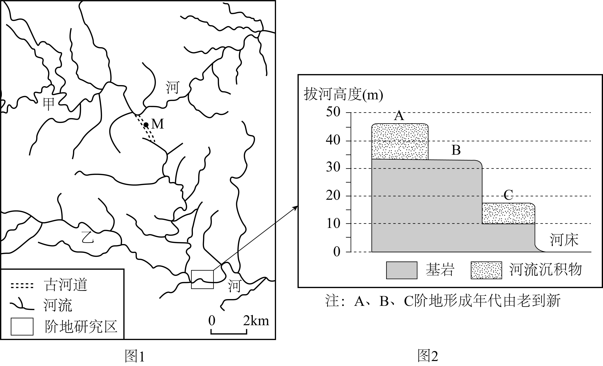
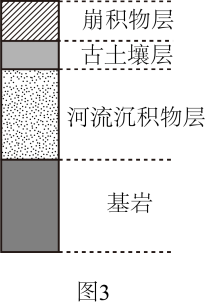
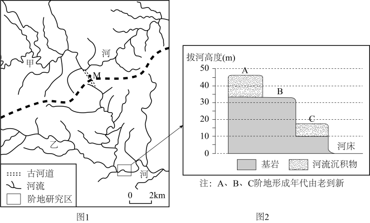

# 2025年山东高考地理真题

## 关联知识主题

[[02_知识主题/交通运输布局与区域发展__交通运输布局对区域发展的影响|交通运输布局对区域发展的影响]] [[02_知识主题/交通运输布局与区域发展__区域发展对交通运输布局的影响|区域发展对交通运输布局的影响]] [[02_知识主题/产业区位因素__农业区位因素及其变化|农业区位因素及其变化]] [[02_知识主题/产业区位因素__工业区位因素及其变化|工业区位因素及其变化]] [[02_知识主题/产业区位因素__服务业区位因素及其变化|服务业区位因素及其变化]] [[02_知识主题/人口__人口容量|人口容量]] [[02_知识主题/人口__人口数量变化|人口数量变化]] [[02_知识主题/人口__人口结构|人口结构]] [[02_知识主题/地球的运动__地球的自转和公转|地球的自转和公转]] [[02_知识主题/地球的运动__地球运动的地理意义|地球运动的地理意义]] [[02_知识主题/地表形态的塑造__塑造地表形态的力量|塑造地表形态的力量]] [[02_知识主题/地表形态的塑造__构造地貌的形成|构造地貌的形成]] [[02_知识主题/地表形态的塑造__河流地貌的发育|河流地貌的发育]] [[02_知识主题/城市、产业与区域发展__地区产业结构变化|地区产业结构变化]] [[02_知识主题/大气的运动__常见天气系统|常见天气系统]] [[02_知识主题/水的运动__洋流|洋流]] [[02_知识主题/水的运动__海—气相互作用|海—气相互作用]] [[02_知识主题/水的运动__陆地水体及其相互关系|陆地水体及其相互关系]] [[02_知识主题/自然灾害__地理信息技术在防灾减灾中的应用|地理信息技术在防灾减灾中的应用]] [[02_知识主题/自然环境的整体性与差异性__自然环境的整体性|自然环境的整体性]] [[02_知识主题/资源、环境与区域发展__资源枯竭型城市的转型发展|资源枯竭型城市的转型发展]] [[02_知识主题/资源安全与国家安全__资源安全对国家安全的影响|资源安全对国家安全的影响]]

## 题目导航

- [[04_题目/2025年山东高考地理真题__Q1|第1题]]：1959年修建砂石路基铁路取代木制铁路桥，其主要目的是（ ）
- [[04_题目/2025年山东高考地理真题__Q2|第2题]]：2016年挖开新缺口对大盐湖产生的影响是（ ）
- [[04_题目/2025年山东高考地理真题__Q3|第3题]]：截至2023年，因该区域连年干旱，水下石坝较修建时被加高了近3米。推测加高石坝的主要目的是（ ）
- [[04_题目/2025年山东高考地理真题__Q4|第4题]]：打样订单由自营工厂完成的主要目的是（ ）
- [[04_题目/2025年山东高考地理真题__Q5|第5题]]：J公司开发的工业互联网平台的主要作用是（ ）
- [[04_题目/2025年山东高考地理真题__Q6|第6题]]：1997~2017年，该国人口数量（ ）
- [[04_题目/2025年山东高考地理真题__Q7|第7题]]：1997~2017年，该国（ ）
- [[04_题目/2025年山东高考地理真题__Q8|第8题]]：18日8时，甲、乙、丙、丁四处附近，风向和风速分布最均匀的是（ ）
- [[04_题目/2025年山东高考地理真题__Q9|第9题]]：推测18日8时，暴雪天气最可能出现在图所示（ ）
- [[04_题目/2025年山东高考地理真题__Q10|第10题]]：18日8时至20时，G地近地面出现由偏东风和偏南风两股气流形成的气旋式辐合线，该辐合线有利于暴雪天气的维持。下图中对该辐合线附近风场示意正确的是（ ）
- [[04_题目/2025年山东高考地理真题__Q11|第11题]]：小明使用该软件模拟在山东省某地观测恒星时，观测到一颗遥远的恒星在某一时刻正好位于天顶。小明将时间参数调整为第二天的相同时刻，则观测到该恒星的位置相较于调整前（…
- [[04_题目/2025年山东高考地理真题__Q12|第12题]]：小明在该软件中将观测点分别设定在我国下列四地，并模拟一日观测，小明能观测到的恒星数量理论上最多的是（ ）
- [[04_题目/2025年山东高考地理真题__Q13|第13题]]：涨潮时段，该河段经常出现上行小型船舶的通行高峰，其主要影响因素是（ ）
- [[04_题目/2025年山东高考地理真题__Q14|第14题]]：大型船舶无法直接经福北水道下行停靠P港，须经福中水道下行，转如皋中汊上行停靠P港，其主要原因是P港附近的下行航道（ ）
- [[04_题目/2025年山东高考地理真题__Q15|第15题]]：船舶夜间航行时，使用北斗卫星导航系统的主要目的是（ ）
- [[04_题目/2025年山东高考地理真题__Q16|第16题]]：(1)说明梅树下草本植物、乔灌混交林对梅林土壤养分维持所起的作用。；(2)说明当地农户通过青梅复合生产系统能够获得稳定收入的原因。
- [[04_题目/2025年山东高考地理真题__Q17|第17题]]：(1)分析三门峡市建设中试基地对该市产业转型的促进作用。；(2)说明超高纯镓中试成功对我国战略性新兴产业发展的意义。
- [[04_题目/2025年山东高考地理真题__Q18|第18题]]：(1)营养盐是影响浮游植物生物量主要因素之一。A、B两海区营养盐含量均较高，但主导因素不同。分别指出导致A、B两海区营养盐含量较高的主导因素。；(2)溶解氧是…
- [[04_题目/2025年山东高考地理真题__Q19|第19题]]：(1)用虚线“----”在图1中画出甲河流域与乙河流域之间的分水线（分水岭最高点的连线）。；(2)根据图2信息，指出在B阶地的形成过程中，河流下切最深处的拔河…

## 试卷原文

机密★启用前

2025年全省普通高中学业水平等级考试

地理

注意事项：

1．答卷前，考生务必将自己的姓名、考生号等填写在答题卡和试卷指定位置。

2．回答选择题时，选出每小题答案后、用铅笔把答题卡上对应题目的答案标号涂黑。如需改动、用橡皮擦干净后，再选涂其他答案标号，回答非选择题时，将答案写在答题卡上。写在本试卷上无效。

3．考试结束后，将本试卷和答题卡一并交回。

一、选择题：本题共15小题，每小题3分，共45分。每小题只有一个选项符合题目要求。

美国大盐湖（图1）平均深度约4.3米，湖中只有卤虫等少数耐盐物种。研究表明，120‰~160‰的盐度可使大盐湖中卤虫种群维持较高的密度。20世纪初，湖上修建了一座跨湖木制铁路桥。该桥在1959年被一条新建的与其平行的砂石路基铁路取代。砂石路基将大盐湖分为北湾和南湾，并催生了两湾的特色产业——北湾的盐业和南湾的卤虫捕捞业。2013年，砂石路基仅有的两处4.6米宽的涵洞因老化被永久封闭。2016年，路基又被挖开一个55米宽的“新缺口”，并修建了桥梁和一道高度可调整的水下石坝（图2）。据此完成下面小题。

1. 1959年修建砂石路基铁路取代木制铁路桥，其主要目的是（   ）

①降低维护成本  ②提高铁路运力  ③缩短运输距离  ④促进航运发展

A. ①②B. ②③C. ①④D. ③④

2. 2016年挖开新缺口对大盐湖产生的影响是（   ）

A. 增加入湖地表径流B. 缩小南北湾之间水位差

C. 增加北湾湖水盐度D. 减小南湾湖床出露面积

3. 截至2023年，因该区域连年干旱，水下石坝较修建时被加高了近3米。推测加高石坝的主要目的是（   ）

A. 便于引水灌溉B. 降低北湾采盐成本C. 限制船舶通行D. 保护南湾生态系统

J公司是一家以电子产品关键零部件供应为主营业务的高新技术企业。近年来，J公司开发了一款工业互联网平台，并邀请众多电子产品零部件生产工厂入驻。该公司承接的订单包括产品打样订单和批量生产订单两类。打样的目的在于验证和测试，样品数量一般几件到几十件不等，成本较高。J公司以较低的报价承接打样订单，并安排其自营工厂生产，由此获得的批量生产订单则通过平台匹配给适宜的工厂完成。据此完成下面小题。

4. 打样订单由自营工厂完成的主要目的是（   ）

A. 减少材料消耗B. 节省样品运输时间

C. 确保样品质量D. 提高打样订单利润

5. J公司开发的工业互联网平台的主要作用是（   ）

A
减少生产工序B. 优化生产资源配置

C. 延长产业链条D. 加强生产技术交流

下图示意某人口大国1997~2017年人口总抚养比和少年儿童抚养比的变化，据此完成下面小题。

6. 1997~2017年，该国人口数量（   ）

A. 持续增长B. 持续下降C. 先增后减D. 保持稳定

7
1997~2017年，该国（   ）

A. 老年人口数量保持稳定B. 劳动年龄人口数量有所下降

C. 老年人口比重不断增加D. 劳动年龄人口比重变化较小

风向或风速分布不均匀时，空气会发生辐合（或辐散）。散度是描述空气从周围向某一处汇合或从某一处向周围流散的程度的量。某年10月17日~18日，G地经历了一次暴雪天气。下图示意18日8时沿106°E经线（经过G地）的散度等值线垂直分布，散度大于0表示水平辐散，小于0表示水平辐合。据此完成下面小题。

8. 18日8时，甲、乙、丙、丁四处附近，风向和风速分布最均匀的是（   ）

A. 甲处B. 乙处C. 丙处D. 丁处

9. 推测18日8时，暴雪天气最可能出现在图所示
（   ）

A. 33°N附近B. 36°N附近C. 38°N附近D. 40°N附近

10. 18日8时至20时，G地近地面出现由偏东风和偏南风两股气流形成的气旋式辐合线，该辐合线有利于暴雪天气的维持。下图中对该辐合线附近风场示意正确的是（   ）

A. ①B. ②C. ③D. ④

某观星软件能够模拟出不受昼夜、天气等客观因素限制的真实星空景象，人们可以通过设定位置和时间参数观测地球上任一点地平面以上的恒星分布。据此完成下面小题。

11. 小明使用该软件模拟在山东省某地观测恒星时，观测到一颗遥远的恒星在某一时刻正好位于天顶。小明将时间参数调整为第二天的相同时刻，则观测到该恒星的位置相较于调整前（   ）

A. 偏东B. 偏西C. 偏南D. 不变

12. 小明在该软件中将观测点分别设定在我国下列四地，并模拟一日观测，小明能观测到的恒星数量理论上最多的是（   ）

A. 曾母暗沙B. 钓鱼岛C. 乌鲁木齐D. 漠河

内河航道是河流水道中相对固定、能够保障船舶安全航行的通道：船舶由下游向上游行驶为上行，反之为下行。下图所示河段河水水位、流速和流向会随潮汐发生周期性改变。该河段各航道均能保障小型船舶全时段双向通行。该河段船舶航行时须靠航道右侧行驶。据此完成下面小题。

13. 涨潮时段，该河段经常出现上行小型船舶的通行高峰，其主要影响因素是（   ）

A. 水面落差B. 河流水深C. 泥沙含量D. 河面宽度

14. 大型船舶无法直接经福北水道下行停靠P港，须经福中水道下行，转如皋中汊上行停靠P港，其主要原因是P港附近的下行航道（   ）

A. 水位高B. 水流急C. 淤积强D. 曲率大

15. 船舶夜间航行时，使用北斗卫星导航系统的主要目的是（   ）

A. 监测流速B. 探测水深C. 测定流向D. 校正航向

二、非选择题：本题共4小题，共55分。

16. 阅读材料，完成下列要求。

日本和歌山县某地区山地陡峭、土壤贫瘠。大约四百年前，人们开始尝试在山坡上种植青梅。经过长期发展，当地逐渐形成了稳定的集种植、加工、旅游等为一体的青梅复合生产系统（下图）。当地青梅有早、中、晚熟等品种，普遍具有皮薄、肉多、核小等优良特性，年产量占日本的一半。农户除出售鲜梅外，还将青梅加工成梅干等初级产品，并依托梅林开展赏花、采摘等活动。青梅复合生产系统为当地农户带来了稳定收入。

（1）说明梅树下草本植物、乔灌混交林对梅林土壤养分维持所起的作用。

（2）说明当地农户通过青梅复合生产系统能够获得稳定收入的原因。

17. 阅读材料，完成下列要求。

材料一  中试是指某项科技成果在研发成功后，为验证其技术可行性、优化工艺并降低产业化风险而进行的小批量产品生产试验。

材料二  河南省三门峡市矿产资源丰富，是较为典型的资源型城市。近年来、该市积极推进中试基地建设，力争通过中试将省内外研发成功的科技成果尽快在本市转化应用，促进产业转型。该市依托中试基地加强与多地高校、科研院所的深度合作，逐步改善当地科研基础薄弱的状况；建成了“多金属资源综合利用”“花果酒饮品及牡丹深加工”等4家省级中试基地。目前，三门峡市中试基地已承担数十项中试项目，部分项目已中试成功并在本市实现产业化。

材料三  超高纯镓是制造新一代半导体等的重要原材料。我国超高纯镓一度以进口为主，制约了战略性新兴产业的发展。三门峡市从铝冶炼副产品中提取粗镓和精镓的产能居全国前列。2024年，超高纯镓生产技术在该市的中试基地试验成功。

（1）分析三门峡市建设中试基地对该市产业转型的促进作用。

（2）说明超高纯镓中试成功对我国战略性新兴产业发展的意义。

18. 阅读图文材料，完成下列要求。

海水性质的水平分布与垂直变化受多种因素的影响。下图示意大西洋局部海域的风速、风向以及浮游植物生物量高值区。

（1）营养盐是影响浮游植物生物量
主要因素之一。A、B两海区营养盐含量均较高，但主导因素不同。分别指出导致A、B两海区营养盐含量较高的主导因素。

（2）溶解氧是以分子形式存在于水体中的氧气。下图示意该海域沿23°S纬线局部断面溶解氧浓度的垂直变化。说明该断面底层海水溶解氧浓度低的主要原因。

（3）某科研团队研究发现，全球变暖会导致该海域23°S附近海区信风增强，信风增强可能引起表层海水溶解氧浓度变化。从信风增强角度，推测该海区表层海水溶解氧浓度的可能变化，并说明理由。

19. 阅读材料，完成下列要求。

图1示意甲、乙两河的部分流域。约7万年前，该区域发生了河流袭夺。图2示意乙河阶地研究区的阶地剖面模式。

（1）用虚线“----”在图1中画出甲河流域与乙河流域之间的分水线（分水岭最高点的连线）。

（2）根据图2信息，指出在B阶地的形成过程中，河流下切最深处的拔河高度，并说明判断依据。

（3）图3为图1中M处的地质剖面示意图，其中古土壤的物质组成继承了下层河流沉积物的成分。从外力作用变化的角度，说明图3中基岩以上各层的形成过程。

机密★启用前

2025年全省普通高中学业水平等级考试

地理

注意事项：

1．答卷前，考生务必将自己的姓名、考生号等填写在答题卡和试卷指定位置。

2．回答选择题时，选出每小题答案后、用铅笔把答题卡上对应题目的答案标号涂黑。如需改动、用橡皮擦干净后，再选涂其他答案标号，回答非选择题时，将答案写在答题卡上。写在本试卷上无效。

3．考试结束后，将本试卷和答题卡一并交回。

一、选择题：本题共15小题，每小题3分，共45分。每小题只有一个选项符合题目要求。

【1~3题答案】

【答案】1. A    2. B    3. D

【4~5题答案】

【答案】4. C    5. B

【6~7题答案】

【答案】6. A    7. D

【8~10题答案】

【答案】8. D    9. B    10. C

【11~12题答案】

【答案】11. B    12. A

【13~15题答案】

【答案】13. A    14. C    15. D

二、非选择题：本题共4小题，共55分。

【16题答案】

【答案】（1）梅树下草本植物起到固土作用，减少梅林土壤养分流失；乔灌混交林有利于保持水土，减轻地表径流对梅林表层土壤的侵蚀，减少梅林土壤养分流失；乔灌混交林下的土壤养分和有机质通过径流等方式输送至梅林土壤；修剪下来的草增加土壤有机质，有机质分解将养分归还梅林土壤。

（2）

该系统有利于减轻地质、气象等自然灾害的影响；青梅种植历史悠久，农户有管理经验，保障产量稳定；通过种植早、中、晚熟品种，错时收获，降低价格波动的影响；青梅品质优，市场认可度高，产品畅销；经营方式多样，产品多元，收益来源多，保障收入稳定。

【17题答案】

【答案】（1）

中试基地属于新型生产性服务业，其建设是三门峡市产业升级的体现；有利于集聚相关人才，促进高新技术产业发展；依托中试基地可以跳过科技成果研发环节，加快成果在本市的转化，促进产业转型；依托中试基地，引人与当地资源和产业基础相关的科技成果，利于传统产业改造升级，促进产业延伸；中试基地引进省内外不同类型的科技成果，利于新产业形成。

（2）

中试成功实现超高纯镓提取技术突破，可以实现产业化生产，增加供应量，减少进口依赖，降低超高纯镓的市场供应风险，支持战略性新兴产业发展。

【18题答案】

【答案】（1）

A海区：河流径流
B海区：上升流。

（2）断面海水底层光照条件差，海洋植物与光合细菌数量少，光合作用释放氧气少；与大气直接交换获得的氧气少；微生物等分解者分解大陆架表面沉积的有机物消耗氧气。

（3）①表层海水溶解氧浓度增加。理由：信风增强，表层海水混合加强，通过海-气界面进人到表层海水的氧气增多，溶解氧浓度增加；信风增强，上升流加强，将营养盐类带至海水表层，促进浮游植物生长，光合作用释放的氧气增多，表层海水溶解氧浓度增加。

②表层海水溶解氧浓度降低。理由：信风增强，上升流加强，将更多底层的低溶解氧海水带至表层，溶解氧浓度降低；信风增强，上升流加强，将营养盐类带至海水表层，表层动植物增加，呼吸作用消耗的氧气增多，表层海水溶解氧浓度降低。

③表层海水溶解氧浓度变化结果不确定。理由：信风增强，表层海水混合加强，通过海-气界面进人到表层海水的氧气增多，溶解氧浓度增加；信风增强，上升流加强，将营养盐类带至海水表层，促进浮游植物生长，光合作用释放的氧气增多，表层海水溶解氧浓度增加。另一方面，信风增强，上升流加强，导致海水表层动植物增加，生物的呼吸作用增强，消耗氧气增多，表层海水溶解氧浓度降低；信风增强，上升流加强，将更多底层的低溶解氧海水带至表层，海水溶解氧浓度降低。上述两方面对表层海水溶解氧浓度的综合影响导致变化结果不确定。

【19题答案】

【答案】（1）分水线绘制如下图（标准:虚线穿过空白处，不与任何河流相交）：

（2）10米。依据：C阶地的沉积物和基岩的交界面处，河流作用由下切侵蚀为主转变为沉积作用为主，指示B阶地的下切侵蚀最深处

（3）河流侵蚀形成河谷，后河流作用以沉积作用为主，形成河流沉积物层；流水作用停止，风化作用开始；地表风化物在气候、生物等因素长期作用下，形成古土壤层；外力作用转变为重力作用为主，陡坡上物质等在重力作用下形成崩积物层，古土壤被崩积物覆盖。
