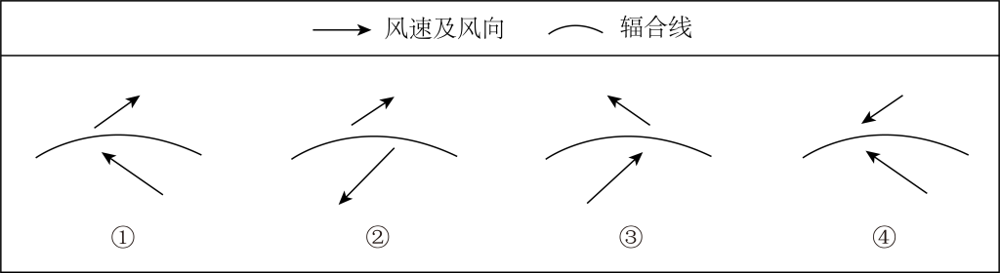

# 2025年山东高考地理真题 第10题

## 来源试卷

- [[01_试卷/2025年山东高考地理真题|2025年山东高考地理真题]]

## 关联知识主题

[[02_知识主题/大气的运动__常见天气系统|常见天气系统]]

## 细知识点

天气图判读、气旋

## 题目元信息

- 题型：single_choice
- 解析置信度：未知

## 题目材料

散度等值线垂直分布与暴雪天气材料题组。

## 题目

18日8时至20时，G地近地面出现由偏东风和偏南风两股气流形成的气旋式辐合线，该辐合线有利于暴雪天气的维持。下图中对该辐合线附近风场示意正确的是（   ）

### 选项

- A. ①
- B. ②
- C. ③
- D. ④

## 相关图片

## 答案

C

## 解析

题干说明近地面由偏东风和偏南风两股气流形成气旋式辐合线。该地位于北半球，气旋式辐合表现为逆时针辐合；偏南风受地转偏向力影响向右偏，偏东风也向右偏，二者共同指向低压槽式的辐合线。符合这一风场特征的是 C。

## 教学备注（预留）

- 易错点：
- 课堂提示：
- 讲解建议：
