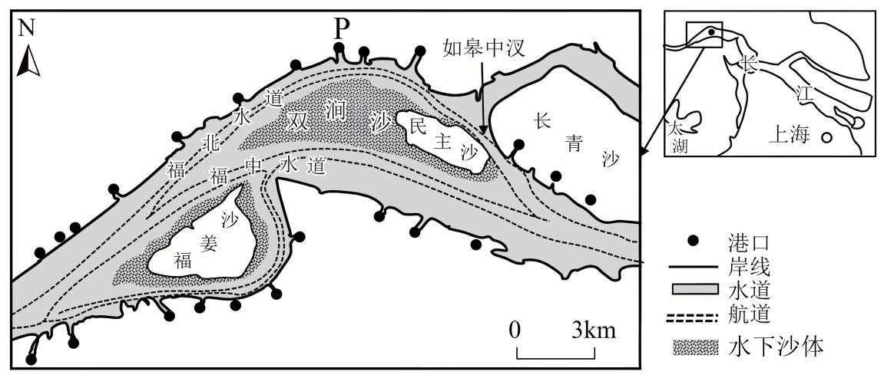

# 2025年山东高考地理真题 第15题

## 来源试卷

- [[01_试卷/2025年山东高考地理真题|2025年山东高考地理真题]]

## 关联知识主题

[[02_知识主题/交通运输布局与区域发展__区域发展对交通运输布局的影响|区域发展对交通运输布局的影响]] [[02_知识主题/自然灾害__地理信息技术在防灾减灾中的应用|地理信息技术在防灾减灾中的应用]]

## 细知识点

全球卫星导航系统、地理信息技术综合应用、技术因素与交通

## 题目元信息

- 题型：single_choice
- 解析置信度：未知

## 题目材料

内河航道、潮汐与船舶航行材料题组。

## 题目

船舶夜间航行时，使用北斗卫星导航系统的主要目的是（   ）

### 选项

- A. 监测流速
- B. 探测水深
- C. 测定流向
- D. 校正航向

## 相关图片

## 答案

D

## 解析

夜间航行时视线受限，船舶容易偏离航道。北斗卫星导航系统具有定位和导航功能，能够帮助船舶准确确定位置并校正航向，保证航行安全。北斗卫星导航系统不能直接监测流速、探测水深或测定流向。因此选 D。

## 教学备注（预留）

- 易错点：
- 课堂提示：
- 讲解建议：
