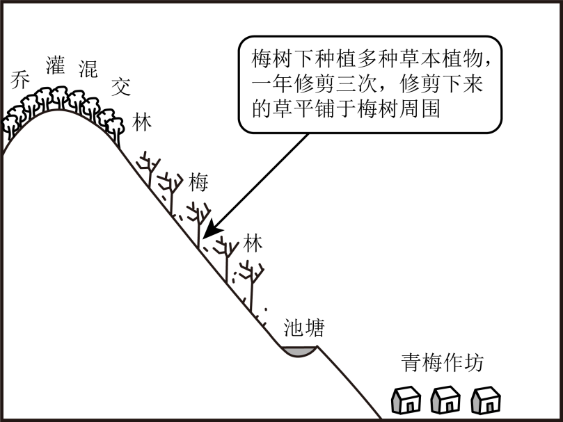

# 2025年山东高考地理真题 第16题

## 来源试卷

- [[01_试卷/2025年山东高考地理真题|2025年山东高考地理真题]]

## 关联知识主题

[[02_知识主题/产业区位因素__农业区位因素及其变化|农业区位因素及其变化]] [[02_知识主题/自然环境的整体性与差异性__自然环境的整体性|自然环境的整体性]]

## 细知识点

人类活动对自然环境整体性的影响、农业区位因素、农业地域类型、土壤形成、物质迁移、要素相互作用

## 题目元信息

- 题型：constructed_response
- 解析置信度：未知

## 题目材料

日本和歌山县某地区山地陡峭、土壤贫瘠。大约四百年前，人们开始尝试在山坡上种植青梅。经过长期发展，当地逐渐形成了稳定的集种植、加工、旅游等为一体的青梅复合生产系统（下图）。当地青梅有早、中、晚熟等品种，普遍具有皮薄、肉多、核小等优良特性，年产量占日本的一半。农户除出售鲜梅外，还将青梅加工成梅干等初级产品，并依托梅林开展赏花、采摘等活动。青梅复合生产系统为当地农户带来了稳定收入。

## 题目

阅读材料，完成下列要求。

### 小问

- （1）说明梅树下草本植物、乔灌混交林对梅林土壤养分维持所起的作用。
- （2）说明当地农户通过青梅复合生产系统能够获得稳定收入的原因。

## 相关图片

## 答案

- （1）梅树下草本植物起到固土作用，减少梅林土壤养分流失；乔灌混交林有利于保持水土，减轻地表径流对梅林表层土壤的侵蚀，减少梅林土壤养分流失；乔灌混交林下的土壤养分和有机质通过径流等方式输送至梅林土壤；修剪下来的草增加土壤有机质，有机质分解将养分归还梅林土壤。
- （2）该系统有利于减轻地质、气象等自然灾害的影响；青梅种植历史悠久，农户有管理经验，保障产量稳定；通过种植早、中、晚熟品种，错时收获，降低价格波动的影响；青梅品质优，市场认可度高，产品畅销；经营方式多样，产品多元，收益来源多，保障收入稳定。

## 解析

### （1）

梅树下草本植物中部分种类具有固氮作用，可增加土壤氮素；草本植物根系能固定表层土壤，减少坡地水土流失和养分流失；草本植物凋落物分解后可增加土壤有机质，改善土壤肥力。乔灌混交林中乔木根系较深，可吸收深层养分并通过落叶等方式带回表层，促进养分循环；树冠遮荫保湿，利于微生物活动和有机质分解；多样化凋落物丰富土壤养分来源；立体植被还能减轻风蚀、水蚀，减少养分流失。

### （2）

当地有早、中、晚熟品种，能延长青梅供应期，降低集中上市造成的价格波动风险；鲜梅加工成梅干等初级产品，提高附加值并延长销售周期；赏花、采摘等活动增加旅游收入；种植、加工、旅游多元经营可以分散单一市场风险；优良品种和较大产量增强市场竞争力；复合生产系统维持土壤肥力，保障青梅长期稳定生产。

## 教学备注（预留）

- 易错点：
- 课堂提示：
- 讲解建议：
