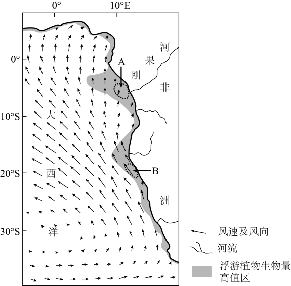
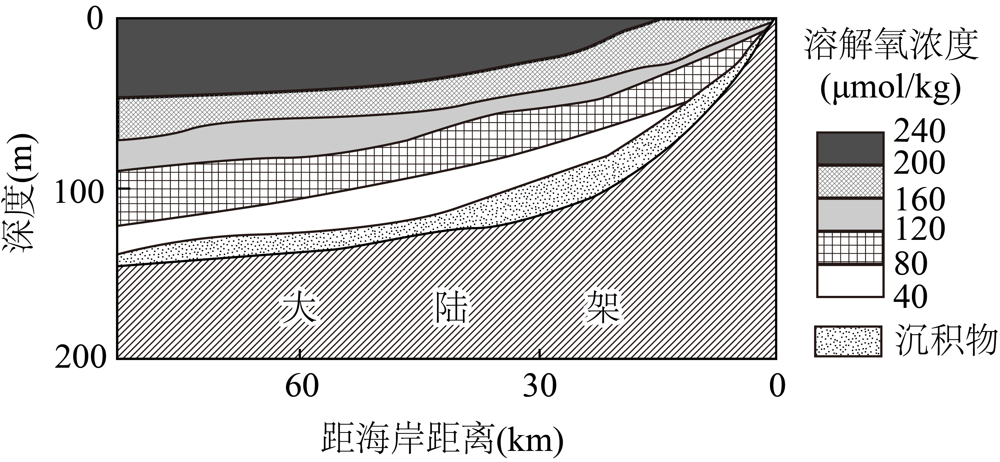

# 2025年山东高考地理真题 第18题

## 来源试卷

- [[01_试卷/2025年山东高考地理真题|2025年山东高考地理真题]]

## 关联知识主题

[[02_知识主题/水的运动__洋流|洋流]] [[02_知识主题/水的运动__海—气相互作用|海—气相互作用]]

## 细知识点

大气对海洋的影响、洋流对渔场的影响、海气热量交换、海气相互作用与气候异常、补偿流

## 题目元信息

- 题型：constructed_response
- 解析置信度：未知

## 题目材料

海水性质的水平分布与垂直变化受多种因素的影响。下图示意大西洋局部海域的风速、风向以及浮游植物生物量高值区。

## 题目

阅读图文材料，完成下列要求。

### 小问

- （1）营养盐是影响浮游植物生物量主要因素之一。A、B两海区营养盐含量均较高，但主导因素不同。分别指出导致A、B两海区营养盐含量较高的主导因素。
- （2）溶解氧是以分子形式存在于水体中的氧气。下图示意该海域沿23°S纬线局部断面溶解氧浓度的垂直变化。说明该断面底层海水溶解氧浓度低的主要原因。
- （3）某科研团队研究发现，全球变暖会导致该海域23°S附近海区信风增强，信风增强可能引起表层海水溶解氧浓度变化。从信风增强角度，推测该海区表层海水溶解氧浓度的可能变化，并说明理由。

## 相关图片

## 答案

- （1）A海区：河流径流；B海区：上升流。
- （2）断面海水底层光照条件差，海洋植物与光合细菌数量少，光合作用释放氧气少；与大气直接交换获得的氧气少；微生物等分解者分解大陆架表面沉积的有机物消耗氧气。
- （3）可能答案一：表层海水溶解氧浓度增加。理由：信风增强，表层海水混合加强，通过海-气界面进人到表层海水的氧气增多，溶解氧浓度增加；信风增强，上升流加强，将营养盐类带至海水表层，促进浮游植物生长，光合作用释放的氧气增多，表层海水溶解氧浓度增加。可能答案二：表层海水溶解氧浓度降低。理由：信风增强，上升流加强，将更多底层的低溶解氧海水带至表层，溶解氧浓度降低；信风增强，上升流加强，将营养盐类带至海水表层，表层动植物增加，呼吸作用消耗的氧气增多，表层海水溶解氧浓度降低。可能答案三：表层海水溶解氧浓度变化结果不确定。理由：信风增强，表层海水混合加强，通过海-气界面进人到表层海水的氧气增多，溶解氧浓度增加；信风增强，上升流加强，将营养盐类带至海水表层，促进浮游植物生长，光合作用释放的氧气增多，表层海水溶解氧浓度增加。另一方面，信风增强，上升流加强，导致海水表层动植物增加，生物的呼吸作用增强，消耗氧气增多，表层海水溶解氧浓度降低；信风增强，上升流加强，将更多底层的低溶解氧海水带至表层，海水溶解氧浓度降低。上述两方面对表层海水溶解氧浓度的综合影响导致变化结果不确定。

## 解析

### （1）

A 海区位于刚果河入海口附近，刚果河入海径流携带丰富陆源营养盐，使该海区营养盐含量较高。B 海区位于非洲西岸，受东南信风影响，离岸风驱动表层海水离岸运动，深层冷海水上升补偿，把深层营养盐带到表层，因此营养盐含量较高。

### （2）

底层海水不能直接从大气中获得氧气补充；深水区光照弱，绿色植物少，光合作用产生的氧气少；海底沉积物、有机碎屑和生物残体分解会消耗溶解氧；表层海水温度较高、密度较小，水体分层明显，表层与深层海水交换弱，导致底层溶解氧浓度低。

### （3）

本小问为开放性设问，表层海水溶解氧浓度可能有三种合理判断。可能增加：信风增强使表层海水混合加强，海气交换增强，大气中的氧气更易进入表层海水；同时上升流增强，把营养盐带至表层，促进浮游植物生长，光合作用释放氧气增多。可能降低：信风增强使上升流加强，更多底层低溶解氧海水被带至表层；营养盐增加后表层生物量上升，生物呼吸作用增强，也会消耗更多氧气。也可能变化结果不确定：信风增强一方面通过海气交换和光合作用增加溶解氧，另一方面通过低氧深层水上泛和生物呼吸消耗降低溶解氧，两类作用方向相反，综合结果取决于哪一类作用占主导。

## 教学备注（预留）

- 易错点：
- 课堂提示：
- 讲解建议：
