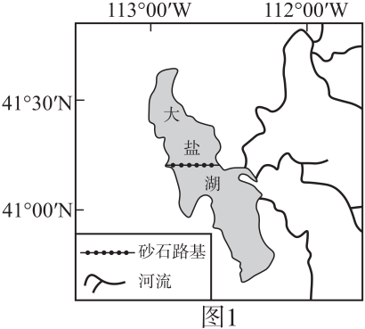
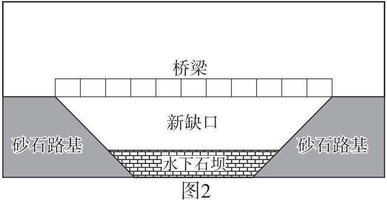

# 2025年山东高考地理真题 第2题

## 来源试卷

- [[01_试卷/2025年山东高考地理真题|2025年山东高考地理真题]]

## 关联知识主题

[[02_知识主题/水的运动__陆地水体及其相互关系|陆地水体及其相互关系]]

## 细知识点

水位变化、湖泊水

## 题目元信息

- 题型：single_choice
- 解析置信度：未知

## 题目材料

美国大盐湖材料题组。

## 题目

2016年挖开新缺口对大盐湖产生的影响是（   ）

### 选项

- A. 增加入湖地表径流
- B. 缩小南北湾之间水位差
- C. 增加北湾湖水盐度
- D. 减小南湾湖床出露面积

## 相关图片

## 答案

B

## 解析

砂石路基把大盐湖分成南、北两湾，南湾有淡水河流注入，水位较高、盐度较低；北湾无淡水流入，蒸发强，水位较低、盐度较高。2016 年挖开新缺口后，两湾水体能够交换，南湾水体流向北湾，使南北湾水位差缩小。新缺口不增加外部入湖径流，也不会提高北湾盐度；南湾水位可能下降，湖床出露面积可能增加。因此选 B。

## 教学备注（预留）

- 易错点：
- 课堂提示：
- 讲解建议：
