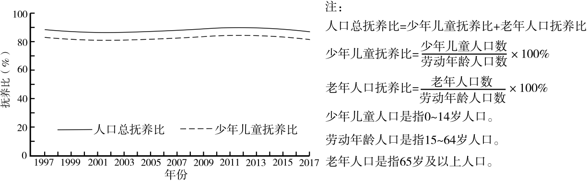

# 2025年山东高考地理真题 第7题

## 来源试卷

- [[01_试卷/2025年山东高考地理真题|2025年山东高考地理真题]]

## 关联知识主题

[[02_知识主题/人口__人口数量变化|人口数量变化]] [[02_知识主题/人口__人口结构|人口结构]]

## 细知识点

人口增长的地区差异、人口老龄化、人口问题

## 题目元信息

- 题型：single_choice
- 解析置信度：未知

## 题目材料

某人口大国1997~2017年人口抚养比变化图题组。

## 题目

1997~2017年，该国（   ）

### 选项

- A. 老年人口数量保持稳定
- B. 劳动年龄人口数量有所下降
- C. 老年人口比重不断增加
- D. 劳动年龄人口比重变化较小

## 相关图片

## 答案

D

## 解析

根据图示，该国人口总抚养比、少年儿童抚养比以及由二者差值得出的老年人口抚养比变化幅度均较小，说明少年儿童、劳动年龄人口、老年人口的比重变化都不大。该国仍属于年轻型人口结构，人口数量持续增长，因此各年龄组人口数量并非保持稳定或下降。因此选 D。

## 教学备注（预留）

- 易错点：
- 课堂提示：
- 讲解建议：
