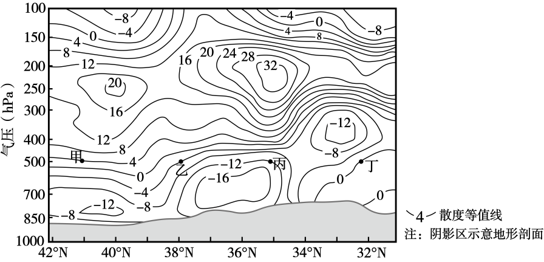

# 2025年山东高考地理真题 第9题

## 来源试卷

- [[01_试卷/2025年山东高考地理真题|2025年山东高考地理真题]]

## 关联知识主题

[[02_知识主题/大气的运动__常见天气系统|常见天气系统]]

## 细知识点

天气图判读、锋面天气

## 题目元信息

- 题型：single_choice
- 解析置信度：未知

## 题目材料

散度等值线垂直分布与暴雪天气材料题组。

## 题目

推测18日8时，暴雪天气最可能出现在图所示（   ）

### 选项

- A. 33°N附近
- B. 36°N附近
- C. 38°N附近
- D. 40°N附近

## 相关图片

## 答案

B

## 解析

36°N 附近低空存在明显辐合，高空存在明显辐散，形成低空汇聚、高空流出的垂直运动配置，有利于气流上升和强降水天气发展。33°N、38°N、40°N 附近低空与高空配置不如 36°N 附近有利。因此暴雪天气最可能出现在 36°N 附近，选 B。

## 教学备注（预留）

- 易错点：
- 课堂提示：
- 讲解建议：
