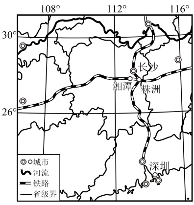

# 2025年安徽高考地理真题 · 综合题第17题（小问1–3）

## 来源
- 来源文档：精品解析：2025年安徽高考地理真题（解析版）
- 题号：第17题（非选择题，共3小问）

## 题组材料
17. 阅读图文材料，完成下列要求。

湘潭市是一座重要的钢铁工业城市。近年来该市积极转变发展思路，以"锰矿+锂云母"资源为基础，瞄准东部沿海地区新能源汽车及相关产业转移的机遇，通过"整车+电池+研发"全产业链布局，实施"链式承接"；同时与深圳高校共建异地联合实验室，将沿海地区研发成果在湘潭市孵化。下图示意湘潭市地理位置。

## 相关图片


### 第17题（1）
question_id: `2025-安徽-地理-2025年安徽高考地理真题-Q17-1`

**题干**：（1）分析湘潭市围绕新能源汽车产业实施链式承接的地理位置优势。

**答案**：湘潭市靠近长沙，地处长株潭城市群，产业协同便利；距东部沿海地区适中，便于承接产业转移；有铁路等交通线，利于要素流通。

**解析**：本题考查地理位置对产业承接的优势，从区域协同、距转移地距离、交通等分析。根据材料"湘潭市地理位置"及区域常识，湘潭靠近长沙，长株潭城市群产业联系紧密，利于协同发展；其距东部沿海产业转出地距离合适，便于承接新能源汽车产业转移；图中及材料隐含交通信息（铁路等），交通便利利于产业要素（如人才、物资、资金）的流通，保障产业链各环节高效衔接。

**知识点归属**：
- **核心考点 · 权重 1.0**：区域发展 → 区际联系与区域协调发展 → 产业转移
- **支撑知识 · 权重 0.7**：人文地理 → 交通运输与区域发展 → 交通运输布局对区域发展的影响
- **支撑知识 · 权重 0.7**：区域发展 → 区际联系与区域协调发展 → 区域协调发展

**整体置信度**：高

<!-- MANAGED-KM-START Q17-1
```yaml
question_id: "2025-安徽-地理-2025年安徽高考地理真题-Q17-1"
question_number: 17
sub_question: 1
knowledge_points:
  - role: core_exam_point
    weight: 1.0
    domain_id: DM-REG
    domain: "区域发展"
    theme_id: TH-REG-INTERREGION
    theme: "区际联系与区域协调发展"
    knowledge_unit_id: KU-REG-INTERREGION-003
    knowledge_unit: "产业转移"
    evidence: "湘潭与东部沿海产业转出地距离适中，并位于长株潭城市群，便于承接新能源汽车产业及其链条。"
  - role: supporting_knowledge
    weight: 0.7
    domain_id: DM-HUM
    domain: "人文地理"
    theme_id: TH-HUM-TRANSPORT
    theme: "交通运输与区域发展"
    knowledge_unit_id: KU-HUM-TRA-002
    knowledge_unit: "交通运输布局对区域发展的影响"
    evidence: "铁路等交通线促进人才、物资和资金流动，保障产业链各环节高效衔接。"
  - role: supporting_knowledge
    weight: 0.7
    domain_id: DM-REG
    domain: "区域发展"
    theme_id: TH-REG-INTERREGION
    theme: "区际联系与区域协调发展"
    knowledge_unit_id: KU-REG-INTERREGION-005
    knowledge_unit: "区域协调发展"
    evidence: "靠近长沙并处于长株潭城市群，使湘潭能够利用城市群内部产业联系开展协同承接。"
extra_tags:
  - "链式承接"
  - "城市群产业协同"
taxonomy_version: "config-v0.2-draft"
confidence: "high"
label_status: "completed"
needs_review: false
taxonomy_review:
  needs_review: false
  issue_type: "none"
  review_note: ""
note: ""
```
-->

### 第17题（2）
question_id: `2025-安徽-地理-2025年安徽高考地理真题-Q17-2`

**题干**：（2）从产业关联的角度，为湘潭市新能源汽车产业链式承接提出针对性策略，并简要说明理由。

**答案**：策略：依托"锰矿+锂云母"资源，发展电池原材料产业。理由：新能源汽车产业需大量电池，原材料产业是产业链基础，可降低成本、保障供应。

**解析**：本题从产业关联（产业链上下游联系）提策略，结合本地资源分析。材料明确提到湘潭以"锰矿+锂云母"资源为基础发展新能源汽车产业。新能源汽车产业的核心部件是电池，而电池生产依赖锰、锂等原材料。依托本地丰富的"锰矿+锂云母"资源，发展电池原材料产业，能成为新能源汽车产业链的上游基础环节。这样做一方面可降低从外地采购原材料的成本，另一方面能保障电池生产的原材料供应稳定，强化产业链的关联性与完整性，促进新能源汽车产业集群发展。

**知识点归属**：
- **核心考点 · 权重 1.0**：人文地理 → 产业区位 → 工业区位因素
- **支撑知识 · 权重 0.7**：区域发展 → 区域发展的条件 → 自然资源与区域发展

**整体置信度**：高

<!-- MANAGED-KM-START Q17-2
```yaml
question_id: "2025-安徽-地理-2025年安徽高考地理真题-Q17-2"
question_number: 17
sub_question: 2
knowledge_points:
  - role: core_exam_point
    weight: 1.0
    domain_id: DM-HUM
    domain: "人文地理"
    theme_id: TH-HUM-INDUSTRY
    theme: "产业区位"
    knowledge_unit_id: KU-HUM-IND-002
    knowledge_unit: "工业区位因素"
    evidence: "利用本地锰矿和锂云母发展电池原材料产业，可强化上下游产业关联、降低运输采购成本并保障供应。"
  - role: supporting_knowledge
    weight: 0.7
    domain_id: DM-REG
    domain: "区域发展"
    theme_id: TH-REG-CONDITION
    theme: "区域发展的条件"
    knowledge_unit_id: KU-REG-CONDITION-002
    knowledge_unit: "自然资源与区域发展"
    evidence: "锰矿和锂云母资源为湘潭布局电池材料这一产业链上游环节提供本地资源基础。"
extra_tags:
  - "产业链上下游关联"
  - "新能源汽车电池材料"
taxonomy_version: "config-v0.2-draft"
confidence: "high"
label_status: "completed"
needs_review: false
taxonomy_review:
  needs_review: false
  issue_type: "none"
  review_note: ""
note: ""
```
-->

### 第17题（3）
question_id: `2025-安徽-地理-2025年安徽高考地理真题-Q17-3`

**题干**：（3）从创新发展的视角，为湘潭市新能源汽车产业高质量发展提出建议。

**答案**：建议：深化与深圳高校合作，完善异地联合实验室功能，加速研发成果转化；培育本地创新人才，打造产业创新平台，推动技术迭代。

**解析**：本题从创新发展（技术、人才、平台）提建议，结合材料中"与深圳高校共建异地联合实验室"分析。材料提及湘潭与深圳高校共建异地联合实验室，将沿海研发成果在湘潭孵化。在此基础上，深化合作可进一步完善实验室功能，比如拓展研发领域（如电池新技术、整车智能化）、优化成果转化流程（加快从实验室到产业化的速度），让沿海先进研发成果更高效地在湘潭落地应用。同时，本地创新人才是产业持续创新的根基，需培育本地创新人才（如与本地高校合作培养新能源汽车专业人才），并打造产业创新平台（如新能源汽车产业研究院、企业技术中心），汇聚各方创新力量，推动技术迭代升级，提升产业核心竞争力。

**知识点归属**：
- **核心考点 · 权重 1.0**：区域发展 → 产业结构变化与区域发展 → 产业结构的升级
- **支撑知识 · 权重 0.7**：区域发展 → 区际联系与区域协调发展 → 区域协调发展

**整体置信度**：高

<!-- MANAGED-KM-START Q17-3
```yaml
question_id: "2025-安徽-地理-2025年安徽高考地理真题-Q17-3"
question_number: 17
sub_question: 3
knowledge_points:
  - role: core_exam_point
    weight: 1.0
    domain_id: DM-REG
    domain: "区域发展"
    theme_id: TH-REG-INDUSTRY
    theme: "产业结构变化与区域发展"
    knowledge_unit_id: KU-REG-INDUSTRY-002
    knowledge_unit: "产业结构的升级"
    evidence: "通过联合实验室、成果转化、人才培养和创新平台推动技术迭代，可提升新能源汽车产业技术层级与竞争力。"
  - role: supporting_knowledge
    weight: 0.7
    domain_id: DM-REG
    domain: "区域发展"
    theme_id: TH-REG-INTERREGION
    theme: "区际联系与区域协调发展"
    knowledge_unit_id: KU-REG-INTERREGION-005
    knowledge_unit: "区域协调发展"
    evidence: "湘潭与深圳高校跨区域共建实验室并承接研发成果，体现创新资源协同与成果转化。"
extra_tags:
  - "异地联合实验室"
  - "创新成果孵化"
  - "产业创新平台"
taxonomy_version: "config-v0.2-draft"
confidence: "high"
label_status: "completed"
needs_review: false
taxonomy_review:
  needs_review: false
  issue_type: "none"
  review_note: ""
note: ""
```
-->

## 教学备注
<!-- TEACHER-NOTES-START -->
- 易错点：
- 课堂提示：
- 讲解建议：
<!-- TEACHER-NOTES-END -->
