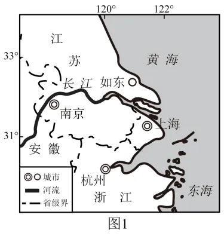
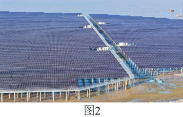
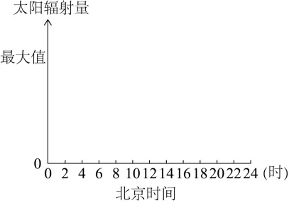
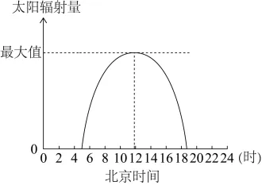

# 2025年安徽高考地理真题 · 综合题第18题（小问1–3）

## 来源
- 来源文档：精品解析：2025年安徽高考地理真题（解析版）
- 题号：第18题（非选择题，共3小问）

## 题组材料
18. 阅读图文材料，完成下列要求。

5月某日，天气晴朗，某研学小组在江苏如东"光氢储一体化"海上光伏示范项目基地开展研学活动。当地利用大面积的滩涂，建设集海上光伏发电、制氢加氢和储能电站于一体的综合性项目，实现绿电就地消纳、转化应用。图1示意如东地理位置，图2为光伏项目景观照片。

研学活动一　太阳高度角对太阳辐射的影响研究

研学活动二　光氢储一体化的必要性研究

研学活动三　光伏项目带来的生态价值研究

## 相关图片




### 第18题（1）
question_id: `2025-安徽-地理-2025年安徽高考地理真题-Q18-1`

**题干**：（1）研学小组利用传感器测量当天到达地表太阳辐射量日变化。请在下图中用平滑曲线画出预期实验结果示意图。



**答案**：（作图题，预期曲线的关键特征：在地方时12时达到最大值；日出前、日落后太阳辐射量为0；曲线大致以地方时12时为中心呈对称钟形分布）



**解析**：由图可知，如东大约位于121°E，地方时比北京时间（120°E的地方时）早4分钟。5月份晴朗的一天，昼长夜短，日出在地方时6点之前，日落在地方时18点之后，正午太阳高度最大，太阳辐射最强，故太阳辐射量在地方时12点达最大值，如东地方时12点对应北京时间11：56。

**知识点归属**：
- **核心考点 · 权重 1.0**：自然地理 → 地球的宇宙环境 → 太阳辐射及其对地球的影响
- **支撑知识 · 权重 0.7**：自然地理 → 地球的运动 → 正午太阳高度的变化
- **支撑知识 · 权重 0.7**：自然地理 → 地球的运动 → 昼夜长短的变化

**整体置信度**：高

<!-- MANAGED-KM-START Q18-1
```yaml
question_id: "2025-安徽-地理-2025年安徽高考地理真题-Q18-1"
question_number: 18
sub_question: 1
knowledge_points:
  - role: core_exam_point
    weight: 1.0
    domain_id: DM-NAT
    domain: "自然地理"
    theme_id: TH-NAT-UNIVERSE
    theme: "地球的宇宙环境"
    knowledge_unit_id: KU-NAT-UNIVERSE-002
    knowledge_unit: "太阳辐射及其对地球的影响"
    evidence: "晴天到达地表的太阳辐射随太阳高度增大而增强、随太阳高度减小而减弱，形成日变化曲线。"
  - role: supporting_knowledge
    weight: 0.7
    domain_id: DM-NAT
    domain: "自然地理"
    theme_id: TH-NAT-EARTH-MOTION
    theme: "地球的运动"
    knowledge_unit_id: KU-NAT-EARTH-MOTION-007
    knowledge_unit: "正午太阳高度的变化"
    evidence: "地方时12时正午太阳高度最大，因此曲线在如东当地正午附近达到峰值。"
  - role: supporting_knowledge
    weight: 0.7
    domain_id: DM-NAT
    domain: "自然地理"
    theme_id: TH-NAT-EARTH-MOTION
    theme: "地球的运动"
    knowledge_unit_id: KU-NAT-EARTH-MOTION-006
    knowledge_unit: "昼夜长短的变化"
    evidence: "5月北半球昼长夜短，日出早于6时、日落晚于18时，限定曲线大于零的时间范围。"
extra_tags:
  - "太阳辐射日变化作图"
  - "太阳高度与辐射强度"
taxonomy_version: "config-v0.2-draft"
confidence: "high"
label_status: "completed"
needs_review: false
taxonomy_review:
  needs_review: false
  issue_type: "none"
  review_note: ""
note: ""
```
-->

### 第18题（2）
question_id: `2025-安徽-地理-2025年安徽高考地理真题-Q18-2`

**题干**：（2）分析该项目实施光氢储一体化的必要性。

**答案**：受太阳辐射变化的影响，光伏发电不稳定；制氢可以消纳光电；储能电站可以储存氢能和光电。

**解析**：太阳辐射受季节变化、天气变化等影响，不稳定，而光伏发电依赖太阳辐射，故光伏发电不稳定，光电充足时需要及时存储或消纳，而制氢可以消纳多余的电力，并形成氢能；储能电站建设可以及时储存氢能和多余的光电，该项目有必要实施光氢储一体化。

**知识点归属**：
- **核心考点 · 权重 1.0**：资源、环境与国家安全 → 资源安全 → 能源安全
- **支撑知识 · 权重 0.7**：自然地理 → 地球的宇宙环境 → 太阳辐射及其对地球的影响

**整体置信度**：高

<!-- MANAGED-KM-START Q18-2
```yaml
question_id: "2025-安徽-地理-2025年安徽高考地理真题-Q18-2"
question_number: 18
sub_question: 2
knowledge_points:
  - role: core_exam_point
    weight: 1.0
    domain_id: DM-RES
    domain: "资源、环境与国家安全"
    theme_id: TH-RES-RES
    theme: "资源安全"
    knowledge_unit_id: KU-RES-RES-002
    knowledge_unit: "能源安全"
    evidence: "制氢与储能可消纳和储存波动的光伏电力，提高新能源供给的稳定性与利用效率。"
  - role: supporting_knowledge
    weight: 0.7
    domain_id: DM-NAT
    domain: "自然地理"
    theme_id: TH-NAT-UNIVERSE
    theme: "地球的宇宙环境"
    knowledge_unit_id: KU-NAT-UNIVERSE-002
    knowledge_unit: "太阳辐射及其对地球的影响"
    evidence: "太阳辐射随昼夜、季节和天气变化，导致依赖太阳辐射的光伏发电具有间歇性和波动性。"
extra_tags:
  - "光氢储一体化"
  - "新能源消纳与储能"
taxonomy_version: "config-v0.2-draft"
confidence: "high"
label_status: "completed"
needs_review: false
taxonomy_review:
  needs_review: false
  issue_type: "none"
  review_note: ""
note: ""
```
-->

### 第18题（3）
question_id: `2025-安徽-地理-2025年安徽高考地理真题-Q18-3`

**题干**：（3）研学小组想从碳减排角度了解该光伏项目带来的生态价值，计划访谈相关生态环境专家，请为他们拟一份访谈提纲（要求至少列出3条）。

**答案**：一、光伏项目的发电功能对碳减排的影响；二、光伏项目对所在区域碳储量（生态系统）的影响；三、该地的生态环境现状及光伏项目的碳减排预期效果等。

**解析**：从碳减排角度了解该光伏项目带来的生态价值，结合生态环境专家的专业素养，列出访谈提纲。光伏项目具有发电功能，可请教专家光电的使用对碳减排的影响；光伏面板对所在地的土壤等形成了遮阴环境，改变了植被的生长环境，可请教专家，光伏项目对所在区域碳储量（生态系统）的影响；该项目的生态价值需要结合该地生态环境现状进行评价，可请专家谈谈该地生态环境现状及该光伏项目可能取得的生态价值等。

**知识点归属**：
- **核心考点 · 权重 1.0**：人文地理 → 地理调查与实践 → 地理调查方案设计
- **支撑知识 · 权重 0.7**：资源、环境与国家安全 → 环境安全 → 全球气候变化与国家安全
- **支撑知识 · 权重 0.7**：资源、环境与国家安全 → 资源环境与人类社会 → 自然环境的服务功能

**整体置信度**：高

<!-- MANAGED-KM-START Q18-3
```yaml
question_id: "2025-安徽-地理-2025年安徽高考地理真题-Q18-3"
question_number: 18
sub_question: 3
knowledge_points:
  - role: core_exam_point
    weight: 1.0
    domain_id: DM-HUM
    domain: "人文地理"
    theme_id: TH-HUM-GEOPRACTICE
    theme: "地理调查与实践"
    knowledge_unit_id: KU-HUM-PRACTICE-001
    knowledge_unit: "地理调查方案设计"
    evidence: "访谈提纲需要围绕碳减排目标确定专家访谈主题，覆盖发电减排、生态系统碳储量和项目预期效果。"
  - role: supporting_knowledge
    weight: 0.7
    domain_id: DM-RES
    domain: "资源、环境与国家安全"
    theme_id: TH-RES-ENV
    theme: "环境安全"
    knowledge_unit_id: KU-RES-ENV-004
    knowledge_unit: "全球气候变化与国家安全"
    evidence: "评估光伏替代传统能源所减少的碳排放，是访谈中判断气候减缓效益的关键内容。"
  - role: supporting_knowledge
    weight: 0.7
    domain_id: DM-RES
    domain: "资源、环境与国家安全"
    theme_id: TH-RES-SOC
    theme: "资源环境与人类社会"
    knowledge_unit_id: KU-RES-SOC-001
    knowledge_unit: "自然环境的服务功能"
    evidence: "访谈还需调查项目对区域生态系统碳储量及其他生态价值的影响。"
extra_tags:
  - "专家访谈提纲"
  - "光伏项目碳减排评价"
taxonomy_version: "config-v0.2-draft"
confidence: "high"
label_status: "completed"
needs_review: false
taxonomy_review:
  needs_review: false
  issue_type: "none"
  review_note: ""
note: ""
```
-->

## 教学备注
<!-- TEACHER-NOTES-START -->
- 易错点：
- 课堂提示：
- 讲解建议：
<!-- TEACHER-NOTES-END -->
