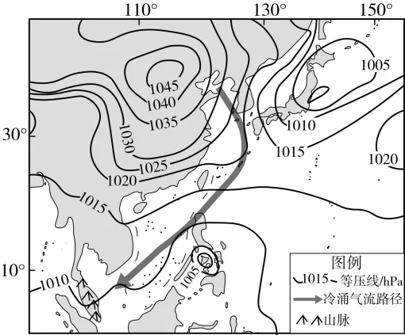

# 2025年安徽高考地理真题 · 综合题第19题（小问1–3）

## 来源
- 来源文档：精品解析：2025年安徽高考地理真题（解析版）
- 题号：第19题（非选择题，共3小问）

## 题组材料
19. 阅读图文材料，完成下列要求。

通常把中高纬大陆冷空气突然向南爆发，南海一带东北风迅速加强的现象称为"冷涌"。2021年12月15—20日，南海一带经历了一次强冷涌过程，马来西亚出现了持续性强降雨天气。下图表示北京时间12月17日8时海平面等压线分布，图中箭头示意此次冷涌气流移动路径。

## 相关图片


### 第19题（1）
question_id: `2025-安徽-地理-2025年安徽高考地理真题-Q19-1`

**题干**：（1）说明此次冷涌形成的动力条件。

**答案**：①蒙古—西伯利亚地区受强烈冷却，形成强盛的冷高压（亚洲高压），冷高压势力强大，冷空气堆积，气压梯度大，为冷空气南下提供强大动力；②冷高压南侧等压线密集，水平气压梯度力大，促使冷空气快速向南爆发；③冷空气向南移动过程中，受地转偏向力影响，逐渐形成偏北风，沿着亚洲东部的地形通道南下，加速冷涌的推进。

**解析**：冷涌形成的动力条件需从气压系统、气压梯度力和地转偏向力等角度分析。冬季，中高纬地区因太阳辐射减弱，地面强烈冷却，在蒙古—西伯利亚地区形成冷高压，这是冷空气的源地。冷高压与周边地区形成较大的气压差异，气压梯度大，使得冷空气具有向南移动的趋势。等压线密集程度反映水平气压梯度力大小，冷高压南侧等压线密集，水平气压梯度力大，推动冷空气快速向南移动。同时，在地转偏向力作用下，北半球水平运动物体向右偏转，冷空气逐渐转为偏北风，并且亚洲东部的地形相对平坦开阔，有利于冷空气沿着通道快速南下，形成冷涌。

**知识点归属**：
- **核心考点 · 权重 1.0**：自然地理 → 大气 → 大气的水平运动
- **支撑知识 · 权重 0.7**：自然地理 → 大气 → 气旋与反气旋
- **支撑知识 · 权重 0.7**：自然地理 → 地球的运动 → 地转偏向力

**整体置信度**：高

<!-- MANAGED-KM-START Q19-1
```yaml
question_id: "2025-安徽-地理-2025年安徽高考地理真题-Q19-1"
question_number: 19
sub_question: 1
knowledge_points:
  - role: core_exam_point
    weight: 1.0
    domain_id: DM-NAT
    domain: "自然地理"
    theme_id: TH-NAT-ATMOSPHERE
    theme: "大气"
    knowledge_unit_id: KU-NAT-ATM-HEAT-006
    knowledge_unit: "大气的水平运动"
    evidence: "冷高压南侧等压线密集形成较大水平气压梯度力，直接推动冷空气快速向南爆发。"
  - role: supporting_knowledge
    weight: 0.7
    domain_id: DM-NAT
    domain: "自然地理"
    theme_id: TH-NAT-ATMOSPHERE
    theme: "大气"
    knowledge_unit_id: KU-NAT-ATM-CIRC-002
    knowledge_unit: "气旋与反气旋"
    evidence: "蒙古—西伯利亚强冷高压是冷空气堆积和向外输送的气压系统背景。"
  - role: supporting_knowledge
    weight: 0.7
    domain_id: DM-NAT
    domain: "自然地理"
    theme_id: TH-NAT-EARTH-MOTION
    theme: "地球的运动"
    knowledge_unit_id: KU-NAT-EARTH-MOTION-005
    knowledge_unit: "地转偏向力"
    evidence: "北半球地转偏向力使南下冷空气运动方向偏转并形成偏北风。"
extra_tags:
  - "冷涌动力条件"
  - "亚洲高压"
taxonomy_version: "config-v0.2-draft"
confidence: "high"
label_status: "completed"
needs_review: false
taxonomy_review:
  needs_review: false
  issue_type: "none"
  review_note: ""
note: ""
```
-->

### 第19题（2）
question_id: `2025-安徽-地理-2025年安徽高考地理真题-Q19-2`

**题干**：（2）指出冷涌南下过程中气流温湿性质的变化，并运用海—气相互作用原理解其变化原因。

**答案**：变化：气流温度升高，湿度增大。

原因：冷涌气流南下过程中，海面温度高于冷空气温度，海洋向大气输送热量，通过热传导的方式使冷空气增温；海洋表面水分蒸发，水汽进入冷空气中，使冷空气湿度增大，且冷空气受海洋加热后，空气对流运动增强，进一步促进水汽的输送和混合，导致冷涌气流湿度增加。

**解析**：海—气相互作用中，热量和水汽交换是关键。南海海域纬度较低，冬季海面温度相对较高，而冷涌气流来自中高纬度地区，温度较低；当冷涌气流南下经过南海时，冷的空气与暖的海面接触，根据热传递原理，热量从高温的海洋传递到低温的冷空气，使冷空气温度升高；同时，海洋表面存在持续的水分蒸发过程，水汽不断进入冷空气中，增加了空气的水汽含量。此外，冷空气受热后，空气密度减小，产生对流运动，使得水汽在垂直和水平方向上得到更充分的混合和输送，从而进一步增大了冷涌气流的湿度。

**知识点归属**：
- **核心考点 · 权重 1.0**：自然地理 → 水文与海洋 → 海—气相互作用

**整体置信度**：高

<!-- MANAGED-KM-START Q19-2
```yaml
question_id: "2025-安徽-地理-2025年安徽高考地理真题-Q19-2"
question_number: 19
sub_question: 2
knowledge_points:
  - role: core_exam_point
    weight: 1.0
    domain_id: DM-NAT
    domain: "自然地理"
    theme_id: TH-NAT-WATER
    theme: "水文与海洋"
    knowledge_unit_id: KU-NAT-WATER-006
    knowledge_unit: "海—气相互作用"
    evidence: "冷空气经过较暖南海时，海洋向大气输送热量和水汽，使冷涌气流温度升高、湿度增大。"
extra_tags:
  - "海气热量交换"
  - "海气水汽交换"
taxonomy_version: "config-v0.2-draft"
confidence: "high"
label_status: "completed"
needs_review: false
taxonomy_review:
  needs_review: false
  issue_type: "none"
  review_note: ""
note: ""
```
-->

### 第19题（3）
question_id: `2025-安徽-地理-2025年安徽高考地理真题-Q19-3`

**题干**：（3）结合材料，分析马来西亚此次强降雨的成因。

**答案**：①冷涌带来的冷空气与当地暖湿空气相遇，形成冷暖气团交汇，暖湿空气被迫抬升，水汽冷却凝结形成降水；②冷涌气流势力强，推动暖湿空气强烈上升，垂直上升运动显著，水汽快速凝结成云致雨，降水强度大；③冷涌持续时间较长（12月15—20日），使得暖湿空气持续抬升，降水持续时间长，累计降水量大。

**解析**：降雨的形成需要水汽、上升气流和冷却凝结条件。此次冷涌带来的冷空气南下，与马来西亚当地原本的暖湿空气相遇，冷暖气团交汇形成锋面，暖湿空气密度小，在冷空气的推动下被迫抬升；随着高度升高，气温降低，水汽冷却凝结形成降水。冷涌气流势力强大，促使暖湿空气强烈上升，垂直上升运动越强烈，水汽凝结速度越快，降水强度也就越大。而且此次冷涌过程从12月15—20日，持续时间长达6天，在这段时间内，暖湿空气持续被冷空气抬升，不断有水汽冷却凝结，从而形成持续性的强降雨天气，累计降水量大。

**知识点归属**：
- **核心考点 · 权重 1.0**：自然地理 → 大气 → 锋与天气
- **支撑知识 · 权重 0.7**：自然地理 → 水文与海洋 → 海—气相互作用

**整体置信度**：高

<!-- MANAGED-KM-START Q19-3
```yaml
question_id: "2025-安徽-地理-2025年安徽高考地理真题-Q19-3"
question_number: 19
sub_question: 3
knowledge_points:
  - role: core_exam_point
    weight: 1.0
    domain_id: DM-NAT
    domain: "自然地理"
    theme_id: TH-NAT-ATMOSPHERE
    theme: "大气"
    knowledge_unit_id: KU-NAT-ATM-CIRC-001
    knowledge_unit: "锋与天气"
    evidence: "冷涌冷空气与马来西亚暖湿空气交汇，暖湿空气被迫持续抬升、冷却凝结，形成持续性强降雨。"
  - role: supporting_knowledge
    weight: 0.7
    domain_id: DM-NAT
    domain: "自然地理"
    theme_id: TH-NAT-WATER
    theme: "水文与海洋"
    knowledge_unit_id: KU-NAT-WATER-006
    knowledge_unit: "海—气相互作用"
    evidence: "冷涌越过南海时从海面获得热量和水汽，为马来西亚强降雨持续提供充足暖湿条件。"
extra_tags:
  - "冷涌降雨"
  - "持续性强降水成因"
taxonomy_version: "config-v0.2-draft"
confidence: "high"
label_status: "completed"
needs_review: false
taxonomy_review:
  needs_review: false
  issue_type: "none"
  review_note: ""
note: ""
```
-->

## 教学备注
<!-- TEACHER-NOTES-START -->
- 易错点：
- 课堂提示：
- 讲解建议：
<!-- TEACHER-NOTES-END -->
