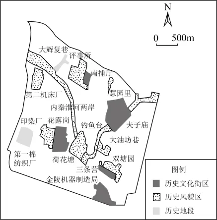

# 2025年安徽高考地理真题 · 选择题题组 G3（第6–8题）

## 来源
- 来源文档：精品解析：2025年安徽高考地理真题（解析版）
- 题号：第6–8题（选择题，共3小题）

## 题组材料
老城南地区位于南京市内城南部，经过持续更新改造，已成为城市新名片。下图示意老城南地区历史要素的空间分布，下表为老城南地区四种更新方式及案例。据此完成下面小题。

| 更新方式 | 案例 |
| --- | --- |
| 复建仿古建筑群；历史文化空间的繁体仿真 | 夫子庙 |
| 复原传统民居，发展时尚餐饮、文博展览、文旅节庆等产业 | 老门东 |
| 改造工业遗址，创新多元化的文创业态 | 新门西文化生态创意园 |
| 利用闲置名人故居、游园绿地等创建公共阅读休憩空间 | "转角·遇见"系列空间 |

## 相关图片


## 第6题
question_id: `2025-安徽-地理-2025年安徽高考地理真题-Q6`

**题干**：6. 老城南更新成为商贸文旅区的主要优势条件是（   ）

**选项**：
- A. 位于城市中心，位置优越
- B. 文化底蕴深厚，特色鲜明
- C. 位于老旧城区，地价较低
- D. 发展历史悠久，商贸发达

**答案**：B

**解析**：根据材料可知，老城南地区有众多历史要素（历史文化街区、历史风貌区等），经过复建仿古建筑、复原传统民居发展文旅产业等更新方式。这说明其主要优势是文化底蕴深厚，特色鲜明，利于发展商贸文旅，B正确。发展商贸文旅必须依托一定的旅游资源，而地理位置、地价均没有体现旅游资源，AC错误。发展历史悠久，使得老城南文化底蕴深厚，从而促进老城南更新成为商贸文旅区，故商贸发达不是老城南更新前的区位优势，D错误。故选B。

**知识点归属**：
- **核心考点 · 权重 1.0**：人文地理 → 产业区位 → 服务业区位因素
- **支撑知识 · 权重 0.7**：人文地理 → 乡村与城镇 → 地域文化与城乡景观

**整体置信度**：高

<!-- MANAGED-KM-START Q6
```yaml
question_id: "2025-安徽-地理-2025年安徽高考地理真题-Q6"
question_number: 6
knowledge_points:
  - role: core_exam_point
    weight: 1.0
    domain_id: DM-HUM
    domain: "人文地理"
    theme_id: TH-HUM-INDUSTRY
    theme: "产业区位"
    knowledge_unit_id: KU-HUM-IND-003
    knowledge_unit: "服务业区位因素"
    evidence: "商贸文旅区需要具有吸引力的旅游资源，老城南深厚而鲜明的历史文化是其主要区位优势。"
  - role: supporting_knowledge
    weight: 0.7
    domain_id: DM-HUM
    domain: "人文地理"
    theme_id: TH-HUM-SETTLEMENT
    theme: "乡村与城镇"
    knowledge_unit_id: KU-HUM-SET-008
    knowledge_unit: "地域文化与城乡景观"
    evidence: "历史文化街区、传统民居和工业遗址构成具有地方特色的城市文化景观。"
extra_tags:
  - "文化旅游区位"
  - "历史文化资源活化"
taxonomy_version: "config-v0.2-draft"
confidence: "high"
label_status: "completed"
needs_review: false
taxonomy_review:
  needs_review: false
  issue_type: "none"
  review_note: ""
note: ""
```
-->

## 第7题
question_id: `2025-安徽-地理-2025年安徽高考地理真题-Q7`

**题干**：7. "转角·遇见"系列空间的设计意图是（   ）

**选项**：
- A. 尊重自然
- B. 提升审美情趣
- C. 增加就业
- D. 增加社会福利

**答案**：D

**解析**：通过创建公共阅读休憩空间直接增加了社会福利，提供公共文化服务，D正确。该空间利用的是"闲置名人故居、游园绿地"，并未强调生态保护或自然景观，A错误。公共阅读休憩空间可能具有一定审美价值，但题目更强调其"公共性"和"社会服务功能"，B错误。公共空间的主要目的并非直接创造就业机会，而是提供公共服务。C错误。故选D。

**知识点归属**：
- **核心考点 · 权重 1.0**：人文地理 → 乡村与城镇 → 合理利用城乡空间

**整体置信度**：高

<!-- MANAGED-KM-START Q7
```yaml
question_id: "2025-安徽-地理-2025年安徽高考地理真题-Q7"
question_number: 7
knowledge_points:
  - role: core_exam_point
    weight: 1.0
    domain_id: DM-HUM
    domain: "人文地理"
    theme_id: TH-HUM-SETTLEMENT
    theme: "乡村与城镇"
    knowledge_unit_id: KU-HUM-SET-004
    knowledge_unit: "合理利用城乡空间"
    evidence: "把闲置故居和游园绿地改造成公共阅读休憩空间，可增加公共文化服务并提升居民社会福利。"
extra_tags:
  - "城市公共空间"
  - "公共文化服务"
taxonomy_version: "config-v0.2-draft"
confidence: "high"
label_status: "completed"
needs_review: false
taxonomy_review:
  needs_review: false
  issue_type: "none"
  review_note: ""
note: ""
```
-->

## 第8题
question_id: `2025-安徽-地理-2025年安徽高考地理真题-Q8`

**题干**：8. 老城南的城市更新方式对城市空间优化的意义主要体现在（   ）

**选项**：
- A. 激发城市产业活力
- B. 改善城市生态环境
- C. 优化城市职住空间
- D. 提升城市空间品质

**答案**：D

**解析**：材料中老城南的更新方式，如复建仿古建筑、复原传统民居发展产业、改造工业遗址、利用闲置空间创建特色空间等，这些举措能让历史文化与现代功能融合，提升城市空间的文化、景观等品质，D正确。激发城市产业活力是产业层面影响，不是对城市空间优化的主要体现，A错误。材料侧重文化、休憩空间打造，非生态环境，B错误。职住空间指居住地与就业地的空间分布，老城南的城市更新方式并未直接改变居民居住地和就业地的空间分布，C错误。故选D。

**点睛**：影响城市内部空间结构的因素包括：地形平坦的地区通常形成规整的城市布局，而山地或丘陵地区则可能导致城市分散或不规则发展；河流、湖泊等水资源影响城市的工业区、居住区和交通线路的布局；城市中心地价高，通常分布商业区；郊区地价低，适合发展工业区和居住区；交通便利的地区容易形成商业中心或工业区，交通不便的地区可能发展较慢；历史悠久的城市可能保留原有的功能区布局，新兴城市则更注重现代化规划。

**知识点归属**：
- **核心考点 · 权重 1.0**：人文地理 → 乡村与城镇 → 合理利用城乡空间
- **支撑知识 · 权重 0.7**：人文地理 → 乡村与城镇 → 城镇内部空间结构的形成与变化

**整体置信度**：高

<!-- MANAGED-KM-START Q8
```yaml
question_id: "2025-安徽-地理-2025年安徽高考地理真题-Q8"
question_number: 8
knowledge_points:
  - role: core_exam_point
    weight: 1.0
    domain_id: DM-HUM
    domain: "人文地理"
    theme_id: TH-HUM-SETTLEMENT
    theme: "乡村与城镇"
    knowledge_unit_id: KU-HUM-SET-004
    knowledge_unit: "合理利用城乡空间"
    evidence: "复建、复原、遗址改造和闲置空间利用使历史文化与现代功能融合，直接提升城市空间品质。"
  - role: supporting_knowledge
    weight: 0.7
    domain_id: DM-HUM
    domain: "人文地理"
    theme_id: TH-HUM-SETTLEMENT
    theme: "乡村与城镇"
    knowledge_unit_id: KU-HUM-SET-003
    knowledge_unit: "城镇内部空间结构的形成与变化"
    evidence: "城市更新通过改变旧建筑和闲置空间的功能，推动老城区内部空间功能重组。"
extra_tags:
  - "城市更新"
  - "历史空间活化利用"
taxonomy_version: "config-v0.2-draft"
confidence: "high"
label_status: "completed"
needs_review: false
taxonomy_review:
  needs_review: false
  issue_type: "none"
  review_note: ""
note: ""
```
-->

## 教学备注
<!-- TEACHER-NOTES-START -->
- 易错点：
- 课堂提示：
- 讲解建议：
<!-- TEACHER-NOTES-END -->
