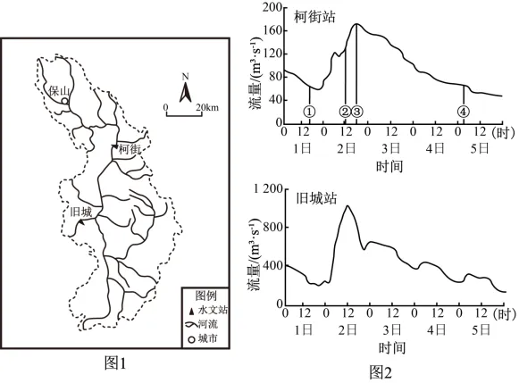
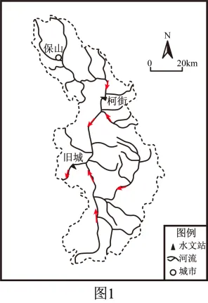

# 2025年安徽高考地理真题 · 选择题题组 G4（第9–10题）

## 来源
- 来源文档：精品解析：2025年安徽高考地理真题（解析版）
- 题号：第9–10题（选择题，共2小题）

## 题组材料
勐波罗河流域（图1）大部分位于云南省保山市，河流发源地海拔2860m。2023年9月2日该流域经历大范围短时强降雨。图2表示勐波罗河流域柯街和旧城两个水文站9月1—5日流量变化。据此完成下面小题。

## 相关图片




## 第9题
question_id: `2025-安徽-地理-2025年安徽高考地理真题-Q9`

**题干**：9. 柯街站径流补给（   ）

**选项**：
- A. ①时以季节性积雪融水补给为主
- B. ②时以大气降水补给为主
- C. ③时以地下水补给为主
- D. ④时以冰川融水补给为主

**答案**：B

**解析**：季节性积雪融水通常出现在纬度较高或海拔较高的区域，冬季气温较低，降雪不断积累，春季气温回升时，积雪融化，而①为9月1日白天，从时间和空间的角度，此时柯街站径流补给均不可能以季节性积雪融水补给为主，A错误；根据材料可知，勐波罗河流域纬度较低，河流发源地海拔也较低，可推测无冰川分布，且④为9月5日夜间，不可能以冰川融水补给为主，D错误；图中可看出，②为9月2日白天，河流流量明显增大，结合材料，9月2日流域内有大范围降雨，可推测②时以大气降水补给为主，B正确；③之前流量迅速增加，在③时流量达峰值，可推测③时的流量主要受降水和河流上游来水影响，地下水补给水量较小且较稳定，C错误。故选B。

**知识点归属**：
- **核心考点 · 权重 1.0**：自然地理 → 水文与海洋 → 陆地水体及其相互关系

**整体置信度**：高

<!-- MANAGED-KM-START Q9
```yaml
question_id: "2025-安徽-地理-2025年安徽高考地理真题-Q9"
question_number: 9
knowledge_points:
  - role: core_exam_point
    weight: 1.0
    domain_id: DM-NAT
    domain: "自然地理"
    theme_id: TH-NAT-WATER
    theme: "水文与海洋"
    knowledge_unit_id: KU-NAT-WATER-005
    knowledge_unit: "陆地水体及其相互关系"
    evidence: "9月2日强降雨与柯街站流量迅速增大同步，表明②时河流径流主要接受大气降水补给。"
extra_tags:
  - "河流补给类型判读"
  - "降雨径流过程"
taxonomy_version: "config-v0.2-draft"
confidence: "high"
label_status: "completed"
needs_review: false
taxonomy_review:
  needs_review: false
  issue_type: "none"
  review_note: ""
note: ""
```
-->

## 第10题
question_id: `2025-安徽-地理-2025年安徽高考地理真题-Q10`

**题干**：10. 旧城站流量最大峰值出现时间早于柯街站，其原因可能是旧城站（   ）

**选项**：
- A. 在柯街站上游
- B. 受附近支流影响大
- C. 雨前流量较大
- D. 流量峰值相对较大

**答案**：B

**解析**：从图2中可看出，旧城站流量远大于柯街站，可推测柯街站位于旧城站上游，汇水面积小，A错误；流域内降水时，流量最大峰值出现时间早，说明汇水速度快，与雨前流量和流量峰值大小关系不大，CD错误；图中可看出，旧城站附近支流众多，汇水面积较大，可推测附近支流汇水速度快，汇水量大，导致旧城站流量最大峰值出现时间早于柯街站，B正确。故选B。

**点睛**：关于河流补给需要注意的问题：1.一条河流往往有多种补给方式，但其径流的变化特点取决于主要补给方式的变化特点。2.东北地区的河流，具有春汛和夏汛两个汛期，但其最主要的补给方式是大气降水补给，所以其洪峰期出现在降水最多的夏季。3.地中海气候区靠大气降水补给的河流，汛期在冬季。4.黄河下游由于泥沙淤积形成"地上河"，河流水位高于两岸的潜水位，因此只能是河水补给两岸的潜水。

**知识点归属**：
- **核心考点 · 权重 1.0**：自然地理 → 水文与海洋 → 陆地水体及其相互关系
- **支撑知识 · 权重 0.7**：自然地理 → 水文与海洋 → 水循环

**整体置信度**：高

<!-- MANAGED-KM-START Q10
```yaml
question_id: "2025-安徽-地理-2025年安徽高考地理真题-Q10"
question_number: 10
knowledge_points:
  - role: core_exam_point
    weight: 1.0
    domain_id: DM-NAT
    domain: "自然地理"
    theme_id: TH-NAT-WATER
    theme: "水文与海洋"
    knowledge_unit_id: KU-NAT-WATER-005
    knowledge_unit: "陆地水体及其相互关系"
    evidence: "旧城站附近支流多且汇水范围大，支流来水快速汇入使其洪峰早于柯街站出现。"
  - role: supporting_knowledge
    weight: 0.7
    domain_id: DM-NAT
    domain: "自然地理"
    theme_id: TH-NAT-WATER
    theme: "水文与海洋"
    knowledge_unit_id: KU-NAT-WATER-001
    knowledge_unit: "水循环"
    evidence: "判断洪峰时间需要理解降水形成地表径流并沿河网汇流的水循环过程。"
extra_tags:
  - "流域汇流"
  - "洪峰时间判读"
taxonomy_version: "config-v0.2-draft"
confidence: "high"
label_status: "completed"
needs_review: false
taxonomy_review:
  needs_review: false
  issue_type: "none"
  review_note: ""
note: ""
```
-->

## 教学备注
<!-- TEACHER-NOTES-START -->
- 易错点：
- 课堂提示：
- 讲解建议：
<!-- TEACHER-NOTES-END -->
