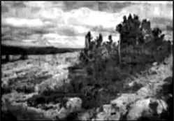
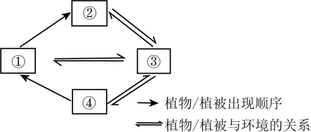

# 2025年安徽高考地理真题 · 选择题题组 G5（第11–13题）

## 来源
- 来源文档：精品解析：2025年安徽高考地理真题（解析版）
- 题号：第11–13题（选择题，共3小题）

## 题组材料
西伯利亚某山区的林线过渡带分布有树篱景观。该景观的形成多始于山坡上大石块后或微洼地内的第一棵树（先锋树）。随后生长的植物（后生植物）种类和数量逐渐增多，整体形态呈现为条带状（下图）。据此完成下面小题。

## 相关图片


## 第11题
question_id: `2025-安徽-地理-2025年安徽高考地理真题-Q11`

**题干**：11. 树篱形态的塑造主要是由于（   ）

**选项**：
- A. 降水稀少
- B. 土层浅薄
- C. 风力强劲
- D. 光照不足

**答案**：C

**解析**：结合材料可知，树篱的形态为条带状，其形成起始于山坡上的大石块或微洼地，这些地区属于良好的避风环境，可以有效阻挡强劲的大风，C正确；降水稀少、土壤浅薄、光照不足等条件不会导致树篱呈现条带状分布，而是零散分布，ABD错误。故选C。

**知识点归属**：
- **核心考点 · 权重 1.0**：自然地理 → 植被与土壤 → 植被与环境

**整体置信度**：高

<!-- MANAGED-KM-START Q11
```yaml
question_id: "2025-安徽-地理-2025年安徽高考地理真题-Q11"
question_number: 11
knowledge_points:
  - role: core_exam_point
    weight: 1.0
    domain_id: DM-NAT
    domain: "自然地理"
    theme_id: TH-NAT-VEGETATION-SOIL
    theme: "植被与土壤"
    knowledge_unit_id: KU-NAT-VEG-SOIL-001
    knowledge_unit: "植被与环境"
    evidence: "大石块后和微洼地能够避开强风，风力对植物定植与生长的限制塑造了条带状树篱。"
extra_tags:
  - "风力塑造植被形态"
  - "林线过渡带树篱"
taxonomy_version: "config-v0.2-draft"
confidence: "high"
label_status: "completed"
needs_review: false
taxonomy_review:
  needs_review: false
  issue_type: "none"
  review_note: ""
note: ""
```
-->

## 第12题
question_id: `2025-安徽-地理-2025年安徽高考地理真题-Q12`

**题干**：12. 下图示意树篱景观形成过程。图中①②③④分别代表（   ）



**选项**：
- A. 先锋树、后生植物、微生境、树篱
- B. 先锋树、微生境、树篱、后生植物
- C. 后生植物、树篱、微生境、先锋树
- D. 后生植物、先锋树、树篱、微生境

**答案**：C

**解析**：结合材料可知，树篱的形成多始于山坡上大石块后或微洼地内的第一棵树（先锋树）。在先锋树和当地环境的长期作用，形成适合后生植物的环境条件，进而发育较多的后生植物。先锋树和后生植物共同构成树篱。因此，从先后顺序来看，应为先锋树→后生植物→树篱，分别对应图中的④、①、②。微生境与三种植物之间存在相互作用的关系，因此微生境为③。综上所述，C正确，ABD错误。故选C。

**知识点归属**：
- **核心考点 · 权重 1.0**：自然地理 → 自然环境的整体性与差异性 → 自然环境的统一演化和要素组合
- **支撑知识 · 权重 0.7**：自然地理 → 植被与土壤 → 植被与环境

**整体置信度**：高

<!-- MANAGED-KM-START Q12
```yaml
question_id: "2025-安徽-地理-2025年安徽高考地理真题-Q12"
question_number: 12
knowledge_points:
  - role: core_exam_point
    weight: 1.0
    domain_id: DM-NAT
    domain: "自然地理"
    theme_id: TH-NAT-INTEGRITY
    theme: "自然环境的整体性与差异性"
    knowledge_unit_id: KU-NAT-INTEGRITY-003
    knowledge_unit: "自然环境的统一演化和要素组合"
    evidence: "先锋树改善微生境、后生植物增加并共同形成树篱，体现植被与环境相互作用下的协同演化。"
  - role: supporting_knowledge
    weight: 0.7
    domain_id: DM-NAT
    domain: "自然地理"
    theme_id: TH-NAT-VEGETATION-SOIL
    theme: "植被与土壤"
    knowledge_unit_id: KU-NAT-VEG-SOIL-001
    knowledge_unit: "植被与环境"
    evidence: "图示判读依赖先锋树、后生植物和微生境之间双向影响的植被—环境关系。"
extra_tags:
  - "先锋植物与群落演替"
  - "微生境反馈"
taxonomy_version: "config-v0.2-draft"
confidence: "high"
label_status: "completed"
needs_review: false
taxonomy_review:
  needs_review: false
  issue_type: "none"
  review_note: ""
note: ""
```
-->

## 第13题
question_id: `2025-安徽-地理-2025年安徽高考地理真题-Q13`

**题干**：13. 基于全球气候变化的背景，推测该山区未来最可能出现（   ）

**选项**：
- A. 树篱分布区上移，原树篱演化为森林
- B. 树篱分布区上移，原树篱演化为苔原
- C. 树篱分布区下移，原树篱演化为森林
- D. 树篱分布区下移，原树篱演化为苔原

**答案**：A

**解析**：结合所学知识，树篱地处山区林线（森林分布上限）过渡地区，树篱下部为森林景观。随着全球气候变暖，当地热量条件明显改善，森林植被将增加、林线上移，导致树篱分布区上移，原有树篱逐渐演化为森林植被，A正确，BCD错误。故选A。

**点睛**：自然环境由大气、水、土壤、生物、岩石及地貌等要素组成。这些要素在物质组成和形态特征方面差异明显。这些要素并不是彼此孤立、互不相关的，而是通过水循环、生物循环和岩石圈物质循环等过程，进行着物质迁移和能量交换，形成一个相互渗透、相互制约和相互联系的整体。自然环境要素间的物质迁移和能量交换是自然环境整体性的基础。
换是自然环境整体性的基础。

**知识点归属**：
- **核心考点 · 权重 1.0**：自然地理 → 自然环境的整体性与差异性 → 垂直地域分异规律
- **支撑知识 · 权重 0.7**：资源、环境与国家安全 → 环境安全 → 全球气候变化与国家安全

**整体置信度**：高

<!-- MANAGED-KM-START Q13
```yaml
question_id: "2025-安徽-地理-2025年安徽高考地理真题-Q13"
question_number: 13
knowledge_points:
  - role: core_exam_point
    weight: 1.0
    domain_id: DM-NAT
    domain: "自然地理"
    theme_id: TH-NAT-INTEGRITY
    theme: "自然环境的整体性与差异性"
    knowledge_unit_id: KU-NAT-INTEGRITY-006
    knowledge_unit: "垂直地域分异规律"
    evidence: "气候变暖改善高海拔热量条件，使林线和林线过渡带沿山地高度方向上移，原树篱区演化为森林。"
  - role: supporting_knowledge
    weight: 0.7
    domain_id: DM-RES
    domain: "资源、环境与国家安全"
    theme_id: TH-RES-ENV
    theme: "环境安全"
    knowledge_unit_id: KU-RES-ENV-004
    knowledge_unit: "全球气候变化与国家安全"
    evidence: "全球变暖是热量条件改变并引起林线及植被带迁移的背景驱动力。"
extra_tags:
  - "气候变暖下林线上移"
  - "植被带迁移"
taxonomy_version: "config-v0.2-draft"
confidence: "high"
label_status: "completed"
needs_review: false
taxonomy_review:
  needs_review: false
  issue_type: "none"
  review_note: ""
note: ""
```
-->

## 教学备注
<!-- TEACHER-NOTES-START -->
- 易错点：
- 课堂提示：
- 讲解建议：
<!-- TEACHER-NOTES-END -->
