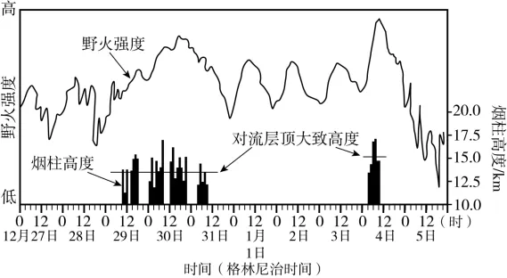

# 2025年安徽高考地理真题 · 选择题题组 G6（第14–16题）

## 来源
- 来源文档：精品解析：2025年安徽高考地理真题（解析版）
- 题号：第14–16题（选择题，共3小题）

## 题组材料
2020年1月1日前后，澳大利亚东南部发生大面积高强度森林野火，引发强烈上升气流，在一定的天气形势下，烟尘上升至对流层顶附近，形成积雨云状烟柱。下图表示该区域野火强度与积雨云状烟柱高度随时间变化情况。

## 相关图片


## 第14题
question_id: `2025-安徽-地理-2025年安徽高考地理真题-Q14`

**题干**：14. 图中积雨云状烟柱最早出现时间为当地（   ）

**选项**：
- A. 黎明前后
- B. 正午前后
- C. 傍晚前后
- D. 午夜前后

**答案**：C

**解析**：由图可知，积雨云状烟柱最早出现时格林尼治时间大约为9时，格林尼治时间即世界标准时，0°经线的地方时，澳大利亚东南部经度在150°E左右，比格林尼治时间大约早10个小时，故积雨云状烟柱最早出现时间为当地19点左右，结合选项，C正确、ABD错误。故选C。

**知识点归属**：
- **核心考点 · 权重 1.0**：自然地理 → 地球的运动 → 地球的自转

**整体置信度**：高

<!-- MANAGED-KM-START Q14
```yaml
question_id: "2025-安徽-地理-2025年安徽高考地理真题-Q14"
question_number: 14
knowledge_points:
  - role: core_exam_point
    weight: 1.0
    domain_id: DM-NAT
    domain: "自然地理"
    theme_id: TH-NAT-EARTH-MOTION
    theme: "地球的运动"
    knowledge_unit_id: KU-NAT-EARTH-MOTION-001
    knowledge_unit: "地球的自转"
    evidence: "将格林尼治时间9时按澳大利亚东南部约150°E换算为当地约19时，才能判断为傍晚前后。"
extra_tags:
  - "经度与地方时换算"
taxonomy_version: "config-v0.2-draft"
confidence: "high"
label_status: "completed"
needs_review: false
taxonomy_review:
  needs_review: false
  issue_type: "none"
  review_note: ""
note: ""
```
-->

## 第15题
question_id: `2025-安徽-地理-2025年安徽高考地理真题-Q15`

**题干**：15. 1月1—3日没有产生积雨云状烟柱，其原因最可能是（   ）

**选项**：
- A. 野火强度低
- B. 大气湿度高
- C. 野火持续时间短
- D. 大气较为稳定

**答案**：D

**解析**：由图可知，1月1—3日野火强度在波动，野火强度整体较高，同时也说明野火在持续，持续时间较长，AC错误；由材料可知，积雨云状烟柱的产生需要强烈的上升气流和一定的天气形势，而1月1—3日野火强度呈现规律性的波动，说明天气较晴朗，大气环流稳定，野火强度主要受昼夜交替导致的热力环流等影响，D正确；野火在持续，说明没有形成强降雨，且受野火影响，气温较高，可推测大气湿度较低，B错误。故选D。

**知识点归属**：
- **核心考点 · 权重 1.0**：自然地理 → 大气 → 大气稳定度与对流运动

**整体置信度**：高

<!-- MANAGED-KM-START Q15
```yaml
question_id: "2025-安徽-地理-2025年安徽高考地理真题-Q15"
question_number: 15
knowledge_points:
  - role: core_exam_point
    weight: 1.0
    domain_id: DM-NAT
    domain: "自然地理"
    theme_id: TH-NAT-ATMOSPHERE
    theme: "大气"
    knowledge_unit_id: KU-NAT-ATM-HEAT-007
    knowledge_unit: "大气稳定度与对流运动"
    evidence: "形成高烟柱需要强烈上升运动，1月1—3日大气稳定抑制对流，因而即使野火较强也未形成积雨云状烟柱。"
extra_tags:
  - "火积云形成条件"
taxonomy_version: "config-v0.2-draft"
confidence: "high"
label_status: "completed"
needs_review: false
taxonomy_review:
  needs_review: false
  issue_type: "none"
  review_note: ""
note: ""
```
-->

## 第16题
question_id: `2025-安徽-地理-2025年安徽高考地理真题-Q16`

**题干**：16. 积雨云状烟柱突破对流层顶，将使得（   ）

**选项**：
- A. 平流层气温骤降
- B. 平流层强降雨增加
- C. 大气中CO₂含量减少
- D. 烟尘扩散范围增大

**答案**：D

**解析**：根据大气的垂直分层相关知识，对流层顶部向上首先是平流层，大气以平流运动为主，故积雨云状烟柱突破对流层顶，进入平流层，受大气水平运动影响，烟尘扩散范围将会增大，D正确；平流层水汽含量很少，通常无云雨现象，烟柱也难以明显改变平流层的降雨条件，B错误；平流层下层气温随高度变化很小，且烟柱会向平流层输送一定的热量，不会导致平流层气温骤降，A错误；烟柱突破对流层顶，说明烟柱强度大，森林燃烧产生的CO₂从对流层进入平流层一部分，但仍在地球大气层中，大气中CO₂含量不会减少，C错误。故选D。

**点睛**：森林野火发生受多种因素影响，如可燃物（枯死的植物、落叶、枝干等）、气候气象因素（高温、干燥、强风等天气条件）、火源（自然火源如雷击、自燃等，以及人为火源如故意纵火、烟头引燃等）、地形、管理因素等。

**知识点归属**：
- **核心考点 · 权重 1.0**：自然地理 → 大气 → 大气的垂直分层
- **支撑知识 · 权重 0.7**：自然地理 → 大气 → 大气的水平运动

**整体置信度**：高

<!-- MANAGED-KM-START Q16
```yaml
question_id: "2025-安徽-地理-2025年安徽高考地理真题-Q16"
question_number: 16
knowledge_points:
  - role: core_exam_point
    weight: 1.0
    domain_id: DM-NAT
    domain: "自然地理"
    theme_id: TH-NAT-ATMOSPHERE
    theme: "大气"
    knowledge_unit_id: KU-NAT-ATM-HEAT-002
    knowledge_unit: "大气的垂直分层"
    evidence: "烟柱突破对流层顶进入以平流运动为主的平流层后，其水平扩散范围会明显增大。"
  - role: supporting_knowledge
    weight: 0.7
    domain_id: DM-NAT
    domain: "自然地理"
    theme_id: TH-NAT-ATMOSPHERE
    theme: "大气"
    knowledge_unit_id: KU-NAT-ATM-HEAT-006
    knowledge_unit: "大气的水平运动"
    evidence: "平流层中显著的水平运动能够把进入其中的烟尘输送到更广区域。"
extra_tags:
  - "烟尘跨层输送"
  - "平流层扩散"
taxonomy_version: "config-v0.2-draft"
confidence: "high"
label_status: "completed"
needs_review: false
taxonomy_review:
  needs_review: false
  issue_type: "none"
  review_note: ""
note: ""
```
-->

## 教学备注
<!-- TEACHER-NOTES-START -->
- 易错点：
- 课堂提示：
- 讲解建议：
<!-- TEACHER-NOTES-END -->
