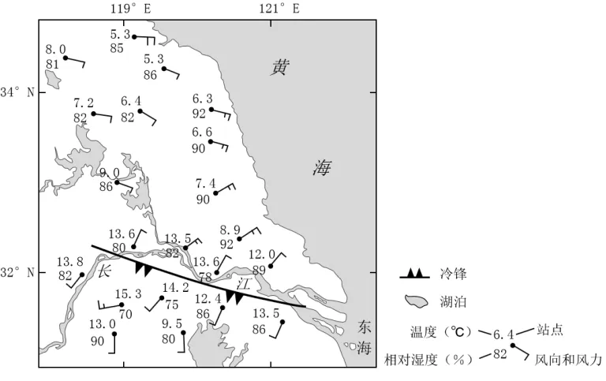

# 2024年山东高考地理真题 · 综合题 G16（第16题）

## 来源
- 来源文档：精品解析：2024年山东省高考地理真题（解析版）.docx
- 题号：第16题（综合题，共2小问）

## 题组材料
16. 阅读图文材料，完成下列要求。

我国沿海某区域某时段经历了一次大范围的浓雾天气，给当地交通带来了较大影响。气象部门指出，此次浓雾为平流雾，是由暖湿空气流经冷的下垫面而形成的。如图示意该区域0时（雾过程初期）近地面主要气象要素的分布。

## 相关图片


### 第16题（1）
question_id: `2024-山东-地理-2024年山东高考地理真题-Q16-1`

**小问**：（1）分析此次浓雾天气形成的主要原因。

**答案**：（1）暖湿空气与地表之间有较大的温差；有适当的风向和风速；冷锋过境，气温较低，空气迅速降温；空气中水汽含量较高。

**解析**：【小问1详解】

本题考查雾的成因。根据材料可知，暖湿空气经过较冷下垫面时，近地面大气中的水汽凝结形成平流雾。它的形成必须具备，一是暖湿空气与地表之间有较大的温差，促进雾的形成；二是有适当的风向和风速，保证雾的存留；根据图示可知，在平流雾形成之前，有冷锋过境，地表降温，气温较低，当暖湿空气经过较冷下垫面时，空气迅速降温，该地湖泊众多，空气中水汽较为充足，空气中水汽冷却而达到饱和，水汽凝结而形成平流雾。

**知识点归属**：
- **核心考点 · 权重 1.0**：自然地理 → 大气 → 雾的形成机制
- **支撑知识 · 权重 0.7**：自然地理 → 大气 → 大气的水平运动
- **材料线索 · 权重 0.4**：自然地理 → 大气 → 锋与天气

**整体置信度**：高

<!-- MANAGED-KM-START Q16-1
```yaml
question_id: "2024-山东-地理-2024年山东高考地理真题-Q16-1"
question_number: 16
sub_question: 1
knowledge_points:
  - role: core_exam_point
    weight: 1.0
    domain_id: DM-NAT
    domain: "自然地理"
    theme_id: TH-NAT-ATMOSPHERE
    theme: "大气"
    knowledge_unit_id: KU-NAT-ATM-WEATHER-001
    knowledge_unit: "雾的形成机制"
    evidence: "暖湿空气流经冷下垫面迅速降温至饱和，水汽凝结形成平流雾。"
  - role: supporting_knowledge
    weight: 0.7
    domain_id: DM-NAT
    domain: "自然地理"
    theme_id: TH-NAT-ATMOSPHERE
    theme: "大气"
    knowledge_unit_id: KU-NAT-ATM-HEAT-006
    knowledge_unit: "大气的水平运动"
    evidence: "适当风向和风速持续输送暖湿空气并维持雾层。"
  - role: material_clue
    weight: 0.4
    domain_id: DM-NAT
    domain: "自然地理"
    theme_id: TH-NAT-ATMOSPHERE
    theme: "大气"
    knowledge_unit_id: KU-NAT-ATM-CIRC-001
    knowledge_unit: "锋与天气"
    evidence: "冷锋过境使下垫面和近地层气温较低，为暖湿空气冷却提供条件。"
extra_tags:
  - "平流雾形成机制"
  - "暖湿平流冷却"
taxonomy_version: "config-v0.2-draft"
confidence: "high"
label_status: "completed"
needs_review: false
taxonomy_review:
  needs_review: false
  issue_type: "none"
  review_note: ""
note: ""
```
-->

### 第16题（2）
question_id: `2024-山东-地理-2024年山东高考地理真题-Q16-2`

**小问**：（2）夜间，该区域被厚厚的云层覆盖，低层的雾逐渐发展增强，形成了“上云下雾、云雾共存”的特征。说明在夜间，云对雾发展快慢的影响。

**答案**：（2）云的存在对平流雾的持续发展有促进作用，云层具有增加向下长波辐射通量起保温的作用，也具有阻挡太阳辐射的作用，起到降温的作用；雾顶高度升高，利于水汽凝结，促进雾的生成；高层逆温的形成也有利于雾的维持，阻止雾的消散。

**解析**：【小问2详解】

在层云接地的过程中，云顶的辐射降温会引起云内的不稳定，冷却的空气和云滴以湍流涡动的形式向下传输，云底之下蒸发的水汽在冷却的环境下导致层云接地，云层具有增加向下长波辐射通量起保温的作用，也具有阻挡太阳辐射的作用，可起到降温的作用，在低云向海雾转化中，云顶的辐射降温是低云和海洋层混合和冷却的重要机制。雾顶高度较高，利于水汽凝结，为雾的生成提供了外部温度条件；同时冷锋过境，形成下冷上热的逆温层，高层逆温的形成也有利于雾的维持，阻止雾的消散。

**知识点归属**：
- **核心考点 · 权重 1.0**：自然地理 → 大气 → 大气的保温作用
- **支撑知识 · 权重 0.7**：自然地理 → 大气 → 大气稳定度与对流运动

**整体置信度**：高

<!-- MANAGED-KM-START Q16-2
```yaml
question_id: "2024-山东-地理-2024年山东高考地理真题-Q16-2"
question_number: 16
sub_question: 2
knowledge_points:
  - role: core_exam_point
    weight: 1.0
    domain_id: DM-NAT
    domain: "自然地理"
    theme_id: TH-NAT-ATMOSPHERE
    theme: "大气"
    knowledge_unit_id: KU-NAT-ATM-HEAT-004
    knowledge_unit: "大气的保温作用"
    evidence: "云层向下长波辐射和云顶辐射降温共同改变雾层热量条件，影响云雾混合与凝结发展。"
  - role: supporting_knowledge
    weight: 0.7
    domain_id: DM-NAT
    domain: "自然地理"
    theme_id: TH-NAT-ATMOSPHERE
    theme: "大气"
    knowledge_unit_id: KU-NAT-ATM-HEAT-007
    knowledge_unit: "大气稳定度与对流运动"
    evidence: "云内湍流向下输送冷空气和云滴，且高层逆温抑制垂直交换与雾的消散。"
extra_tags:
  - "云顶辐射降温"
  - "云雾共存"
  - "逆温维持雾层"
taxonomy_version: "config-v0.2-draft"
confidence: "high"
label_status: "completed"
needs_review: false
taxonomy_review:
  needs_review: false
  issue_type: "none"
  review_note: ""
note: ""
```
-->

## 教学备注
<!-- TEACHER-NOTES-START -->
- 易错点：
- 课堂提示：
- 讲解建议：
<!-- TEACHER-NOTES-END -->
