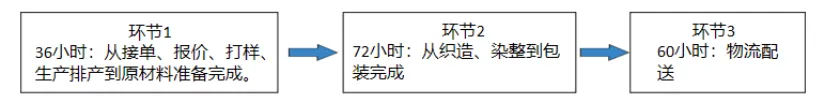

# 2024年山东高考地理真题 · 综合题 G17（第17题）

## 来源
- 来源文档：精品解析：2024年山东省高考地理真题（解析版）.docx
- 题号：第17题（综合题，共3小问）

## 题组材料
17. 阅读图文材料，完成下列要求。

材料一  吉林省辽源市曾经是我国东北地区重要的煤炭城市，煤炭开采和洗选业一直由辽源矿业公司经营。20世纪80年代末期，该市煤炭资源渐近枯竭。2001年以来，辽源矿业公司坚持“以煤为主、多种经营”的理念，通过开发域外煤矿，使原煤产量不降反增，逐渐发展成为一家集煤炭生产、装备制造、建筑建材、新能源于一体的现代煤炭企业。

材料二  20世纪60至70年代，辽源市纺织袜业较为发达。80年代末期，该市国营袜厂效益不断下降。2000年辽源市“十五”规划纲要提出，要“突出纺织、轻工业地位”“壮大袜子产业”，将纺织袜业作为煤炭产业的接续替代产业之一。辽源市东北袜业园于2005年开工建设，现已发展为全国最大的棉袜生产基地，园区内企业由最初的40家增至1200余家，通过打造“七天供应链”（如图），园区完成10万双以下订单的时间较常规节省10余天。

## 相关图片


### 第17题（1）
question_id: `2024-山东-地理-2024年山东高考地理真题-Q17-1`

**小问**：（1）说明辽源矿业公司域外煤矿开发对辽源市产业转型的益处。

**答案**：（1）巩固了煤炭产业的基础地位，推动经济转型；积极拓展新能源建设，促进绿色发展；促进基础设施完善，推动企业从传统能源企业向新型综合能源服务供应商转变；通过技术创新和产业升级，提高了产品的附加值和市场竞争力。

**解析**：【小问1详解】

辽源市作为一个因煤而兴的城市，随着资源的枯竭，经济转型成为必然选择，辽源矿业公司通过域外煤矿开发，不仅巩固了煤炭产业的基础地位，还积极拓展了新能源建设，如光伏发电站、和风力发电项目的建设，这些举措有助于辽源市加快新旧动能转换，实现从传统能源城市向新型综合能源服务供应商的转变，推动经济转型，促进绿色发展。辽源矿业公司在域外煤矿开发中，注重节能减排和环境保护，通过配置风力发电项目等措施，实现了显著的节能减排效益，这种做法不仅符合国家“双碳”目标，也为辽源市的绿色转型提供了强大的支撑和保障。辽源矿业公司通过域外煤矿开发，不仅提升了自身的生产能力和效率，还通过技术创新和产业升级，提高了产品的附加值和市场竞争力，为辽源市的产业转型和经济可持续发展提供了重要支撑。

**知识点归属**：
- **核心考点 · 权重 1.0**：区域发展 → 资源型区域的发展与转型 → 资源枯竭型城市的转型机制
- **支撑知识 · 权重 0.7**：区域发展 → 产业结构变化与区域发展 → 产业结构的升级

**整体置信度**：高

<!-- MANAGED-KM-START Q17-1
```yaml
question_id: "2024-山东-地理-2024年山东高考地理真题-Q17-1"
question_number: 17
sub_question: 1
knowledge_points:
  - role: core_exam_point
    weight: 1.0
    domain_id: DM-REG
    domain: "区域发展"
    theme_id: TH-REG-RESOURCE
    theme: "资源型区域的发展与转型"
    knowledge_unit_id: KU-REG-RESOURCE-002
    knowledge_unit: "资源枯竭型城市的转型机制"
    evidence: "域外煤矿维持主业收益和能力基础，同时支撑装备制造、新能源等多元经营，为资源枯竭城市转型提供条件。"
  - role: supporting_knowledge
    weight: 0.7
    domain_id: DM-REG
    domain: "区域发展"
    theme_id: TH-REG-INDUSTRY
    theme: "产业结构变化与区域发展"
    knowledge_unit_id: KU-REG-INDUSTRY-002
    knowledge_unit: "产业结构的升级"
    evidence: "技术创新、多种经营和新能源拓展推动辽源产业结构多元化与升级。"
extra_tags:
  - "域外资源开发"
  - "煤炭企业多元化转型"
taxonomy_version: "config-v0.2-draft"
confidence: "high"
label_status: "completed"
needs_review: false
taxonomy_review:
  needs_review: false
  issue_type: "none"
  review_note: ""
note: ""
```
-->

### 第17题（2）
question_id: `2024-山东-地理-2024年山东高考地理真题-Q17-2`

**小问**：（2）分析纺织袜业作为辽源市接续替代产业的主要优势。

**答案**：（2）发展历史悠久，产业基础扎实；全链条发展，汇聚产业发展动能；国内消费升级，对高档袜子的消费需求增加；科学技术进步，新材料不断应用；电商不断发展，拓展销售渠道；政策大力支持。

**解析**：【小问2详解】

材料提及“20世纪60至70年代，辽源市纺织袜业较为发达”，其袜子产业发展历史悠久，产业基础扎实；辽源市东北袜业园于2005年开工建设，现已发展为全国最大的棉袜生产基地，全产业链条发展，汇聚产业发展动能；伴随我国经济不断走好，国内消费水平升级，对高档袜子的消费需求增加，市场前景好；同时科学技术进步，新材料不断应用于袜子产业，也大大促进产业快速发展；电商平台增多，快速物流不断发展，拓展销售渠道，扩大销售范围；产业接续，政策大力支持。

**知识点归属**：
- **核心考点 · 权重 1.0**：人文地理 → 产业区位 → 工业区位因素
- **支撑知识 · 权重 0.7**：区域发展 → 资源型区域的发展与转型 → 资源枯竭型城市的转型机制

**整体置信度**：高

<!-- MANAGED-KM-START Q17-2
```yaml
question_id: "2024-山东-地理-2024年山东高考地理真题-Q17-2"
question_number: 17
sub_question: 2
knowledge_points:
  - role: core_exam_point
    weight: 1.0
    domain_id: DM-HUM
    domain: "人文地理"
    theme_id: TH-HUM-INDUSTRY
    theme: "产业区位"
    knowledge_unit_id: KU-HUM-IND-002
    knowledge_unit: "工业区位因素"
    evidence: "纺织袜业具有历史产业基础、完整链条、市场需求、技术与电商渠道以及政策支持等综合区位优势。"
  - role: supporting_knowledge
    weight: 0.7
    domain_id: DM-REG
    domain: "区域发展"
    theme_id: TH-REG-RESOURCE
    theme: "资源型区域的发展与转型"
    knowledge_unit_id: KU-REG-RESOURCE-002
    knowledge_unit: "资源枯竭型城市的转型机制"
    evidence: "选择已有基础的袜业作为煤炭接续替代产业，服务于资源枯竭型城市产业多元化。"
extra_tags:
  - "接续替代产业"
  - "袜业产业基础"
taxonomy_version: "config-v0.2-draft"
confidence: "high"
label_status: "completed"
needs_review: false
taxonomy_review:
  needs_review: false
  issue_type: "none"
  review_note: ""
note: ""
```
-->

### 第17题（3）
question_id: `2024-山东-地理-2024年山东高考地理真题-Q17-3`

**小问**：（3）从企业生产的角度，分析东北袜业园是如何通过“七天供应链”缩短订单完成时间的。

**答案**：（3）全链条发展，加强对市场快速反应，减少采购时间，快速准备原料；以技术创新逐步实现智能化，加大机械化科技化投入，袜业织造流程实现自动化生产，极大缩短了供应时间成本；快速便捷的全国供应物流网络，引入其他物流平台相互配合，打造快速供货专线，缩短配送时间。

**解析**：【小问3详解】

全国最大的棉袜生产基地，园区内企业由最初的40家增至1200余家，产业全链条发展，大大提高对市场的快速反应，减少采购时间，快速准备原料；同时积极发展科技应用，以技术创新逐步实现智能化，加大生产工厂机械化、科技化投入，袜业织造流程实现自动化生产，可极大缩短了供应时间成本；借助我国电商平台，以及快速便捷的全国供应物流网络，除专线运输外，在积极引入其他物流平台相互配合，打造快速供货专线，缩短配送时间。综合快速反应机制，快速制造体系，快捷物流配送，实现七天供应链。

**知识点归属**：
- **核心考点 · 权重 1.0**：人文地理 → 产业区位 → 工业区位因素

**整体置信度**：高

<!-- MANAGED-KM-START Q17-3
```yaml
question_id: "2024-山东-地理-2024年山东高考地理真题-Q17-3"
question_number: 17
sub_question: 3
knowledge_points:
  - role: core_exam_point
    weight: 1.0
    domain_id: DM-HUM
    domain: "人文地理"
    theme_id: TH-HUM-INDUSTRY
    theme: "产业区位"
    knowledge_unit_id: KU-HUM-IND-002
    knowledge_unit: "工业区位因素"
    evidence: "园区以完整供应链缩短备料时间，以自动化压缩制造时间，以专线和多平台物流缩短配送时间。"
extra_tags:
  - "七天供应链"
  - "快速反应制造"
  - "产业集聚协作"
taxonomy_version: "config-v0.2-draft"
confidence: "high"
label_status: "completed"
needs_review: false
taxonomy_review:
  needs_review: false
  issue_type: "none"
  review_note: ""
note: ""
```
-->

## 教学备注
<!-- TEACHER-NOTES-START -->
- 易错点：
- 课堂提示：
- 讲解建议：
<!-- TEACHER-NOTES-END -->
