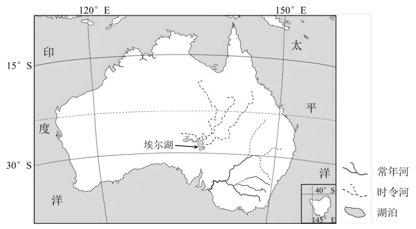

# 2024年山东高考地理真题 · 综合题 G18（第18题）

## 来源
- 来源文档：精品解析：2024年山东省高考地理真题（解析版）.docx
- 题号：第18题（综合题，共3小问）

## 题组材料
18. 阅读图文材料，完成下列要求。

埃尔湖（如图）是澳大利亚海拔最低的地方，湖水深度较浅。某研学小组对埃尔湖流域开展了研究。

活动一  同学们通过查阅资料了解到，埃尔湖碳储量大，是巨大的碳库。

活动二  同学们通过查阅资料和野外考察，发现埃尔湖沉积物中有多层泥炭层，有的厚度巨大。埃尔湖泥炭中的碳不易释放。旱季，强烈蒸发使湖泊水面缩小，有的地方泥沙裸露，有的地方“变成”盐壳，最厚处可达数米；雨季，若大量河水汇入，湖泊水面扩大，最大可超过15000 km²。

活动三  水生软体动物种类多，数量大，分布广，对水环境变化敏感。软体动物死亡后，其碳酸钙壳体保留在沉积物中成为化石，对古环境变化具有重要指示意义。为研究埃尔湖不同时期湖水盐度的变化，同学们采集了各地层中的软体动物化石。

## 相关图片


### 第18题（1）
question_id: `2024-山东-地理-2024年山东高考地理真题-Q18-1`

**小问**：（1）分析埃尔湖入湖碳量大的自然原因。

**答案**：（1）多条入湖河流流经热带雨林和热带草原区，生物量大，提供大量枯落物等含碳物质；入湖河流流程长，数量众多，搬运大量含碳物质入湖。

**解析**：【小问1详解】

根据教材知识可知，澳大利亚东北部分布有热带雨林和热带草原景观，生物量较大，埃尔湖的入湖河流流经，会搬运大量的枯落物入湖，为埃尔湖提供碳源；图中可看到，多条河流入湖，且流程较长，向埃尔湖输送的含碳物质较多。

**知识点归属**：
- **核心考点 · 权重 1.0**：自然地理 → 自然环境的整体性与差异性 → 自然环境要素间的物质迁移和能量交换
- **支撑知识 · 权重 0.7**：自然地理 → 水文与海洋 → 水循环

**整体置信度**：高

<!-- MANAGED-KM-START Q18-1
```yaml
question_id: "2024-山东-地理-2024年山东高考地理真题-Q18-1"
question_number: 18
sub_question: 1
knowledge_points:
  - role: core_exam_point
    weight: 1.0
    domain_id: DM-NAT
    domain: "自然地理"
    theme_id: TH-NAT-INTEGRITY
    theme: "自然环境的整体性与差异性"
    knowledge_unit_id: KU-NAT-INTEGRITY-001
    knowledge_unit: "自然环境要素间的物质迁移和能量交换"
    evidence: "流域植被形成大量含碳有机物，多条长流程河流将其搬运入湖，体现生物圈与水圈之间的物质迁移。"
  - role: supporting_knowledge
    weight: 0.7
    domain_id: DM-NAT
    domain: "自然地理"
    theme_id: TH-NAT-WATER
    theme: "水文与海洋"
    knowledge_unit_id: KU-NAT-WATER-001
    knowledge_unit: "水循环"
    evidence: "地表径流是流域含碳物质向埃尔湖输送的载体。"
extra_tags:
  - "流域碳输入"
  - "河流搬运有机碳"
taxonomy_version: "config-v0.2-draft"
confidence: "high"
label_status: "completed"
needs_review: false
taxonomy_review:
  needs_review: false
  issue_type: "none"
  review_note: ""
note: ""
```
-->

### 第18题（2）
question_id: `2024-山东-地理-2024年山东高考地理真题-Q18-2`

**小问**：（2）从湖泊水面变化的角度，分析埃尔湖泥炭中的碳不易释放的主要原因。

**答案**：（2）雨季，湖泊水面扩大，湖中泥炭处于渍水、缺氧环境，微生物不活跃，碳不易释放；旱季，湖泊水面缩小，湖床裸露，泥炭层受强烈的太阳辐射影响，蒸发旺盛，缺少水分，微生物不活跃，碳不易释放；湖泊水面的定期扩大，使得湖底泥炭不断被深埋，受外界环境影响小，碳不易分解。

**解析**：【小问2详解】

由材料可知，埃尔湖雨季，湖泊水面扩大，可推测湖中泥炭处于渍水、缺氧环境，不利于微生物活动，泥碳不易被分解，碳不易释放；埃尔湖旱季，湖泊水面缩小，可推测大片湖床裸露，在强烈的太阳辐射作用下，泥炭层蒸发旺盛，缺少水分，也不利于微生物活动，泥炭不易被分解，碳不易释放；雨季旱季的交替使得湖底泥炭不断积累、深埋，受外界环境影响小，泥炭得以保存，碳不易释放。

**知识点归属**：
- **核心考点 · 权重 1.0**：自然地理 → 自然环境的整体性与差异性 → 自然环境要素间的物质迁移和能量交换
- **支撑知识 · 权重 0.7**：自然地理 → 水文与海洋 → 陆地水体及其相互关系

**整体置信度**：高

<!-- MANAGED-KM-START Q18-2
```yaml
question_id: "2024-山东-地理-2024年山东高考地理真题-Q18-2"
question_number: 18
sub_question: 2
knowledge_points:
  - role: core_exam_point
    weight: 1.0
    domain_id: DM-NAT
    domain: "自然地理"
    theme_id: TH-NAT-INTEGRITY
    theme: "自然环境的整体性与差异性"
    knowledge_unit_id: KU-NAT-INTEGRITY-001
    knowledge_unit: "自然环境要素间的物质迁移和能量交换"
    evidence: "雨季渍水缺氧、旱季干燥缺水均抑制微生物分解，反复淹没沉积又使泥炭深埋，从而减少碳释放。"
  - role: supporting_knowledge
    weight: 0.7
    domain_id: DM-NAT
    domain: "自然地理"
    theme_id: TH-NAT-WATER
    theme: "水文与海洋"
    knowledge_unit_id: KU-NAT-WATER-005
    knowledge_unit: "陆地水体及其相互关系"
    evidence: "湖泊水面季节扩缩决定泥炭层的淹没、裸露和沉积环境。"
extra_tags:
  - "泥炭碳封存"
  - "微生物分解条件"
  - "干湿交替湖泊"
taxonomy_version: "config-v0.2-draft"
confidence: "high"
label_status: "completed"
needs_review: false
taxonomy_review:
  needs_review: false
  issue_type: "none"
  review_note: ""
note: ""
```
-->

### 第18题（3）
question_id: `2024-山东-地理-2024年山东高考地理真题-Q18-3`

**小问**：（3）指出如何利用采集的生物化石研究埃尔湖不同时期湖水盐度的变化。

**答案**：（3）按地层顺序，将采集的化石排序；查询所采集化石对应的生物对盐度的需求；统计不同地层生物化石的种类和数量。

**解析**：【小问3详解】

研究不同时期湖水盐度的变化，首先应按地层顺序，将采集的化石排序，根据化石种类推测湖水盐度变化；查询所采集化石对应的生物对盐度的需求，从而根据化石生物的变化推测盐度的变化；统计不同地层生物化石的种类，对比分析，通过生物种类变化推测盐度的变化。

**知识点归属**：
- **核心考点 · 权重 1.0**：自然地理 → 地球的结构与演化 → 地层与化石

**整体置信度**：高

<!-- MANAGED-KM-START Q18-3
```yaml
question_id: "2024-山东-地理-2024年山东高考地理真题-Q18-3"
question_number: 18
sub_question: 3
knowledge_points:
  - role: core_exam_point
    weight: 1.0
    domain_id: DM-NAT
    domain: "自然地理"
    theme_id: TH-NAT-EARTH-STRUCTURE
    theme: "地球的结构与演化"
    knowledge_unit_id: KU-NAT-EARTH-STRUCTURE-003
    knowledge_unit: "地层与化石"
    evidence: "按地层顺序排列软体动物化石，并依据各物种耐盐范围及数量组合反演不同时期湖水盐度。"
extra_tags:
  - "指相化石"
  - "古湖泊盐度重建"
taxonomy_version: "config-v0.2-draft"
confidence: "high"
label_status: "completed"
needs_review: false
taxonomy_review:
  needs_review: false
  issue_type: "none"
  review_note: ""
note: ""
```
-->

## 教学备注
<!-- TEACHER-NOTES-START -->
- 易错点：
- 课堂提示：
- 讲解建议：
<!-- TEACHER-NOTES-END -->
