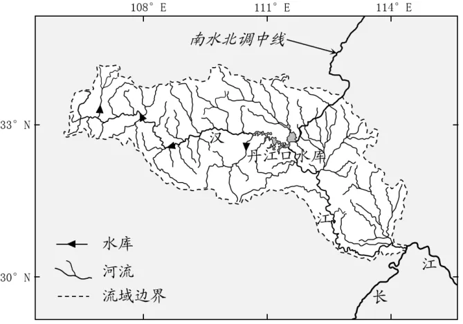
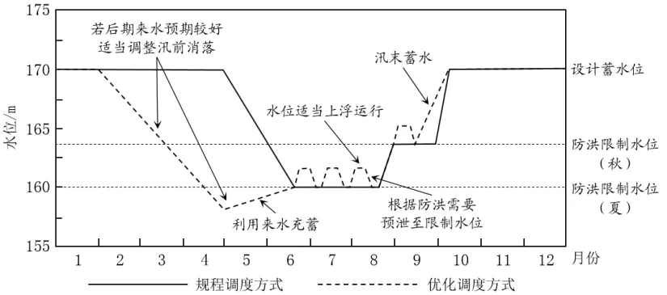

# 2024年山东高考地理真题 · 综合题 G19（第19题）

## 来源
- 来源文档：精品解析：2024年山东省高考地理真题（解析版）.docx
- 题号：第19题（综合题，共3小问）

## 题组材料
19. 阅读图文材料，完成下列要求。

材料一  防洪限制水位是水库在汛期允许蓄水的上限水位。受防洪限制水位的约束，汛期降雨径流经水库调节后，仍有大量径流未得到充分利用，作为弃水排放。

材料二  近年来，丹江口水库以《丹江口水利枢纽调度规程（试行）》为基础，主要从汛前水位消落、汛期水位控制、汛末蓄水三个方面进行优化调度的探索。2021年，基于精准的降水、洪水预报，丹江口水库在保证防洪安全的前提下，通过优化调度超额完成供水计划，并首次蓄水至设计蓄水位170 m。图1示意汉江流域概况。图2示意优化调度方式与规程调度方式的对比。

## 相关图片



### 第19题（1）
question_id: `2024-山东-地理-2024年山东高考地理真题-Q19-1`

**小问**：（1）分别指出防洪限制水位的高低与汛期水库蓄水量大小、预留防洪库容大小的关系。

**答案**：（1）防洪限制水位越高，汛期水库蓄水量越大，预留防洪库容越小。

**解析**：【小问1详解】

防洪限制水位，即考虑防洪需要，汛期可以达到的最高水位，故防洪限制水位越高，汛期水库蓄水量越大；水库的库容是一定的，防洪限制水位越高，汛期水库蓄水量越大，预留防洪库容越小。

**知识点归属**：
- **核心考点 · 权重 1.0**：区域发展 → 区际联系与区域协调发展 → 流域内协调发展

**整体置信度**：高

<!-- MANAGED-KM-START Q19-1
```yaml
question_id: "2024-山东-地理-2024年山东高考地理真题-Q19-1"
question_number: 19
sub_question: 1
knowledge_points:
  - role: core_exam_point
    weight: 1.0
    domain_id: DM-REG
    domain: "区域发展"
    theme_id: TH-REG-INTERREGION
    theme: "区际联系与区域协调发展"
    knowledge_unit_id: KU-REG-INTERREGION-001
    knowledge_unit: "流域内协调发展"
    evidence: "水库总库容一定时，提高防洪限制水位会增加汛期蓄水量并相应压缩预留防洪库容。"
extra_tags:
  - "防洪限制水位"
  - "蓄水与防洪库容权衡"
taxonomy_version: "config-v0.2-draft"
confidence: "high"
label_status: "completed"
needs_review: false
taxonomy_review:
  needs_review: false
  issue_type: "none"
  review_note: ""
note: ""
```
-->

### 第19题（2）
question_id: `2024-山东-地理-2024年山东高考地理真题-Q19-2`

**小问**：（2）以保证防洪安全为前提，优化调度过程中，水库汛期运行水位可在防洪限制水位的基础上适度上浮。说明丹江口水库汛期运行水位可适度上浮的主要保障条件。

**答案**：（2）监测和预报技术水平高，天气预报准确，保障降水、洪水的预报准确性；制定完善的防洪抢险应急预案；汉江流域干支流、丹江口水库各管理机构，统筹协作，预报、调度水平高。

**解析**：【小问2详解】

丹江口水库汛期运行水位适度上浮意味着防洪限制水位提高，汛期水库蓄水量更大，预留防洪库容更小，防洪压力加大，故需要一定的保障条件，丹江口水库汛期运行水位才能适度上浮。这些保障条件主要包括：监测和预报技术水平高，天气预报准确，保障降水、洪水的预报准确性，在此基础上计算可上浮的幅度；制定完善的防洪抢险应急预案，防备异常的降水和洪水；同时还需要汉江流域干支流、丹江口水库各管理机构，能够统筹协作，统一调度。

**知识点归属**：
- **核心考点 · 权重 1.0**：区域发展 → 区际联系与区域协调发展 → 流域内协调发展
- **支撑知识 · 权重 0.7**：自然地理 → 自然灾害 → 气象灾害

**整体置信度**：高

<!-- MANAGED-KM-START Q19-2
```yaml
question_id: "2024-山东-地理-2024年山东高考地理真题-Q19-2"
question_number: 19
sub_question: 2
knowledge_points:
  - role: core_exam_point
    weight: 1.0
    domain_id: DM-REG
    domain: "区域发展"
    theme_id: TH-REG-INTERREGION
    theme: "区际联系与区域协调发展"
    knowledge_unit_id: KU-REG-INTERREGION-001
    knowledge_unit: "流域内协调发展"
    evidence: "精准降水洪水预报、应急预案和流域多机构协同调度，共同保障较小预留库容条件下的防洪安全。"
  - role: supporting_knowledge
    weight: 0.7
    domain_id: DM-NAT
    domain: "自然地理"
    theme_id: TH-NAT-HAZARD
    theme: "自然灾害"
    knowledge_unit_id: KU-NAT-HAZARD-001
    knowledge_unit: "气象灾害"
    evidence: "运行水位上浮增加洪涝风险，需要监测预报和应急防洪能力支撑。"
extra_tags:
  - "水库汛期动态控制"
  - "洪水预报调度"
taxonomy_version: "config-v0.2-draft"
confidence: "high"
label_status: "completed"
needs_review: false
taxonomy_review:
  needs_review: false
  issue_type: "none"
  review_note: ""
note: ""
```
-->

### 第19题（3）
question_id: `2024-山东-地理-2024年山东高考地理真题-Q19-3`

**小问**：（3）分析与规程调度方式相比，优化调度方式的供水优势。

**答案**：（3）与规程调度方式相比，汛前供水时间长，供水量大；汛期供水较灵活，夏秋季防洪限制水位提高，可以依据水库下游的需水量灵活供水；汛末蓄水时间提前，缓慢蓄水，向下游供水时间更长，供水量更大，满足用水需求；优化调度方式的供水更能满足南水北调工程的用水需求，保障流域水安全。

**解析**：【小问3详解】

由图可知，与规程调度方式相比，汛前水库水位较低，可推测水库向外供水时间长，供水量大；由图可知，与规程调度方式相比，夏秋季防洪限制水位提高，汛期水位适度上浮运行，可推测水库向外供水较灵活，可以在下游降水多时，多蓄水，少供水，以满足下游的防洪需要；由图可知，与规程调度方式相比，汛末蓄水时间提前，水位缓慢增加，可推测，水库蓄水提前，向下游供水减少，避免下游秋季出现洪灾；丹江口水库是南水北调工程的水源地，优化调度方式的供水更能满足南水北调工程的用水需求，从而保障国家用水安全。

**知识点归属**：
- **核心考点 · 权重 1.0**：区域发展 → 区际联系与区域协调发展 → 流域内协调发展
- **支撑知识 · 权重 0.7**：区域发展 → 区际联系与区域协调发展 → 资源跨区域调配

**整体置信度**：高

<!-- MANAGED-KM-START Q19-3
```yaml
question_id: "2024-山东-地理-2024年山东高考地理真题-Q19-3"
question_number: 19
sub_question: 3
knowledge_points:
  - role: core_exam_point
    weight: 1.0
    domain_id: DM-REG
    domain: "区域发展"
    theme_id: TH-REG-INTERREGION
    theme: "区际联系与区域协调发展"
    knowledge_unit_id: KU-REG-INTERREGION-001
    knowledge_unit: "流域内协调发展"
    evidence: "优化汛前消落、汛期动态水位和汛末提前蓄水，可统筹防洪、蓄水与下游供水并提高水资源利用。"
  - role: supporting_knowledge
    weight: 0.7
    domain_id: DM-REG
    domain: "区域发展"
    theme_id: TH-REG-INTERREGION
    theme: "区际联系与区域协调发展"
    knowledge_unit_id: KU-REG-INTERREGION-002
    knowledge_unit: "资源跨区域调配"
    evidence: "丹江口水库优化供水还保障南水北调的跨区域用水需求。"
extra_tags:
  - "水库优化调度"
  - "防洪供水协同"
taxonomy_version: "config-v0.2-draft"
confidence: "high"
label_status: "completed"
needs_review: false
taxonomy_review:
  needs_review: false
  issue_type: "none"
  review_note: ""
note: ""
```
-->

## 教学备注
<!-- TEACHER-NOTES-START -->
- 易错点：
- 课堂提示：
- 讲解建议：
<!-- TEACHER-NOTES-END -->
