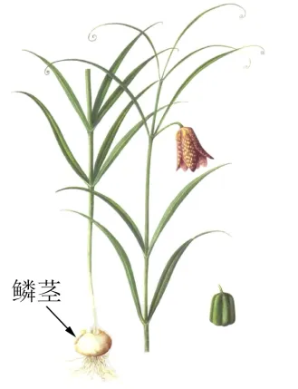

# 2024年山东高考地理真题 · 选择题题组 G1（第1–3题）

## 来源
- 来源文档：精品解析：2024年山东省高考地理真题（解析版）.docx
- 题号：第1–3题（选择题，共3小题）

## 题组材料
平贝（如图）是一种鳞茎入药的名贵中药材，生长周期长，种植投入大。黑龙江省铁力市H村平贝种植历史悠久。在起收平贝后，村民将大鳞茎出售、中小鳞茎作为种茎分级分区栽植，实现逐年轮流起收。起收的鳞茎附着大量泥土，过去村民常在河中手工清洗鳞茎。近年来H村新建了沉淀式自动清洗场，将清洗鳞茎后沉淀的泥土重新还田。在H村的带动下，铁力市已成为全国最大的平贝栽培和集散基地。据此完成下面小题。

## 相关图片


## 第1题
question_id: `2024-山东-地理-2024年山东高考地理真题-Q1`

**题干**：1. “逐年轮流起收”的主要目的是（   ）

**选项**:
- A. 减少产品损耗
- B. 应对市场风险
- C. 保护种质资源
- D. 降低劳动投入

**答案**：B

**解析**：【1题详解】

由材料“在起收平贝后，村民将大鳞茎出售、中小鳞茎作为种茎分级分区栽植，实现逐年轮流起收。”可知，“逐年轮流起收”是起收平贝的一种方式，而产品损耗是起收后产品在储存、运输等过程中的损耗，与逐年轮流起收这种方式关系不大，A错误；逐年轮流起收能灵活应对市场需求，在市场需求量大、价格高时多起收多销售，在市场需求量小、价格低时少起收，这样可以应对市场风险，B正确；由材料可知，平贝在铁力市栽培规模大，说明平贝不是稀缺的种质资源，而“逐年轮流起收”是起收平贝的一种方式，与保护种质资源也无关，C错误；“逐年轮流起收”，每年都要投入一定的劳动力，不能降低劳动投入，D错误。故选B。

**知识点归属**：
- **核心考点 · 权重 1.0**：人文地理 → 产业区位 → 农业区位因素

**整体置信度**：高

<!-- MANAGED-KM-START Q1
```yaml
question_id: "2024-山东-地理-2024年山东高考地理真题-Q1"
question_number: 1
knowledge_points:
  - role: core_exam_point
    weight: 1.0
    domain_id: DM-HUM
    domain: "人文地理"
    theme_id: TH-HUM-INDUSTRY
    theme: "产业区位"
    knowledge_unit_id: KU-HUM-IND-001
    knowledge_unit: "农业区位因素"
    evidence: "逐年轮流起收使销售数量可随市场需求和价格变化调整，从而分散农产品市场风险。"
extra_tags:
  - "农产品市场风险"
  - "轮作式分批起收"
taxonomy_version: "config-v0.2-draft"
confidence: "high"
label_status: "completed"
needs_review: false
taxonomy_review:
  needs_review: false
  issue_type: "none"
  review_note: ""
note: ""
```
-->

## 第2题
question_id: `2024-山东-地理-2024年山东高考地理真题-Q2`

**题干**：2. 与传统清洗方式相比，采用沉淀式自动方式清洗鳞茎有利于（   ）

**选项**:
- A. 提高清洗效果
- B. 减少清洗工序
- C. 保持土壤肥力
- D. 提高产品品质

**答案**：C

**解析**：【2题详解】

根据材料信息“起收的鳞茎附着大量泥土，过去村民常在河中手工清洗鳞茎。近年来H村新建了沉淀式自动清洗场，将清洗鳞茎后沉淀的泥土重新还田。”可知，与传统清洗方式相比，采用沉淀式自动方式清洗鳞茎可以将鳞茎上附带的泥土还田，减少土壤肥力的流失，有利于保持土壤肥力，C正确；传统清洗方式和沉淀式自动方式清洗，均需要保障清洗效果，不损坏产品，保障产品品质，故沉淀式自动方式不能提高清洗效果和产品品质，AD错误；与传统手工清洗相比，沉淀式自动方式可能会增加清洗工序，B错误。所以选C。

**知识点归属**：
- **核心考点 · 权重 1.0**：自然地理 → 植被与土壤 → 土壤的功能与养护

**整体置信度**：高

<!-- MANAGED-KM-START Q2
```yaml
question_id: "2024-山东-地理-2024年山东高考地理真题-Q2"
question_number: 2
knowledge_points:
  - role: core_exam_point
    weight: 1.0
    domain_id: DM-NAT
    domain: "自然地理"
    theme_id: TH-NAT-VEGETATION-SOIL
    theme: "植被与土壤"
    knowledge_unit_id: KU-NAT-VEG-SOIL-006
    knowledge_unit: "土壤的功能与养护"
    evidence: "沉淀式清洗把鳞茎附着泥土回田，减少土壤物质和肥力流失，体现土壤养护。"
extra_tags:
  - "清洗泥土回田"
  - "土壤肥力保持"
taxonomy_version: "config-v0.2-draft"
confidence: "high"
label_status: "completed"
needs_review: false
taxonomy_review:
  needs_review: false
  issue_type: "none"
  review_note: ""
note: ""
```
-->

## 第3题
question_id: `2024-山东-地理-2024年山东高考地理真题-Q3`

**题干**：3. 为打造全国平贝产业高地，铁力市宜重点布局（   ）

**选项**:
- A. 医疗器械企业
- B. 医药制造企业
- C. 食品加工企业
- D. 农机装备企业

**答案**：B

**解析**：【3题详解】

根据材料信息“平贝（如图）是一种鳞茎入药的名贵中药材，生长周期长，种植投入大。”可知，平贝是名贵中药材，应依托平贝种植业发展医药制造企业，延长产业链，提高产品附加值，B正确；医疗器械对科技要求较高，与平贝产业相关性较小，铁力市也无明显技术优势，A错误；平贝属于中药材，不是食品，且食品加工企业附加值也较低，C错误；农机装备企业与平贝产业相关性较小，D错误。所以选B。

【点睛】影响农业的区位因素有自然因素和科学技术因素、市场经济因素三个方面，其中自然因素包括水源、气候（光照、热量、降水）、土壤、地形，发展比较稳定。科学技术因素包括劳动力、生产技术、种植方式、耕作方式，发展比较快；市场经济因素包括市场、交通、农产品消费状况等，发展比较快。

**知识点归属**：
- **核心考点 · 权重 1.0**：区域发展 → 产业结构变化与区域发展 → 产业结构的升级
- **支撑知识 · 权重 0.7**：人文地理 → 产业区位 → 工业区位因素

**整体置信度**：高

<!-- MANAGED-KM-START Q3
```yaml
question_id: "2024-山东-地理-2024年山东高考地理真题-Q3"
question_number: 3
knowledge_points:
  - role: core_exam_point
    weight: 1.0
    domain_id: DM-REG
    domain: "区域发展"
    theme_id: TH-REG-INDUSTRY
    theme: "产业结构变化与区域发展"
    knowledge_unit_id: KU-REG-INDUSTRY-002
    knowledge_unit: "产业结构的升级"
    evidence: "依托平贝原料布局医药制造，可延长产业链、提高附加值并推动地方产业升级。"
  - role: supporting_knowledge
    weight: 0.7
    domain_id: DM-HUM
    domain: "人文地理"
    theme_id: TH-HUM-INDUSTRY
    theme: "产业区位"
    knowledge_unit_id: KU-HUM-IND-002
    knowledge_unit: "工业区位因素"
    evidence: "医药制造与当地平贝原料及既有集散基础关联紧密。"
extra_tags:
  - "农产品深加工"
  - "产业链延伸"
taxonomy_version: "config-v0.2-draft"
confidence: "high"
label_status: "completed"
needs_review: false
taxonomy_review:
  needs_review: false
  issue_type: "none"
  review_note: ""
note: ""
```
-->

## 教学备注
<!-- TEACHER-NOTES-START -->
- 易错点：
- 课堂提示：
- 讲解建议：
<!-- TEACHER-NOTES-END -->
