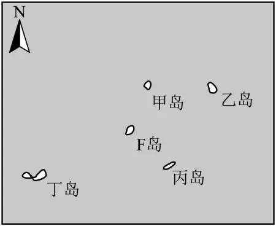

# 2024年山东高考地理真题 · 选择题题组 G3（第6–7题）

## 来源
- 来源文档：精品解析：2024年山东省高考地理真题（解析版）.docx
- 题号：第6–7题（选择题，共2小题）

## 题组材料
小明暑假乘船到F岛旅游。下船后，小明发现太阳当空，周围的人却“没有”影子，他记录了当时的时间为北京时间8月21日00:04。当地时间下午，小明从F岛乘船去往某岛屿观光，途中发现游船甲板中心处旗杆的影子多数时间指向船行进的方向。如图示意F岛及其周边区域。据此完成下面小题。

## 相关图片


## 第6题
question_id: `2024-山东-地理-2024年山东高考地理真题-Q6`

**题干**：6. F岛的位置可能是（   ）

**选项**:
- A. 12°N，61°W
- B. 12°N，121°W
- C. 20°N，61°W
- D. 20°N，121°W

**答案**：A

**解析**：【6题详解】

太阳当空，人却没有影子，说明当地为太阳直射点，且地方时为12时，根据北京时间为00:04，计算可得当地经度是61°W，BD错误；8月21日，太阳直射点接近12°N，故该地纬度位12°N，C错误，A正确。综上所述，BCD错误，故选A。

**知识点归属**：
- **核心考点 · 权重 1.0**：自然地理 → 地球的运动 → 地球的自转
- **核心考点 · 权重 1.0**：自然地理 → 地球的运动 → 黄赤交角与太阳直射点的回归运动

**整体置信度**：高

<!-- MANAGED-KM-START Q6
```yaml
question_id: "2024-山东-地理-2024年山东高考地理真题-Q6"
question_number: 6
knowledge_points:
  - role: core_exam_point
    weight: 1.0
    domain_id: DM-NAT
    domain: "自然地理"
    theme_id: TH-NAT-EARTH-MOTION
    theme: "地球的运动"
    knowledge_unit_id: KU-NAT-EARTH-MOTION-001
    knowledge_unit: "地球的自转"
    evidence: "太阳位于当地天顶时地方时为12时，结合北京时间00:04换算得经度约61°W。"
  - role: core_exam_point
    weight: 1.0
    domain_id: DM-NAT
    domain: "自然地理"
    theme_id: TH-NAT-EARTH-MOTION
    theme: "地球的运动"
    knowledge_unit_id: KU-NAT-EARTH-MOTION-003
    knowledge_unit: "黄赤交角与太阳直射点的回归运动"
    evidence: "8月21日太阳直射点约在12°N，天顶太阳据此确定F岛纬度。"
extra_tags:
  - "地方时与经度计算"
  - "太阳直射纬度定位"
taxonomy_version: "config-v0.2-draft"
confidence: "high"
label_status: "completed"
needs_review: false
taxonomy_review:
  needs_review: false
  issue_type: "none"
  review_note: ""
note: "经度和纬度分别由地方时换算与太阳直射点位置确定，两个机制共同构成完整定位。"
```
-->

## 第7题
question_id: `2024-山东-地理-2024年山东高考地理真题-Q7`

**题干**：7. 当地时间下午，小明去往的岛屿最可能是（   ）

**选项**:
- A. 甲岛
- B. 乙岛
- C. 丙岛
- D. 丁岛

**答案**：C

**解析**：【7题详解】

该日太阳直射点在北半球，日出方位东北，日落方位西北，正午太阳直射，故一天中该地太阳一直在偏北侧。当地时间的下午，太阳位于西北方位，旗杆的影子位于东南方位，所以船的行进方向是东南，位于F岛东南方位的岛屿是丙岛，C正确，ABD错误。故选C。

【点睛】日出日落方位变化规律（极昼极夜地区除外）：直射北半球：东北升，西北落。直射南半球：东南升，西南落。直射赤道：正东升，正西落。

**知识点归属**：
- **核心考点 · 权重 1.0**：自然地理 → 地球的运动 → 黄赤交角与太阳直射点的回归运动

**整体置信度**：高

<!-- MANAGED-KM-START Q7
```yaml
question_id: "2024-山东-地理-2024年山东高考地理真题-Q7"
question_number: 7
knowledge_points:
  - role: core_exam_point
    weight: 1.0
    domain_id: DM-NAT
    domain: "自然地理"
    theme_id: TH-NAT-EARTH-MOTION
    theme: "地球的运动"
    knowledge_unit_id: KU-NAT-EARTH-MOTION-003
    knowledge_unit: "黄赤交角与太阳直射点的回归运动"
    evidence: "太阳直射北半球时当地下午太阳位于西北，旗杆影子指向东南，据此确定航行方向。"
extra_tags:
  - "太阳方位与物影方向"
  - "日落方位"
taxonomy_version: "config-v0.2-draft"
confidence: "high"
label_status: "completed"
needs_review: false
taxonomy_review:
  needs_review: false
  issue_type: "none"
  review_note: ""
note: ""
```
-->

## 教学备注
<!-- TEACHER-NOTES-START -->
- 易错点：
- 课堂提示：
- 讲解建议：
<!-- TEACHER-NOTES-END -->
