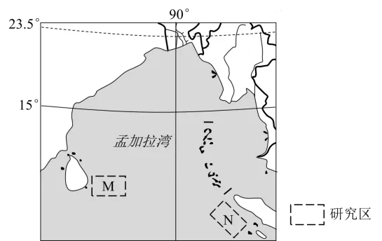

# 2024年山东高考地理真题 · 选择题题组 G4（第8–9题）

## 来源
- 来源文档：精品解析：2024年山东省高考地理真题（解析版）.docx
- 题号：第8–9题（选择题，共2小题）

## 题组材料
海洋浮游植物密度的空间分布与海水性质、营养盐等环境因子密切相关。远岸海域浮游植物密度受陆地影响较小。如图示意孟加拉湾及其周边区域。据此完成下面小题。

## 相关图片


## 第8题
question_id: `2024-山东-地理-2024年山东高考地理真题-Q8`

**题干**：8. 下列月份中，M区域浮游植物密度最高的是（   ）

**选项**:
- A. 1月
- B. 4月
- C. 7月
- D. 10月

**答案**：C

**解析**：【8题详解】

根据图示信息可知，M区域位于北印度洋海域，夏季该地盛行西南季风，该海域为离岸风，形成离岸流，底层营养盐类上泛，有利于浮游生物的繁殖，浮游生物密度较高，7月为北半球夏季，M区域浮游植物密度最高，C正确；1月、4月、10月该海域上升流不强，营养物质较少，浮游生物密度较小，ABD错误。所以选C。

**知识点归属**：
- **核心考点 · 权重 1.0**：自然地理 → 水文与海洋 → 洋流
- **支撑知识 · 权重 0.7**：资源、环境与国家安全 → 资源环境与人类社会 → 海洋生物资源与渔场形成条件

**整体置信度**：高

<!-- MANAGED-KM-START Q8
```yaml
question_id: "2024-山东-地理-2024年山东高考地理真题-Q8"
question_number: 8
knowledge_points:
  - role: core_exam_point
    weight: 1.0
    domain_id: DM-NAT
    domain: "自然地理"
    theme_id: TH-NAT-WATER
    theme: "水文与海洋"
    knowledge_unit_id: KU-NAT-WATER-004
    knowledge_unit: "洋流"
    evidence: "夏季西南季风形成离岸流和上升流，底层营养盐上泛使M区7月浮游植物密度最高。"
  - role: supporting_knowledge
    weight: 0.7
    domain_id: DM-RES
    domain: "资源、环境与国家安全"
    theme_id: TH-RES-SOC
    theme: "资源环境与人类社会"
    knowledge_unit_id: KU-RES-SOC-004
    knowledge_unit: "海洋生物资源与渔场形成条件"
    evidence: "营养盐上泛促进浮游植物繁殖，是海洋生物资源富集的直接条件。"
extra_tags:
  - "季风离岸流"
  - "上升流营养盐"
taxonomy_version: "config-v0.2-draft"
confidence: "high"
label_status: "completed"
needs_review: false
taxonomy_review:
  needs_review: false
  issue_type: "none"
  review_note: ""
note: ""
```
-->

## 第9题
question_id: `2024-山东-地理-2024年山东高考地理真题-Q9`

**题干**：9. 与7—8月相比，12月至次年1月N区域海水盐度较高的主要影响因素是（   ）

**选项**:
- A. 蒸发
- B. 降水
- C. 径流
- D. 洋流

**答案**：D

**解析**：【9题详解】

根据图示信息可知，N区域纬度位置较低，附近陆地主要是热带雨林气候区，气温和降水季节差异不大，蒸发量季节差异也不大，不是影响盐度季节变化的主要因素，AB错误；N区域附近岛屿较小，且N海域离陆地较远，径流补给量较小且季节变化不大，C错误；7-8月孟加拉湾沿岸降水多，入海径流量大，北印度洋海区洋流呈顺时针，将孟加拉湾北部盐度较低的海水带到N海域，而12月-次年1月，北印度洋海区洋流呈逆时针，N海域受孟加拉湾北部低盐度海水的影响小，故N海域12月-次年1月盐度较高，D正确。所以选D。

【点睛】从根本上讲，影响海水盐度的因素是海水有降水量、蒸发量、径流量、溶解度等因素。1、降水量越大，盐度越低；2、蒸发量越大，盐度越高；3、河口地区陆地径流注入越多，盐度越低；4、暖流流经海区蒸发量偏大，盐的溶解度也偏大，则盐度偏高。

**知识点归属**：
- **核心考点 · 权重 1.0**：自然地理 → 水文与海洋 → 洋流
- **支撑知识 · 权重 0.7**：自然地理 → 水文与海洋 → 海水的性质

**整体置信度**：高

<!-- MANAGED-KM-START Q9
```yaml
question_id: "2024-山东-地理-2024年山东高考地理真题-Q9"
question_number: 9
knowledge_points:
  - role: core_exam_point
    weight: 1.0
    domain_id: DM-NAT
    domain: "自然地理"
    theme_id: TH-NAT-WATER
    theme: "水文与海洋"
    knowledge_unit_id: KU-NAT-WATER-004
    knowledge_unit: "洋流"
    evidence: "季风洋流流向季节转换改变孟加拉湾低盐水输送，使N区冬季受低盐水影响较弱。"
  - role: supporting_knowledge
    weight: 0.7
    domain_id: DM-NAT
    domain: "自然地理"
    theme_id: TH-NAT-WATER
    theme: "水文与海洋"
    knowledge_unit_id: KU-NAT-WATER-002
    knowledge_unit: "海水的性质"
    evidence: "海水盐度差异需由低盐水输入强弱判断。"
extra_tags:
  - "北印度洋季风洋流"
  - "低盐水输送"
taxonomy_version: "config-v0.2-draft"
confidence: "high"
label_status: "completed"
needs_review: false
taxonomy_review:
  needs_review: false
  issue_type: "none"
  review_note: ""
note: ""
```
-->

## 教学备注
<!-- TEACHER-NOTES-START -->
- 易错点：
- 课堂提示：
- 讲解建议：
<!-- TEACHER-NOTES-END -->
