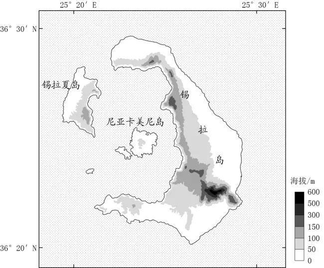

# 2024年山东高考地理真题 · 选择题题组 G5（第10–12题）

## 来源
- 来源文档：精品解析：2024年山东省高考地理真题（解析版）.docx
- 题号：第10–12题（选择题，共3小题）

## 题组材料
锡拉岛位于地中海，整个岛屿被厚厚的火山岩和火山灰覆盖，夏季岛上北风频发。约3600年前的古锡拉岛是一个圆形的大岛（范围包括现在的锡拉岛和附近小岛，以及这些岛屿之间的海域），后来演变成环形群岛，其中最大的岛屿为锡拉岛（左图）。锡拉岛的西部葡萄种植历史悠久，当地农民在管理葡萄时将葡萄藤盘成圆形的篮子状（右图），并将葡萄果实置于“篮子”内生长。据此完成下面小题。

## 相关图片



## 第10题
question_id: `2024-山东-地理-2024年山东高考地理真题-Q10`

**题干**：10. 导致古锡拉岛演变为环形群岛的主要地质作用是（   ）

**选项**:
- A. 火山喷发
- B. 地壳运动
- C. 海浪侵蚀
- D. 风力侵蚀

**答案**：A

**解析**：【10题详解】

岛屿整体形态的变化属于大尺度上的地质作用所产生，外力作用一般只能对地表形态起到“修饰”作用，因此可以排除C、D；根据材料提到的“整个岛屿被厚厚的火山岩和火山灰覆盖”，可以判断这里有火山活动，根据形状可以推测，火山喷发使得原岛屿中部出现火山口，海水通过火山口边缘低洼地区注入，形成现在的环形群岛，A正确；地壳运动难以导致古锡拉岛演变为环形群岛，排除B。故选A。

**知识点归属**：
- **核心考点 · 权重 1.0**：自然地理 → 地表形态 → 塑造地表形态的内力与外力作用

**整体置信度**：高

<!-- MANAGED-KM-START Q10
```yaml
question_id: "2024-山东-地理-2024年山东高考地理真题-Q10"
question_number: 10
knowledge_points:
  - role: core_exam_point
    weight: 1.0
    domain_id: DM-NAT
    domain: "自然地理"
    theme_id: TH-NAT-LANDFORM
    theme: "地表形态"
    knowledge_unit_id: KU-NAT-LANDFORM-006
    knowledge_unit: "塑造地表形态的内力与外力作用"
    evidence: "厚层火山岩和火山灰及环形群岛形态共同指示火山喷发这一内力作用重塑古岛。"
extra_tags:
  - "火山口塌陷与海水侵入"
  - "火山岛"
taxonomy_version: "config-v0.2-draft"
confidence: "high"
label_status: "completed"
needs_review: false
taxonomy_review:
  needs_review: false
  issue_type: "none"
  review_note: ""
note: ""
```
-->

## 第11题
question_id: `2024-山东-地理-2024年山东高考地理真题-Q11`

**题干**：11. 锡拉岛上的葡萄在需水量较大的生长期也无需灌溉，主要是因为（   ）

**选项**:
- A. 大气降水多
- B. 土壤保水性好
- C. 地表蒸发弱
- D. 空气湿度大

**答案**：B

**解析**：【11题详解】

根据区域定位，该岛屿地处地中海气候区，夏季炎热干燥，生长期降水较少，排除A；生长期气温高，地表蒸发强，排除C；夏季炎热干燥，且夏季岛上北风频发，从大陆吹来（从高纬吹向低纬），因此空气湿度小，排除D；根据材料“整个岛屿被厚厚的火山岩和火山灰覆盖”，可以起到保水作用，B正确；故选B。

**知识点归属**：
- **核心考点 · 权重 1.0**：自然地理 → 植被与土壤 → 土壤的功能与养护

**整体置信度**：高

<!-- MANAGED-KM-START Q11
```yaml
question_id: "2024-山东-地理-2024年山东高考地理真题-Q11"
question_number: 11
knowledge_points:
  - role: core_exam_point
    weight: 1.0
    domain_id: DM-NAT
    domain: "自然地理"
    theme_id: TH-NAT-VEGETATION-SOIL
    theme: "植被与土壤"
    knowledge_unit_id: KU-NAT-VEG-SOIL-006
    knowledge_unit: "土壤的功能与养护"
    evidence: "厚厚的火山岩风化物和火山灰具有较强蓄水保水能力，可在夏季少雨期供葡萄生长。"
extra_tags:
  - "火山灰土保水"
  - "旱作葡萄"
taxonomy_version: "config-v0.2-draft"
confidence: "high"
label_status: "completed"
needs_review: false
taxonomy_review:
  needs_review: false
  issue_type: "none"
  review_note: ""
note: ""
```
-->

## 第12题
question_id: `2024-山东-地理-2024年山东高考地理真题-Q12`

**题干**：12. 当地农民将葡萄藤盘成篮子状的主要目的是（   ）

**选项**:
- A. 保土
- B. 增湿
- C. 防风
- D. 降温

**答案**：C

**解析**：【12题详解】

根据材料“夏季岛上北风频发”，“将葡萄果实置于‘篮子’内生长”，可以推测出主要目的是“防风”，C正确；葡萄藤盘可以减少太阳照射、减小风速，因此可以减少蒸发，起到保湿作用，但是不是增湿，排除B；该地不属于风力侵蚀特别严重的区域，且火山灰土壤较厚，因此保土需求不大，排除A；葡萄生长习性是喜光热的，因此不需要降温，排除D；故选C。

【点睛】农业区位因素是指影响农业生产和布局的各种因素，这些因素包括自然因素和社会经济因素。自然因素主要包括气候、地形、土壤、水源等，而社会经济因素则包括市场、交通、劳动力、政策、科技等。这些因素相互关联，共同作用于农业生产，决定了农业的类型、规模和布局。

**知识点归属**：
- **核心考点 · 权重 1.0**：人文地理 → 产业区位 → 农业区位因素

**整体置信度**：高

<!-- MANAGED-KM-START Q12
```yaml
question_id: "2024-山东-地理-2024年山东高考地理真题-Q12"
question_number: 12
knowledge_points:
  - role: core_exam_point
    weight: 1.0
    domain_id: DM-HUM
    domain: "人文地理"
    theme_id: TH-HUM-INDUSTRY
    theme: "产业区位"
    knowledge_unit_id: KU-HUM-IND-001
    knowledge_unit: "农业区位因素"
    evidence: "夏季北风频发，盘篮式整枝使果实处于藤蔓内部以降低风害，是农业生产对气候条件的适应。"
extra_tags:
  - "盘篮式整枝"
  - "农业防风措施"
taxonomy_version: "config-v0.2-draft"
confidence: "high"
label_status: "completed"
needs_review: false
taxonomy_review:
  needs_review: false
  issue_type: "none"
  review_note: ""
note: ""
```
-->

## 教学备注
<!-- TEACHER-NOTES-START -->
- 易错点：
- 课堂提示：
- 讲解建议：
<!-- TEACHER-NOTES-END -->
