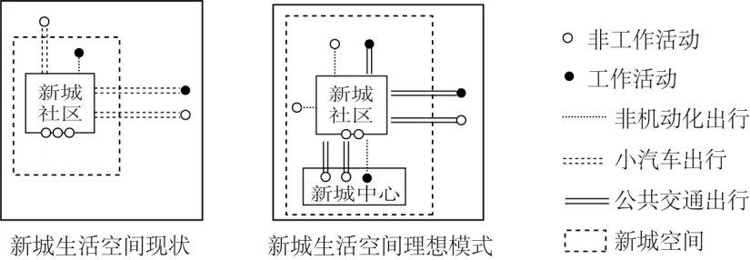

# 2024年山东高考地理真题 · 选择题题组 G6（第13–15题）

## 来源
- 来源文档：精品解析：2024年山东省高考地理真题（解析版）.docx
- 题号：第13–15题（选择题，共3小题）

## 题组材料
新城生活空间是指新城居民在日常生活中各种行为活动所占据的场所和空间。如图示意2017年我国某大都市某新城生活空间现状和新城生活空间理想模式。调查显示，该新城的社区居民休息日与工作日的出行率、人均出行次数均相当。据此完成下面小题。

## 相关图片


## 第13题
question_id: `2024-山东-地理-2024年山东高考地理真题-Q13`

**题干**：13. 该新城的社区居民非工作活动大部分在新城外或社区附近，主要是因为新城（   ）

**选项**:
- A. 交通方式较为单一
- B. 生活服务设施不足
- C. 生态环境质量较差
- D. 居民消费能力较弱

**答案**：B

**解析**：【13题详解】

根据题干和新城生活空间现状图分析可知，该新城的社区居民非工作活动大部分在新城外或社区附近，主要是因为新城超市、公园、医院、娱乐等生活服务设施不足，居民需到新城外或者社区进行消费等生活活动，与交通方式是否单一关系不大，B正确，A错误；新城选址时应该充分考虑了生态环境质量，且居民居住在新城，生态环境质量应该能满足需求，C错误；新城居民有非工作活动，而且居民休息日与工作日的出行率、人均出行次数均相当，说明居民消费需求较多，消费能力较高，D错误。故选B。

**知识点归属**：
- **核心考点 · 权重 1.0**：人文地理 → 乡村与城镇 → 合理利用城乡空间

**整体置信度**：高

<!-- MANAGED-KM-START Q13
```yaml
question_id: "2024-山东-地理-2024年山东高考地理真题-Q13"
question_number: 13
knowledge_points:
  - role: core_exam_point
    weight: 1.0
    domain_id: DM-HUM
    domain: "人文地理"
    theme_id: TH-HUM-SETTLEMENT
    theme: "乡村与城镇"
    knowledge_unit_id: KU-HUM-SET-004
    knowledge_unit: "合理利用城乡空间"
    evidence: "居民非工作活动集中在新城外或社区附近，反映新城生活服务设施配置不足、职住生活功能不完善。"
extra_tags:
  - "新城生活服务设施"
  - "职住生活功能失衡"
taxonomy_version: "config-v0.2-draft"
confidence: "high"
label_status: "completed"
needs_review: false
taxonomy_review:
  needs_review: false
  issue_type: "none"
  review_note: ""
note: ""
```
-->

## 第14题
question_id: `2024-山东-地理-2024年山东高考地理真题-Q14`

**题干**：14. 为达到新城生活空间理想模式状态，该新城未来发展的首要任务是（   ）

**选项**:
- A. 扩大新城空间范围
- B. 增加休闲娱乐场所
- C. 促进就业本地化
- D. 完善社会保障体系

**答案**：C

**解析**：【14题详解】

通过对比新城生活空间现状和新城生活空间理想模式图可知，新城现状是工作活动和非工作活动均主要在新城外，那新城主要是居住功能，也就是“卧城”，为达到新城生活空间理想模式状态，该新城未来发展的首要任务是引进产业，提供就业机会，促进就业本地化，使人口在新城稳定下来，C正确；当新城人口工作和非工作活动均主要在新城后可以增加休闲娱乐场所，完善社会保障体系，BD错误。新城空间稍未充分开发，扩大新城空间范围不是首要任务，A错误。故选C。

**知识点归属**：
- **核心考点 · 权重 1.0**：人文地理 → 乡村与城镇 → 合理利用城乡空间

**整体置信度**：高

<!-- MANAGED-KM-START Q14
```yaml
question_id: "2024-山东-地理-2024年山东高考地理真题-Q14"
question_number: 14
knowledge_points:
  - role: core_exam_point
    weight: 1.0
    domain_id: DM-HUM
    domain: "人文地理"
    theme_id: TH-HUM-SETTLEMENT
    theme: "乡村与城镇"
    knowledge_unit_id: KU-HUM-SET-004
    knowledge_unit: "合理利用城乡空间"
    evidence: "由卧城状态转向理想生活空间，首要是引入就业岗位、促进就业本地化，实现职住平衡。"
extra_tags:
  - "新城职住平衡"
  - "就业本地化"
taxonomy_version: "config-v0.2-draft"
confidence: "high"
label_status: "completed"
needs_review: false
taxonomy_review:
  needs_review: false
  issue_type: "none"
  review_note: ""
note: ""
```
-->

## 第15题
question_id: `2024-山东-地理-2024年山东高考地理真题-Q15`

**题干**：15. 达到新城生活空间理想模式状态后，该新城的社区居民日常（   ）

**选项**:
- A. 平均出行距离增加
- B. 工作出行次数减少
- C. 平均出行成本增加
- D. 出行方式更加多元

**答案**：D

**解析**：【15题详解】

根据材料和图可知，达到新城生活空间理想模式状态后，该新城的社区居民日常平均出行距离减小，非机动化出行、工作活动可能导致工作出行次数增加，AB错误；公共交通出行为主，平均出行成本减少，C错误；出行方式包括非机动化出行、小汽车出行、公共交通出行，出行方式更加多元，D正确。故选D。

【点睛】影响城市形成和发展的区位条件：地理位置：地理位置优越，腹地广阔，服务范围大，发展条件优越，潜力大；资源状况：位于资源丰富地区的城市能够获得支撑城市进一步发展的资源条件；交通条件：位于交通枢纽上的城市能够通过便利的交通为更远的居民提供服务，使其服务范围扩大；政策支持；科学技术。

**知识点归属**：
- **核心考点 · 权重 1.0**：人文地理 → 乡村与城镇 → 合理利用城乡空间

**整体置信度**：高

<!-- MANAGED-KM-START Q15
```yaml
question_id: "2024-山东-地理-2024年山东高考地理真题-Q15"
question_number: 15
knowledge_points:
  - role: core_exam_point
    weight: 1.0
    domain_id: DM-HUM
    domain: "人文地理"
    theme_id: TH-HUM-SETTLEMENT
    theme: "乡村与城镇"
    knowledge_unit_id: KU-HUM-SET-004
    knowledge_unit: "合理利用城乡空间"
    evidence: "理想模式把就业和生活服务配置在新城内部，并组合非机动、小汽车和公共交通，促成多元出行。"
extra_tags:
  - "多元交通方式"
  - "紧凑型生活空间"
taxonomy_version: "config-v0.2-draft"
confidence: "high"
label_status: "completed"
needs_review: false
taxonomy_review:
  needs_review: false
  issue_type: "none"
  review_note: ""
note: ""
```
-->

## 教学备注
<!-- TEACHER-NOTES-START -->
- 易错点：
- 课堂提示：
- 讲解建议：
<!-- TEACHER-NOTES-END -->
