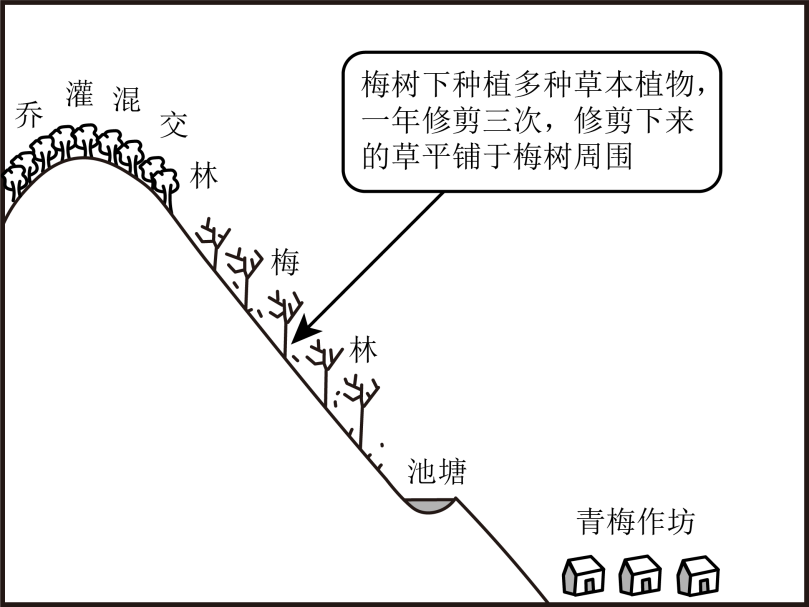

# 2025年山东高考地理真题 · 综合题第16题（小问1–2）

## 来源
- 来源文档：2025年山东高考地理真题
- 题号：第16题（非选择题，共2小问）

## 题组材料
日本和歌山县某地区山地陡峭、土壤贫瘠。大约四百年前，人们开始尝试在山坡上种植青梅。经过长期发展，当地逐渐形成了稳定的集种植、加工、旅游等为一体的青梅复合生产系统（下图）。当地青梅有早、中、晚熟等品种，普遍具有皮薄、肉多、核小等优良特性，年产量占日本的一半。农户除出售鲜梅外，还将青梅加工成梅干等初级产品，并依托梅林开展赏花、采摘等活动。青梅复合生产系统为当地农户带来了稳定收入。

图中文字（按原始页保留）：梅树下种植多种草本植物 灌混 乔 一年修剪三次，修剪下来 交 的草平铺于梅树周围 林 梅 林 池塘 青梅作坊

## 相关图片


### 第16题（1）
question_id: `2025-山东-地理-2025年山东高考地理真题-Q16-1`

**题干**：（1）说明梅树下草本植物、乔灌混交林对梅林土壤养分维持所起的作用。

**答案**：草本植物作用：固氮作用：部分草本植物具有固氮能力，可增加土壤氮含量。减少水土流失：草本根系可固定表层土壤，减少养分流失。凋落物分解：草本植物凋落物分解后可增加土壤有机质含量。

乔灌混交林作用：养分循环：乔木根系较深，可将深层养分带到表层。遮荫保湿：减少水分蒸发，维持土壤湿度，促进养分分解。生物多样性：不同植物种类带来多样化的凋落物，丰富土壤养分来源。防风固土：减少风蚀和水蚀造成的养分流失。

**解析**：梅树下草本植物的作用：部分豆科草本植物具有根瘤菌共生关系，能够将大气中的氮气转化为植物可利用的氮素，显著增加土壤氮含量，这在贫瘠的山地土壤中尤为重要，为青梅生长提供了关键养分。草本植物根系密集且浅层分布，能有效固定表层土壤，在和歌山县陡峭的山坡上，这一作用尤为突出，防止了因雨水冲刷导致的土壤和养分流失。草本植物生长周期短，凋落物（枯叶、枯枝等）量大且分解迅速。这些有机物质被土壤微生物分解后，转化为腐殖质，提高土壤有机质含量，改善土壤结构和肥力。

乔灌混交林的作用：乔木根系可深达数米，能吸收深层土壤中的矿物质养分，并通过落叶等方式将这些养分带到土壤表层，形成“生物泵”效应，实现养分从深层到表层的循环。乔木和灌木的树冠形成遮荫，减少土壤水分蒸发，维持适宜的土壤湿度。湿润的土壤环境有利于微生物活动，促进有机质分解和养分释放，不同种类的乔木和灌木产生多样化的凋落物，为土壤提供多种养分来源，并支持更丰富的土壤生物群落，形成更稳定的生态系统。乔灌混交林形成立体防护体系，减轻风力和雨水对土壤的直接冲击，从而减少风蚀和水蚀造成的养分流失，特别是在台风频发的日本地区尤为重要。

**知识点归属**：
- **核心考点 · 权重 1.0**：自然地理 → 植被与土壤 → 土壤的功能与养护
- **支撑知识 · 权重 0.7**：自然地理 → 植被与土壤 → 土壤的主要形成因素
- **材料线索 · 权重 0.4**：自然地理 → 自然环境的整体性与差异性 → 自然环境要素间的物质迁移和能量交换

**整体置信度**：高

<!-- MANAGED-KM-START Q16-1
```yaml
question_id: "2025-山东-地理-2025年山东高考地理真题-Q16-1"
question_number: 16
sub_question: 1
knowledge_points:
  - role: core_exam_point
    weight: 1.0
    domain_id: DM-NAT
    domain: "自然地理"
    theme_id: TH-NAT-VEGETATION-SOIL
    theme: "植被与土壤"
    knowledge_unit_id: KU-NAT-VEG-SOIL-006
    knowledge_unit: "土壤的功能与养护"
    evidence: "草本覆盖、凋落物归还和乔灌防护共同保肥固土，属于以植被维持土壤肥力的养护机制。"
  - role: supporting_knowledge
    weight: 0.7
    domain_id: DM-NAT
    domain: "自然地理"
    theme_id: TH-NAT-VEGETATION-SOIL
    theme: "植被与土壤"
    knowledge_unit_id: KU-NAT-VEG-SOIL-005
    knowledge_unit: "土壤的主要形成因素"
    evidence: "植物固氮、根系固土和凋落物分解体现生物因素对土壤养分形成与保持的作用。"
  - role: material_clue
    weight: 0.4
    domain_id: DM-NAT
    domain: "自然地理"
    theme_id: TH-NAT-INTEGRITY
    theme: "自然环境的整体性与差异性"
    knowledge_unit_id: KU-NAT-INTEGRITY-001
    knowledge_unit: "自然环境要素间的物质迁移和能量交换"
    evidence: "深根吸收、凋落物归还和分解构成养分在植被与土壤之间的循环。"
extra_tags:
  - "生物养分循环"
  - "梅林生态养护"
taxonomy_version: "config-v0.2-draft"
confidence: "high"
label_status: "completed"
needs_review: false
taxonomy_review:
  needs_review: false
  issue_type: "none"
  review_note: ""
note: ""
```
-->

### 第16题（2）
question_id: `2025-山东-地理-2025年山东高考地理真题-Q16-2`

**题干**：（2）说明当地农户通过青梅复合生产系统能够获得稳定收入的原因。

**答案**：早、中、晚熟品种延长供应期；加工产品附加值更高；赏花、采摘等旅游收入增加；多元化经营分散单一产品市场风险；优质品种（皮薄、肉多、核小）竞争力强，规模优势话语权大；复合系统维护土壤肥力，保障长期生产能力。

**解析**：早、中、晚熟品种组合使青梅供应期从春季延续到夏季，延长了市场供应时间，降低了因单一品种集中上市导致的价格波动和市场风险。除鲜果销售外，将青梅加工成梅干等初级产品，不仅延长了保质期，还显著提升了产品价值。加工品对鲜果的外观要求较低，能充分利用全部收成，减少浪费。依托梅林开展赏花（春季梅花盛开）、采摘（夏季果实成熟）等旅游活动，开辟了非农产品的收入来源。这类活动受农产品市场价格波动影响小，收入更为稳定。种植、加工、旅游三业并举形成产业组合，当某一环节受市场或自然因素影响时，其他环节仍可提供收入，整体收入流更加稳定可靠。当地青梅具有“皮薄、肉多、核小”的优良特性，产品质量高，市场竞争力强。年产量占日本一半的规模优势使当地在定价和市场话语权上占据主动。复合生产系统通过草本植物和乔灌混交林维护土壤肥力，保障了青梅长期稳定的生产能力，避免因土壤退化导致的产量下降，为持续收入提供了基础保障。

**知识点归属**：
- **核心考点 · 权重 1.0**：区域发展 → 产业结构变化与区域发展 → 产业结构的升级
- **支撑知识 · 权重 0.7**：人文地理 → 产业区位 → 农业区位因素

**整体置信度**：高

<!-- MANAGED-KM-START Q16-2
```yaml
question_id: "2025-山东-地理-2025年山东高考地理真题-Q16-2"
question_number: 16
sub_question: 2
knowledge_points:
  - role: core_exam_point
    weight: 1.0
    domain_id: DM-REG
    domain: "区域发展"
    theme_id: TH-REG-INDUSTRY
    theme: "产业结构变化与区域发展"
    knowledge_unit_id: KU-REG-INDUSTRY-002
    knowledge_unit: "产业结构的升级"
    evidence: "种植、加工与旅游融合提高附加值并形成多元收入，分散单一鲜果经营的市场风险。"
  - role: supporting_knowledge
    weight: 0.7
    domain_id: DM-HUM
    domain: "人文地理"
    theme_id: TH-HUM-INDUSTRY
    theme: "产业区位"
    knowledge_unit_id: KU-HUM-IND-001
    knowledge_unit: "农业区位因素"
    evidence: "错期品种、优良品质、规模优势和土壤肥力共同保障青梅长期稳定供给与市场竞争力。"
extra_tags:
  - "农业产业融合"
  - "多元经营风险分散"
taxonomy_version: "config-v0.2-draft"
confidence: "high"
label_status: "completed"
needs_review: false
taxonomy_review:
  needs_review: false
  issue_type: "none"
  review_note: ""
note: ""
```
-->

## 教学备注
<!-- TEACHER-NOTES-START -->
- 易错点：
- 课堂提示：
- 讲解建议：
<!-- TEACHER-NOTES-END -->
