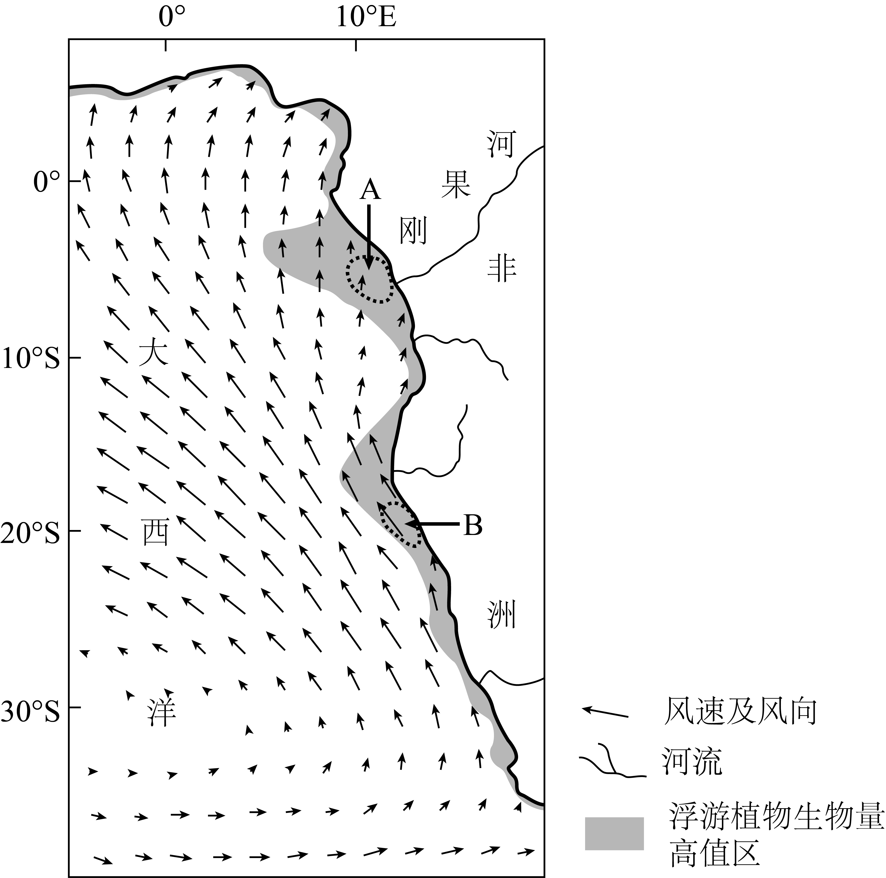
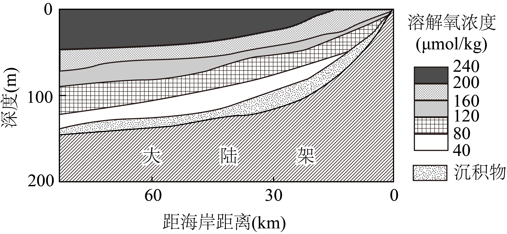

# 2025年山东高考地理真题 · 综合题第18题（小问1–3）

## 来源
- 来源文档：2025年山东高考地理真题
- 题号：第18题（非选择题，共3小问）

## 题组材料
海水性质的水平分布与垂直变化受多种因素的影响。下图示意大西洋局部海域的风速、风向以及浮游植物生物量高值区。

## 相关图片


### 第18题（1）
question_id: `2025-山东-地理-2025年山东高考地理真题-Q18-1`

**题干**：（1）营养盐是影响浮游植物生物量主要因素之一。A、B两海区营养盐含量均较高，但主导因素不同。分别指出导致A、B两海区营养盐含量较高的主导因素。

**答案**：A海区：刚果河入海携带丰富的陆源营养盐类。

B海区：东南信风为离岸风，驱动上升流带来营养物质。

**解析**：营养盐，如硝酸盐、磷酸盐是浮游植物生长关键限制因子，主要来源包括上升流、河流输入、大气沉降等。读图可知，A海区位于刚果河入海口，河流携带丰富的陆源营养盐类入海，导致营养盐含量较高。B海区位于20°S附近的非洲西海岸，盛行东南信风，东南信风为离岸风，驱动表层海水离岸（向西）运动，导致近岸地区表层海水缺失，深层冷海水上涌（上升流），将海底丰富的营养盐带到表层，主导因素为风驱动的上升流。

**知识点归属**：
- **核心考点 · 权重 1.0**：自然地理 → 自然环境的整体性与差异性 → 自然环境要素间的物质迁移和能量交换
- **支撑知识 · 权重 0.7**：自然地理 → 水文与海洋 → 陆地水体及其相互关系
- **支撑知识 · 权重 0.7**：自然地理 → 水文与海洋 → 洋流

**整体置信度**：高

<!-- MANAGED-KM-START Q18-1
```yaml
question_id: "2025-山东-地理-2025年山东高考地理真题-Q18-1"
question_number: 18
sub_question: 1
knowledge_points:
  - role: core_exam_point
    weight: 1.0
    domain_id: DM-NAT
    domain: "自然地理"
    theme_id: TH-NAT-INTEGRITY
    theme: "自然环境的整体性与差异性"
    knowledge_unit_id: KU-NAT-INTEGRITY-001
    knowledge_unit: "自然环境要素间的物质迁移和能量交换"
    evidence: "A区由河流输入、B区由上升流输送营养盐，核心都是营养物质在陆海及海水垂向之间的迁移。"
  - role: supporting_knowledge
    weight: 0.7
    domain_id: DM-NAT
    domain: "自然地理"
    theme_id: TH-NAT-WATER
    theme: "水文与海洋"
    knowledge_unit_id: KU-NAT-WATER-005
    knowledge_unit: "陆地水体及其相互关系"
    evidence: "A海区需要识别刚果河径流将陆源营养盐输送入海。"
  - role: supporting_knowledge
    weight: 0.7
    domain_id: DM-NAT
    domain: "自然地理"
    theme_id: TH-NAT-WATER
    theme: "水文与海洋"
    knowledge_unit_id: KU-NAT-WATER-004
    knowledge_unit: "洋流"
    evidence: "B海区需要判断离岸风驱动上升流，把深层营养物质带至表层。"
extra_tags:
  - "河流营养盐输入"
  - "离岸风上升流"
taxonomy_version: "config-v0.2-draft"
confidence: "high"
label_status: "completed"
needs_review: false
taxonomy_review:
  needs_review: false
  issue_type: "none"
  review_note: ""
note: ""
```
-->

### 第18题（2）
question_id: `2025-山东-地理-2025年山东高考地理真题-Q18-2`

**题干**：（2）溶解氧是以分子形式存在于水体中的氧气。下图示意该海域沿23°S纬线局部断面溶解氧浓度的垂直变化。说明该断面底层海水溶解氧浓度低的主要原因。



**答案**：底层海水无法直接接纳大气中氧气的溶解补充；深水区光照弱，绿色植物少，光合作用合成的氧气少；海底沉积物较厚，海洋生物残骸和有机碎屑较多，分解消耗溶解氧；表层水温高，密度小，水体分层显著，表层海水和深层海水交换弱。

**解析**：注意题干关键词“底层海水溶解氧浓度低”，即底层海水溶解氧收入少，支出多。从局部（底层海水）的角度体现收支思想，另一方面还需从整体角度，考虑海水上下交换。由材料知，溶解氧是以分子形式存在于水体中的氧气，底层海水无法直接接纳大气中氧气的溶解补充；深海区太阳辐射进入少，光照弱，绿色植物少，光合作用合成的氧气少；海底沉积物较厚，沉积物中海洋生物残体和有机物碎屑较多，其分解消耗大量溶解氧。根据所学“海面至水下1000米，海水温度随深度增加而递减”规律可知，表层海水温度较高，密度较小，水体分层显著，表层海水和深层海水交换弱。

**知识点归属**：
- **核心考点 · 权重 1.0**：自然地理 → 自然环境的整体性与差异性 → 自然环境要素间的物质迁移和能量交换
- **支撑知识 · 权重 0.7**：自然地理 → 水文与海洋 → 海水的性质

**整体置信度**：高

<!-- MANAGED-KM-START Q18-2
```yaml
question_id: "2025-山东-地理-2025年山东高考地理真题-Q18-2"
question_number: 18
sub_question: 2
knowledge_points:
  - role: core_exam_point
    weight: 1.0
    domain_id: DM-NAT
    domain: "自然地理"
    theme_id: TH-NAT-INTEGRITY
    theme: "自然环境的整体性与差异性"
    knowledge_unit_id: KU-NAT-INTEGRITY-001
    knowledge_unit: "自然环境要素间的物质迁移和能量交换"
    evidence: "底层溶解氧由大气补给和光合作用产氧等收入、分解与呼吸耗氧等支出以及上下层水体交换共同决定，核心是氧的收支平衡。"
  - role: supporting_knowledge
    weight: 0.7
    domain_id: DM-NAT
    domain: "自然地理"
    theme_id: TH-NAT-WATER
    theme: "水文与海洋"
    knowledge_unit_id: KU-NAT-WATER-002
    knowledge_unit: "海水的性质"
    evidence: "水温、密度和水体分层影响上下层海水交换，从而影响底层溶解氧浓度的垂直差异。"
extra_tags:
  - "溶解氧的收支平衡"
  - "海水溶解氧垂直分布"
  - "有机质分解耗氧"
taxonomy_version: "config-v0.2-draft"
confidence: "high"
label_status: "completed"
needs_review: false
taxonomy_review:
  needs_review: false
  issue_type: "none"
  review_note: ""
note: ""
```
-->

### 第18题（3）
question_id: `2025-山东-地理-2025年山东高考地理真题-Q18-3`

**题干**：（3）某科研团队研究发现，全球变暖会导致该海域23°S附近海区信风增强，信风增强可能引起表层海水溶解氧浓度变化。从信风增强角度，推测该海区表层海水溶解氧浓度的可能变化，并说明理由。

**答案**：①表层海水溶解氧浓度增加。理由：信风增强，表层海水混合加强，通过海-气界面进人到表层海水的氧气增多，溶解氧浓度增加；信风增强，上升流加强，将营养盐类带至海水表层，促进浮游植物生长，光合作用释放的氧气增多，表层海水溶解氧浓度增加。

②表层海水溶解氧浓度降低。理由：信风增强，上升流加强，将更多底层的低溶解氧海水带至表层，溶解氧浓度降低；信风增强，上升流加强，将营养盐类带至海水表层，表层动植物增加，呼吸作用消耗的氧气增多，表层海水溶解氧浓度降低。

③表层海水溶解氧浓度变化结果不确定。理由：信风增强，表层海水混合加强，通过海-气界面进人到表层海水的氧气增多，溶解氧浓度增加；信风增强，上升流加强，将营养盐类带至海水表层，促进浮游植物生长，光合作用释放的氧气增多，表层海水溶解氧浓度增加。另一方面，信风增强，上升流加强，导致海水表层动植物增加，生物的呼吸作用增强，消耗氧气增多，表层海水溶解氧浓度降低；信风增强，上升流加强，将更多底层的低溶解氧海水带至表层，海水溶解氧浓度降低。上述两方面对表层海水溶解氧浓度的综合影响导致变化结果不确定。

**解析**：注意题干限定词“从信风增强角度”。影响溶解氧浓度的因素主要有：①温度（温度越高，溶解氧的饱和含量降低，水生生物消耗氧气增加）；②大气压（大气压越高，水中溶解氧含量越高）；③流动性（流动性越强，溶解氧含量越高）；④水域面积（水域面积越大，和大气接触面积越大，溶解氧含量越高）；⑤冰情（结冰阻隔了水体和大气的氧气交换）；⑥含盐量（含盐量越高，溶解氧的饱和含量越低）；⑦生物（光合作用、呼吸作用等影响水中溶解氧含量）。离岸风增强，深层海水上泛，带来丰富营养物质，浮游植物繁盛，光合作用增强，光合作用会释放出大量氧气。信风增强，上升流增强，上升流为冷水流，导致表层海水温度下降，温度越低，海水溶解氧气的能力越高。风速增大，海水流动性增强，有利于海水与大气交换，吸纳大气中的更多溶解氧。综上，该海区表层海水溶解氧浓度可能变大。

**知识点归属**：
- **核心考点 · 权重 1.0**：自然地理 → 自然环境的整体性与差异性 → 自然环境要素间的物质迁移和能量交换
- **支撑知识 · 权重 0.7**：自然地理 → 水文与海洋 → 海—气相互作用
- **支撑知识 · 权重 0.7**：自然地理 → 水文与海洋 → 洋流

**整体置信度**：高

**机制概括**：外力驱动下的海洋环境要素链式变化——以信风增强为例。

<!-- MANAGED-KM-START Q18-3
```yaml
question_id: "2025-山东-地理-2025年山东高考地理真题-Q18-3"
question_number: 18
sub_question: 3
knowledge_points:
  - role: core_exam_point
    weight: 1.0
    domain_id: DM-NAT
    domain: "自然地理"
    theme_id: TH-NAT-INTEGRITY
    theme: "自然环境的整体性与差异性"
    knowledge_unit_id: KU-NAT-INTEGRITY-001
    knowledge_unit: "自然环境要素间的物质迁移和能量交换"
    evidence: "信风增强依次改变海气交换、上升流、营养盐、生物活动及氧气收支，体现外力驱动下海洋环境要素的链式响应。"
  - role: supporting_knowledge
    weight: 0.7
    domain_id: DM-NAT
    domain: "自然地理"
    theme_id: TH-NAT-WATER
    theme: "水文与海洋"
    knowledge_unit_id: KU-NAT-WATER-006
    knowledge_unit: "海—气相互作用"
    evidence: "风速增强促进海气界面交换，使更多大气氧进入表层海水。"
  - role: supporting_knowledge
    weight: 0.7
    domain_id: DM-NAT
    domain: "自然地理"
    theme_id: TH-NAT-WATER
    theme: "水文与海洋"
    knowledge_unit_id: KU-NAT-WATER-004
    knowledge_unit: "洋流"
    evidence: "离岸信风增强上升流，既输送低氧深层水，也输送营养盐并改变生物产氧与耗氧。"
extra_tags:
  - "外力驱动下的海洋环境要素链式变化——以信风增强为例"
  - "海气氧交换"
  - "上升流与溶解氧"
taxonomy_version: "config-v0.2-draft"
confidence: "high"
label_status: "completed"
needs_review: false
taxonomy_review:
  needs_review: false
  issue_type: "none"
  review_note: ""
note: "外力驱动下的海洋环境要素链式变化——以信风增强为例。"
```
-->

## 教学备注
<!-- TEACHER-NOTES-START -->
- 易错点：
- 课堂提示：
- 讲解建议：
<!-- TEACHER-NOTES-END -->
