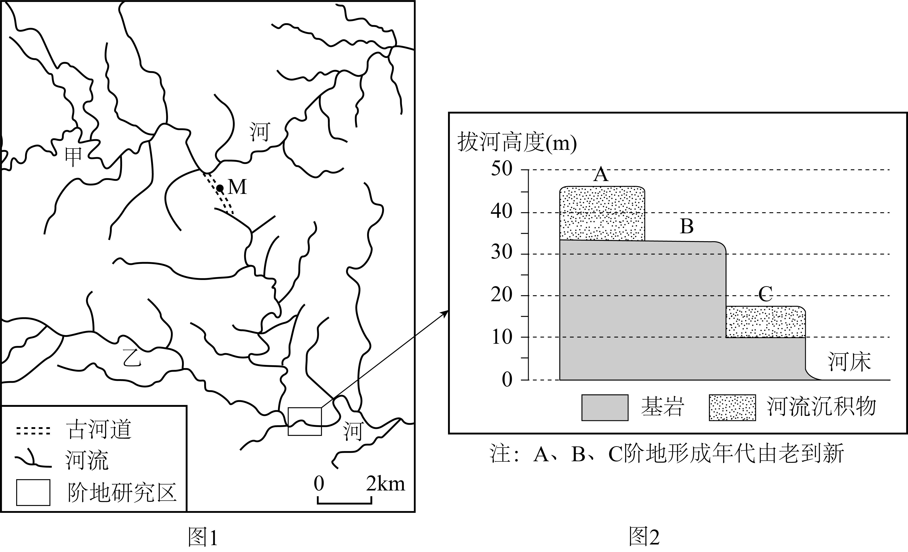
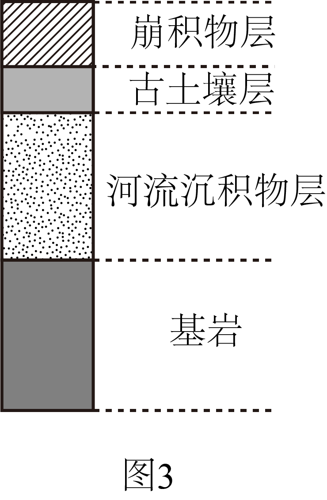
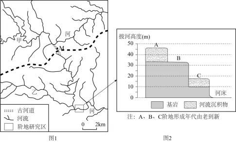

# 2025年山东高考地理真题 · 综合题第19题（小问1–3）

## 来源
- 来源文档：2025年山东高考地理真题
- 题号：第19题（非选择题，共3小问）

## 题组材料
图1示意甲、乙两河的部分流域。约7万年前，该区域发生了河流袭夺。图2示意乙河阶地研究区的阶地剖面模式。

图3为图1中M处的地质剖面示意图，其中古土壤的物质组成继承了下层河流沉积物的成分。

## 相关图片




### 第19题（1）
question_id: `2025-山东-地理-2025年山东高考地理真题-Q19-1`

**题干**：（1）用虚线“----”在图1中画出甲河流域与乙河流域之间的分水线（分水岭最高点的连线）。

**答案**：分水线绘制如下图（标准：虚线穿过空白处，不与任何河流相交）：



（注：分水岭是分隔相邻两个流域的山岭或高地，分水线应沿山脊线绘制，在甲、乙两河支流的源头之间。）

**解析**：分水岭是分隔相邻两个流域的山岭或高地，分水线应沿山脊线绘制。在图中找到甲、乙两河之间的山脊位置，在两条河流的支流的源头之间。

**知识点归属**：
- **核心考点 · 权重 1.0**：自然地理 → 地表形态 → 地貌的观察
- **支撑知识 · 权重 0.7**：自然地理 → 地表形态 → 河流地貌

**整体置信度**：高

<!-- MANAGED-KM-START Q19-1
```yaml
question_id: "2025-山东-地理-2025年山东高考地理真题-Q19-1"
question_number: 19
sub_question: 1
knowledge_points:
  - role: core_exam_point
    weight: 1.0
    domain_id: DM-NAT
    domain: "自然地理"
    theme_id: TH-NAT-LANDFORM
    theme: "地表形态"
    knowledge_unit_id: KU-NAT-LANDFORM-005
    knowledge_unit: "地貌的观察"
    evidence: "绘制分水线必须从河网图识别相邻支流源头之间的山脊和地势高点。"
  - role: supporting_knowledge
    weight: 0.7
    domain_id: DM-NAT
    domain: "自然地理"
    theme_id: TH-NAT-LANDFORM
    theme: "地表形态"
    knowledge_unit_id: KU-NAT-LANDFORM-002
    knowledge_unit: "河流地貌"
    evidence: "分水岭划分甲、乙两河流域，判断依赖河流及支流汇水范围的空间关系。"
extra_tags:
  - "流域分水线绘制"
taxonomy_version: "config-v0.2-draft"
confidence: "high"
label_status: "completed"
needs_review: false
taxonomy_review:
  needs_review: false
  issue_type: "none"
  review_note: ""
note: ""
```
-->

### 第19题（2）
question_id: `2025-山东-地理-2025年山东高考地理真题-Q19-2`

**题干**：（2）根据图2信息，指出在B阶地的形成过程中，河流下切最深处的拔河高度，并说明判断依据。

**答案**：拔河高度：约16—30米。判断依据：河流阶地是河流下切侵蚀，使原先的河谷底部超出一般洪水位，呈阶梯状分布在河谷谷坡的地形。B阶地形成时，河流下切至基岩，B阶地对应的基岩面最低海拔高度约在16—30米。

**解析**：据所学可知，河流阶地是河流下切侵蚀，使原先的河谷底部（河漫滩或河床）超出一般洪水位，呈阶梯状分布在河谷谷坡的地形。B阶地形成时，河流下切至基岩，从图2中可知，B阶地对应的基岩面最低海拔高度约在16—30米（河床底部到基岩面的垂直距离，即河流下切深度，也就是拔河高度，通过图中纵坐标海拔数值读取）。B阶地之下有C阶地，之上有A阶地。B阶地形成时，河流下切至B阶地的基岩面位置。从图2可知，B阶地基岩面距离河床（现代河流位置，拔河高度为0米处）的垂直距离约在16—30米之间，所以在B阶地的形成过程中，河流下切最深处的拔河高度约16—30米。

**知识点归属**：
- **核心考点 · 权重 1.0**：自然地理 → 地表形态 → 河流地貌
- **支撑知识 · 权重 0.7**：自然地理 → 地表形态 → 地貌的观察

**整体置信度**：高

<!-- MANAGED-KM-START Q19-2
```yaml
question_id: "2025-山东-地理-2025年山东高考地理真题-Q19-2"
question_number: 19
sub_question: 2
knowledge_points:
  - role: core_exam_point
    weight: 1.0
    domain_id: DM-NAT
    domain: "自然地理"
    theme_id: TH-NAT-LANDFORM
    theme: "地表形态"
    knowledge_unit_id: KU-NAT-LANDFORM-002
    knowledge_unit: "河流地貌"
    evidence: "B阶地形成于河流下切后，需据阶地基岩面与现代河床关系判断下切最深位置。"
  - role: supporting_knowledge
    weight: 0.7
    domain_id: DM-NAT
    domain: "自然地理"
    theme_id: TH-NAT-LANDFORM
    theme: "地表形态"
    knowledge_unit_id: KU-NAT-LANDFORM-005
    knowledge_unit: "地貌的观察"
    evidence: "答案需要读取剖面纵轴并比较B阶地基岩面的相对高度范围。"
extra_tags:
  - "河流阶地形成"
  - "拔河高度判读"
taxonomy_version: "config-v0.2-draft"
confidence: "high"
label_status: "completed"
needs_review: false
taxonomy_review:
  needs_review: false
  issue_type: "none"
  review_note: ""
note: ""
```
-->

### 第19题（3）
question_id: `2025-山东-地理-2025年山东高考地理真题-Q19-3`

**题干**：（3）图3为图1中M处的地质剖面示意图，其中古土壤的物质组成继承了下层河流沉积物的成分。从外力作用变化的角度，说明图3中基岩以上各层的形成过程。

**答案**：首先，河流流经M处时，由于流速减慢，以流水堆积作用为主，携带的泥沙等物质沉积在基岩之上，形成河流沉积物层。之后，随地壳抬升，河床裸露，环境相对稳定后，河流沉积物长期接受风化、生物等作用，逐渐发育形成古土壤层，由于古土壤物质组成继承下层河流沉积物成分，说明其是在河流沉积物基础上演变而来。后期，随着地壳抬升，坡度变大，受风化，重力崩塌等外力作用，山坡上的物质被迁移到M处，在古土壤之上堆积形成崩积物层。

**解析**：据M处地址剖面图可知自下而上依次为：基岩、河流沉积物层、古土壤层、崩积物层，推测其形成由早到晚顺序依次是河流沉积物层、古土壤层、崩积物层。

早期，该地受河流外力作用影响，河流携带泥沙等物质在此沉积，形成河流沉积物层。此时以河流的沉积作用为主，水流搬运的泥沙在M处堆积，逐渐形成较厚的河流沉积物层。

之后，河流不再在此处沉积，原来的河流沉积物暴露地表，受风化、生物等外力作用，逐渐形成古土壤层。因为古土壤物质组成继承下层河流沉积物成分，说明是在河流沉积物基础上，经成土作用（风化、生物参与等）转变为土壤。

后期，由于地壳抬升，地势变高、坡度变大，加之风化作用影响，易在重力作用下崩落、坍塌，山体上的岩石碎屑等崩落堆积在古土壤层之上，形成崩积物层。

**知识点归属**：
- **核心考点 · 权重 1.0**：自然地理 → 地表形态 → 塑造地表形态的内力与外力作用
- **支撑知识 · 权重 0.7**：自然地理 → 植被与土壤 → 土壤的主要形成因素
- **材料线索 · 权重 0.4**：自然地理 → 地表形态 → 河流地貌

**整体置信度**：高

<!-- MANAGED-KM-START Q19-3
```yaml
question_id: "2025-山东-地理-2025年山东高考地理真题-Q19-3"
question_number: 19
sub_question: 3
knowledge_points:
  - role: core_exam_point
    weight: 1.0
    domain_id: DM-NAT
    domain: "自然地理"
    theme_id: TH-NAT-LANDFORM
    theme: "地表形态"
    knowledge_unit_id: KU-NAT-LANDFORM-006
    knowledge_unit: "塑造地表形态的内力与外力作用"
    evidence: "剖面自下而上记录流水堆积、风化成土和重力崩积三类外力作用的先后变化。"
  - role: supporting_knowledge
    weight: 0.7
    domain_id: DM-NAT
    domain: "自然地理"
    theme_id: TH-NAT-VEGETATION-SOIL
    theme: "植被与土壤"
    knowledge_unit_id: KU-NAT-VEG-SOIL-005
    knowledge_unit: "土壤的主要形成因素"
    evidence: "古土壤由原河流沉积物暴露后经历风化和生物成土作用形成。"
  - role: material_clue
    weight: 0.4
    domain_id: DM-NAT
    domain: "自然地理"
    theme_id: TH-NAT-LANDFORM
    theme: "地表形态"
    knowledge_unit_id: KU-NAT-LANDFORM-002
    knowledge_unit: "河流地貌"
    evidence: "最下部河流沉积物层由流水搬运物质在M处堆积形成。"
extra_tags:
  - "地质剖面形成顺序"
  - "崩积物形成"
taxonomy_version: "config-v0.2-draft"
confidence: "high"
label_status: "completed"
needs_review: false
taxonomy_review:
  needs_review: false
  issue_type: "none"
  review_note: ""
note: ""
```
-->

## 教学备注
<!-- TEACHER-NOTES-START -->
- 易错点：
- 课堂提示：
- 讲解建议：
<!-- TEACHER-NOTES-END -->
