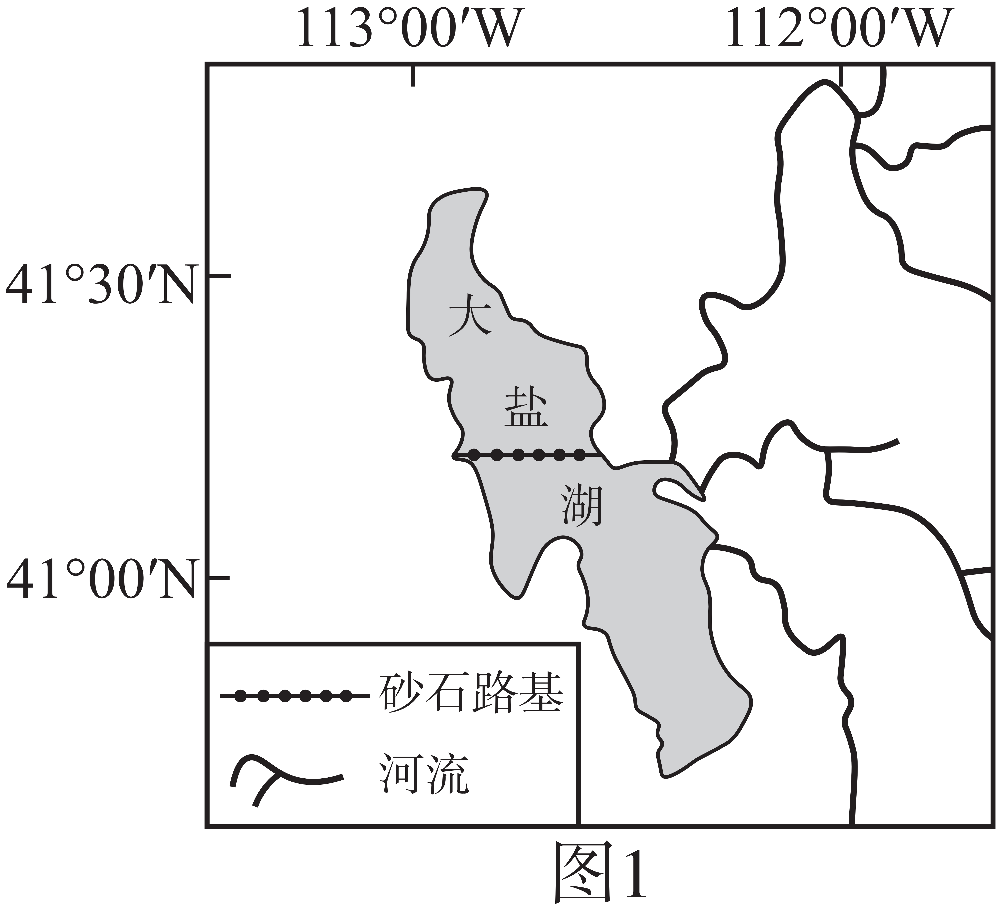
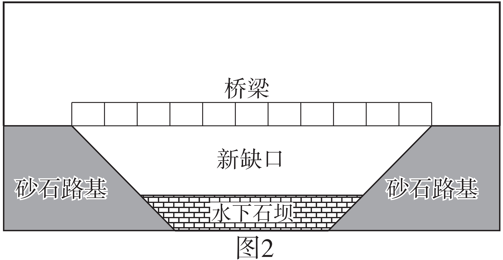

# 2025年山东高考地理真题 · 选择题题组 G1（第1–3题）

## 来源
- 来源文档：2025年山东高考地理真题
- 题号：第1–3题（选择题，共3小题）

## 题组材料
美国大盐湖（图1）平均深度约4.3米，湖中只有卤虫等少数耐盐物种。研究表明，120‰～160‰的盐度可使大盐湖中卤虫种群维持较高的密度。20世纪初，湖上修建了一座跨湖木制铁路桥。该桥在1959年被一条新建的与其平行的砂石路基铁路取代。砂石路基将大盐湖分为北湾和南湾，并催生了两湾的特色产业——北湾的盐业和南湾的卤虫捕捞业。2013年，砂石路基仅有的两处4.6米宽的涵洞因老化被永久封闭。2016年，路基又被挖开一个55米宽的“新缺口”，并修建了桥梁和一道高度可调整的水下石坝（图2）。据此完成下面小题。

## 相关图片




## 第1题
question_id: `2025-山东-地理-2025年山东高考地理真题-Q1`

**题干**：1. 1959年修建砂石路基铁路取代木制铁路桥，其主要目的是（ ） ①降低维护成本 ②提高铁路运力 ③缩短运输距离 ④促进航运发展

**选项**：
- A. ①②
- B. ②③
- C. ①④
- D. ③④

**答案**：A

**解析**：由材料知，美国大盐湖平均深度约4.3米，20世纪初湖上修建了一座跨湖木制铁路桥，该桥在1959年被一条新建的与其平行的砂石路基铁路取代。木制桥梁在盐湖中易受腐蚀和老化，需频繁维修，砂石路基由岩石和砂土构成，抗腐蚀性强，维护成本低，①正确；结合所学和图2信息可知，新建铁路通常采用更先进技术，如更宽路基或更坚固结构，可提升运输效率和运力，②正确；新铁路与旧桥平行，未改变路线，运输距离未缩短，③错误；大盐湖平均深度仅4.3米，水浅、盐度高，不适合发展航运，铁路建设与航运发展关联小，④错误。综上，A正确，BCD错误。故选A。

**知识点归属**：
- **核心考点 · 权重 1.0**：人文地理 → 交通运输与区域发展 → 区域发展对交通运输布局的影响
- **支撑知识 · 权重 0.7**：区域发展 → 区域发展的条件 → 自然条件与区域发展

**整体置信度**：高

<!-- MANAGED-KM-START Q1
```yaml
question_id: "2025-山东-地理-2025年山东高考地理真题-Q1"
question_number: 1
knowledge_points:
  - role: core_exam_point
    weight: 1.0
    domain_id: DM-HUM
    domain: "人文地理"
    theme_id: TH-HUM-TRANSPORT
    theme: "交通运输与区域发展"
    knowledge_unit_id: KU-HUM-TRA-001
    knowledge_unit: "区域发展对交通运输布局的影响"
    evidence: "以砂石路基铁路替代木制铁路桥，可降低维护成本并提高运力，体现运输需求和技术条件对交通设施建设方式的影响。"
  - role: supporting_knowledge
    weight: 0.7
    domain_id: DM-REG
    domain: "区域发展"
    theme_id: TH-REG-CONDITION
    theme: "区域发展的条件"
    knowledge_unit_id: KU-REG-CONDITION-001
    knowledge_unit: "自然条件与区域发展"
    evidence: "盐湖环境易使木结构腐蚀老化，自然条件构成交通设施选型和维护成本的重要约束。"
extra_tags:
  - "交通设施结构选择"
  - "全寿命维护成本"
taxonomy_version: "config-v0.2-draft"
confidence: "high"
label_status: "completed"
needs_review: false
taxonomy_review:
  needs_review: false
  issue_type: "none"
  review_note: ""
note: ""
```
-->

## 第2题
question_id: `2025-山东-地理-2025年山东高考地理真题-Q2`

**题干**：2. 2016年挖开新缺口对大盐湖产生的影响是（ ）

**选项**：
- A. 增加入湖地表径流
- B. 缩小南北湾之间水位差
- C. 增加北湾湖水盐度
- D. 减小南湾湖床出露面积

**答案**：B

**解析**：由材料和图1信息可知，砂石路基1959年将湖分隔为北湾和南湾，南湾有淡水河流注入，盐度较低，水位较高；北湾无淡水流入，蒸发强，盐度较高，水位较低。2013年路基仅有的涵洞被封闭，两湾完全隔离，水位和盐度差异加剧。2016年挖开55米宽的新缺口，并建可调整的水下石坝，允许两湾水流交换。结合题干四个选项：入湖径流由外部水源决定，读图2可知，新缺口是路基开口，用于两湾内部水流交换，不增加外部地表径流，A错误；隔离时，南湾水位高（淡水流入）、北湾水位低（蒸发强），挖开新缺口后，水从高水位南湾流向低水位北湾，直到水位趋于平衡，南北湾之间水位差缩小，B正确；南湾盐度较低，水流向北湾会稀释北湾盐度，而非增加，C错误；南湾水流向北湾可能导致南湾水位下降，湖床出露面积增加，D错误。故选B。

**知识点归属**：
- **核心考点 · 权重 1.0**：自然地理 → 水文与海洋 → 陆地水体及其相互关系

**整体置信度**：高

<!-- MANAGED-KM-START Q2
```yaml
question_id: "2025-山东-地理-2025年山东高考地理真题-Q2"
question_number: 2
knowledge_points:
  - role: core_exam_point
    weight: 1.0
    domain_id: DM-NAT
    domain: "自然地理"
    theme_id: TH-NAT-WATER
    theme: "水文与海洋"
    knowledge_unit_id: KU-NAT-WATER-005
    knowledge_unit: "陆地水体及其相互关系"
    evidence: "新缺口恢复南北湾水体交换，高水位南湾向低水位北湾补给，从而缩小两湾水位差。"
extra_tags:
  - "分隔湖湾水体交换"
taxonomy_version: "config-v0.2-draft"
confidence: "high"
label_status: "completed"
needs_review: false
taxonomy_review:
  needs_review: false
  issue_type: "none"
  review_note: ""
note: ""
```
-->

## 第3题
question_id: `2025-山东-地理-2025年山东高考地理真题-Q3`

**题干**：3. 截至2023年，因该区域连年干旱，水下石坝较修建时被加高了近3米。推测加高石坝的主要目的是（ ）

**选项**：
- A. 便于引水灌溉
- B. 降低北湾采盐成本
- C. 限制船舶通行
- D. 保护南湾生态系统

**答案**：D

**解析**：大盐湖被砂石路基分隔为南北两湾，北湾发展盐业，南湾依赖卤虫捕捞业。卤虫种群密度受盐度（120‰～160‰）调控，生态系统对盐度变化敏感，连年干旱导致湖水减少，水位下降。若不加干预，南湾盐度可能因水量减少而升高，超出卤虫生存适宜范围，破坏生态系统，加高水下石坝可阻隔北湾（更高盐度）水体向南湾扩散，维持南湾盐度稳定，从而保护卤虫种群及捕捞业，故主要目的是保护南湾生态系统，D正确。大盐湖水盐度极高，不适合灌溉，加高石坝与农业用水关联小，A错误；由材料“北湾的盐业和南湾的卤虫捕捞业”可知，北湾依赖高盐度生产盐，连年干旱会导致北湾采盐成本降低，加高堤坝对降低北湾采盐的成本作用较小，B错误；大盐湖平均深度4.3米，水浅，通航价值小，无重要航运，且石坝为水下可调结构，加高水下石坝对船舶通行影响小，C错误。故选D。

**知识点归属**：
- **核心考点 · 权重 1.0**：自然地理 → 自然环境的整体性与差异性 → 自然环境对干扰的整体响应
- **支撑知识 · 权重 0.7**：自然地理 → 水文与海洋 → 陆地水体及其相互关系

**整体置信度**：高

<!-- MANAGED-KM-START Q3
```yaml
question_id: "2025-山东-地理-2025年山东高考地理真题-Q3"
question_number: 3
knowledge_points:
  - role: core_exam_point
    weight: 1.0
    domain_id: DM-NAT
    domain: "自然地理"
    theme_id: TH-NAT-INTEGRITY
    theme: "自然环境的整体性与差异性"
    knowledge_unit_id: KU-NAT-INTEGRITY-004
    knowledge_unit: "自然环境对干扰的整体响应"
    evidence: "持续干旱改变水量与盐度，石坝通过调节两湾水盐联系避免南湾盐度越过卤虫适生范围。"
  - role: supporting_knowledge
    weight: 0.7
    domain_id: DM-NAT
    domain: "自然地理"
    theme_id: TH-NAT-WATER
    theme: "水文与海洋"
    knowledge_unit_id: KU-NAT-WATER-005
    knowledge_unit: "陆地水体及其相互关系"
    evidence: "判断石坝作用需要分析南北湾之间的水体交换及其对水位、盐度的影响。"
extra_tags:
  - "盐湖水盐调控"
  - "卤虫适生盐度"
taxonomy_version: "config-v0.2-draft"
confidence: "high"
label_status: "completed"
needs_review: false
taxonomy_review:
  needs_review: false
  issue_type: "none"
  review_note: ""
note: ""
```
-->

## 教学备注
<!-- TEACHER-NOTES-START -->
- 易错点：
- 课堂提示：
- 讲解建议：
<!-- TEACHER-NOTES-END -->
