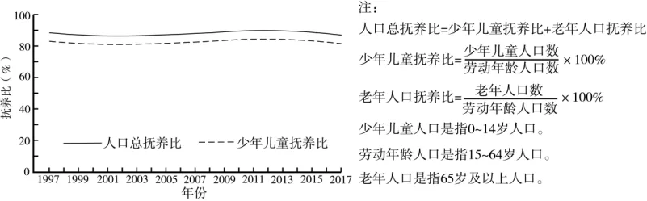

# 2025年山东高考地理真题 · 选择题题组 G3（第6–7题）

## 来源
- 来源文档：2025年山东高考地理真题
- 题号：第6–7题（选择题，共2小题）

## 题组材料
下图示意某人口大国1997～2017年人口总抚养比和少年儿童抚养比的变化，据此完成下面小题。

## 相关图片


## 第6题
question_id: `2025-山东-地理-2025年山东高考地理真题-Q6`

**题干**：6. 1997～2017年，该国人口数量（ ）

**选项**：
- A. 持续增长
- B. 持续下降
- C. 先增后减
- D. 保持稳定

**答案**：A

**解析**：读图可知，1997～2017年期间，该国少年儿童抚养比约82％，人口总抚养比约88％，两条曲线的垂直间距几乎一样，故老年人口抚养比＝人口总抚养比－少年儿童抚养比＝88％－82％=6％，说明少儿人口占比高，老龄人口占比低，人口年龄结构为年轻型；因此，1997～2017年，该国人口数量持续增长，A正确，BCD错误。故选A。

**知识点归属**：
- **核心考点 · 权重 1.0**：人文地理 → 人口 → 人口抚养比

**整体置信度**：高

<!-- MANAGED-KM-START Q6
```yaml
question_id: "2025-山东-地理-2025年山东高考地理真题-Q6"
question_number: 6
knowledge_points:
  - role: core_exam_point
    weight: 1.0
    domain_id: DM-HUM
    domain: "人文地理"
    theme_id: TH-HUM-POPULATION
    theme: "人口"
    knowledge_unit_id: KU-HUM-POP-008
    knowledge_unit: "人口抚养比"
    evidence: "通过总抚养比与少年儿童抚养比之差求得老年人口抚养比，并据三类抚养比判断人口年龄负担和人口增长趋势。"
extra_tags:
  - "总抚养比与少年儿童抚养比"
  - "老年抚养比"
taxonomy_version: "config-v0.2-draft"
confidence: "high"
label_status: "completed"
needs_review: false
taxonomy_review:
  needs_review: false
  issue_type: "none"
  review_note: ""
note: ""
```
-->

## 第7题
question_id: `2025-山东-地理-2025年山东高考地理真题-Q7`

**题干**：7. 1997～2017年，该国（ ）

**选项**：
- A. 老年人口数量保持稳定
- B. 劳动年龄人口数量有所下降
- C. 老年人口比重不断增加
- D. 劳动年龄人口比重变化较小

**答案**：D

**解析**：由上题分析可知，1997～2017年期间，该人口总抚养比、少年儿童抚养比、老年人口抚养比变化均较小，说明少年儿童、劳动年龄人口、老年人口比重变化均较小，D正确，C错误；该国人口年龄结构始终为年轻型，人口数量持续增长，少年儿童人口数量、劳动年龄人口数量、老年人口数量均明显增长，AB错误。故选D。

**知识点归属**：
- **核心考点 · 权重 1.0**：人文地理 → 人口 → 人口年龄结构

**整体置信度**：高

<!-- MANAGED-KM-START Q7
```yaml
question_id: "2025-山东-地理-2025年山东高考地理真题-Q7"
question_number: 7
knowledge_points:
  - role: core_exam_point
    weight: 1.0
    domain_id: DM-HUM
    domain: "人文地理"
    theme_id: TH-HUM-POPULATION
    theme: "人口"
    knowledge_unit_id: KU-HUM-POP-007
    knowledge_unit: "人口年龄结构"
    evidence: "总抚养比、少年儿童抚养比及其差值变化较小，说明少年儿童、劳动年龄和老年人口的构成比例变化较小。"
extra_tags:
  - "劳动年龄人口比重"
  - "年龄组构成变化"
taxonomy_version: "config-v0.2-draft"
confidence: "high"
label_status: "completed"
needs_review: false
taxonomy_review:
  needs_review: false
  issue_type: "none"
  review_note: ""
note: ""
```
-->

## 教学备注
<!-- TEACHER-NOTES-START -->
- 易错点：
- 课堂提示：
- 讲解建议：
<!-- TEACHER-NOTES-END -->
