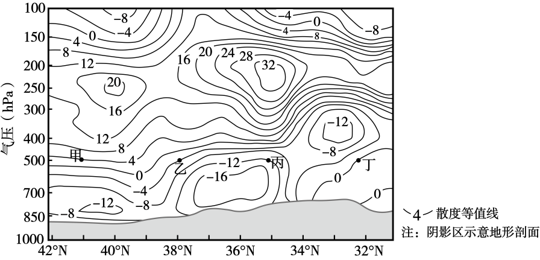
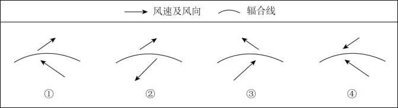

# 2025年山东高考地理真题 · 选择题题组 G4（第8–10题）

## 来源
- 来源文档：2025年山东高考地理真题
- 题号：第8–10题（选择题，共3小题）

## 题组材料
风向或风速分布不均匀时，空气会发生辐合（或辐散）。散度是描述空气从周围向某一处汇合或从某一处向周围流散的程度的量。某年10月17日～18日，G地经历了一次暴雪天气。下图示意18日8时沿106°E经线（经过G地）的散度等值线垂直分布，散度大于0表示水平辐散，小于0表示水平辐合。据此完成下面小题。

## 相关图片


## 第8题
question_id: `2025-山东-地理-2025年山东高考地理真题-Q8`

**题干**：8. 18日8时，甲、乙、丙、丁四处附近，风向和风速分布最均匀的是（ ）

**选项**：
- A. 甲处
- B. 乙处
- C. 丙处
- D. 丁处

**答案**：D

**解析**：据材料“散度是描述空气从周围向某一处汇合或从某一处向周围流散的程度的量”，散度值为正值，属于辐散区域，散度值为负值，属于辐合区域，散度值为0，表示水平风场无显著辐合或辐散，风向和风速分布最均匀。读图，在散度等值线垂直分布图中，丁处散度值为0，因此该处水平风场变化最小，风向和风速分布最均匀；相比之下，甲处散度大于0（辐散）、乙处和丙处散度小于0（辐合），风场不均匀，D正确，ABC错误。故选D。

**知识点归属**：
- **核心考点 · 权重 1.0**：自然地理 → 大气 → 大气的水平运动

**整体置信度**：高

<!-- MANAGED-KM-START Q8
```yaml
question_id: "2025-山东-地理-2025年山东高考地理真题-Q8"
question_number: 8
knowledge_points:
  - role: core_exam_point
    weight: 1.0
    domain_id: DM-NAT
    domain: "自然地理"
    theme_id: TH-NAT-ATMOSPHERE
    theme: "大气"
    knowledge_unit_id: KU-NAT-ATM-HEAT-006
    knowledge_unit: "大气的水平运动"
    evidence: "散度为零表示局地水平风场无明显辐合或辐散，据此判断风向和风速分布最均匀。"
extra_tags:
  - "大气散度"
  - "风场辐合与辐散"
taxonomy_version: "config-v0.2-draft"
confidence: "high"
label_status: "completed"
needs_review: false
taxonomy_review:
  needs_review: false
  issue_type: "none"
  review_note: ""
note: ""
```
-->

## 第9题
question_id: `2025-山东-地理-2025年山东高考地理真题-Q9`

**题干**：9. 推测18日8时，暴雪天气最可能出现在图所示（ ）

**选项**：
- A. 33°N附近
- B. 36°N附近
- C. 38°N附近
- D. 40°N附近

**答案**：B

**解析**：读图分析可知，36°N附近700百帕以上散度值小于-16，属于辐合区域；200-250百帕高空大于32，属于辐散区，这样高空辐散、低空辐合的结构，容易形成强对流天气，利于雷暴的发生发展，B正确；33°N附近、38°N附近、40°N附近近地面和高空近地面和高空的数值差均小于36°N附近，对流运动较弱，ACD错误。故选B。

**知识点归属**：
- **核心考点 · 权重 1.0**：自然地理 → 大气 → 气旋与反气旋
- **支撑知识 · 权重 0.7**：自然地理 → 大气 → 大气的水平运动

**整体置信度**：高

<!-- MANAGED-KM-START Q9
```yaml
question_id: "2025-山东-地理-2025年山东高考地理真题-Q9"
question_number: 9
knowledge_points:
  - role: core_exam_point
    weight: 1.0
    domain_id: DM-NAT
    domain: "自然地理"
    theme_id: TH-NAT-ATMOSPHERE
    theme: "大气"
    knowledge_unit_id: KU-NAT-ATM-CIRC-002
    knowledge_unit: "气旋与反气旋"
    evidence: "低层辐合、高层辐散形成上升运动和阴雨雪天气，据此锁定暴雪最可能出现的位置。"
  - role: supporting_knowledge
    weight: 0.7
    domain_id: DM-NAT
    domain: "自然地理"
    theme_id: TH-NAT-ATMOSPHERE
    theme: "大气"
    knowledge_unit_id: KU-NAT-ATM-HEAT-006
    knowledge_unit: "大气的水平运动"
    evidence: "需要从散度等值线判读不同高度空气的水平辐合与辐散。"
extra_tags:
  - "高低空辐合辐散配置"
  - "暴雪上升运动条件"
taxonomy_version: "config-v0.2-draft"
confidence: "high"
label_status: "completed"
needs_review: false
taxonomy_review:
  needs_review: false
  issue_type: "none"
  review_note: ""
note: ""
```
-->

## 第10题
question_id: `2025-山东-地理-2025年山东高考地理真题-Q10`

**题干**：10. 18日8时至20时，G地近地面出现由偏东风和偏南风两股气流形成的气旋式辐合线，该辐合线有利于暴雪天气的维持。下图中对该辐合线附近风场示意正确的是（ ）



**选项**：
- A. ①
- B. ②
- C. ③
- D. ④

**答案**：C

**解析**：根据题干“近地面出现由偏东风和偏南风两股气流形成的气旋式辐合线”，辐合线可以理解为是低压槽的位置。此处为北半球，因此应为逆时针辐合，且偏南风向右偏偏转为西南风、偏东风向右偏偏转为东南风，C正确，ABD错误。

**知识点归属**：
- **核心考点 · 权重 1.0**：自然地理 → 大气 → 气旋与反气旋
- **支撑知识 · 权重 0.7**：自然地理 → 地球的运动 → 地转偏向力

**整体置信度**：高

<!-- MANAGED-KM-START Q10
```yaml
question_id: "2025-山东-地理-2025年山东高考地理真题-Q10"
question_number: 10
knowledge_points:
  - role: core_exam_point
    weight: 1.0
    domain_id: DM-NAT
    domain: "自然地理"
    theme_id: TH-NAT-ATMOSPHERE
    theme: "大气"
    knowledge_unit_id: KU-NAT-ATM-CIRC-002
    knowledge_unit: "气旋与反气旋"
    evidence: "北半球近地面气旋式辐合呈逆时针旋入，据偏东风和偏南风的组合判断正确风场。"
  - role: supporting_knowledge
    weight: 0.7
    domain_id: DM-NAT
    domain: "自然地理"
    theme_id: TH-NAT-EARTH-MOTION
    theme: "地球的运动"
    knowledge_unit_id: KU-NAT-EARTH-MOTION-005
    knowledge_unit: "地转偏向力"
    evidence: "北半球水平运动气流向右偏，决定两股气流在辐合线附近的偏转方向。"
extra_tags:
  - "近地面气旋式辐合线"
taxonomy_version: "config-v0.2-draft"
confidence: "high"
label_status: "completed"
needs_review: false
taxonomy_review:
  needs_review: false
  issue_type: "none"
  review_note: ""
note: ""
```
-->

## 教学备注
<!-- TEACHER-NOTES-START -->
- 易错点：
- 课堂提示：
- 讲解建议：
<!-- TEACHER-NOTES-END -->
