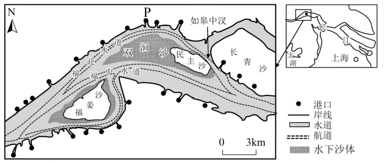

# 2025年山东高考地理真题 · 选择题题组 G6（第13–15题）

## 来源
- 来源文档：2025年山东高考地理真题
- 题号：第13–15题（选择题，共3小题）

## 题组材料
内河航道是河流水道中相对固定、能够保障船舶安全航行的通道：船舶由下游向上游行驶为上行，反之为下行。下图所示河段河水水位、流速和流向会随潮汐发生周期性改变。该河段各航道均能保障小型船舶全时段双向通行。该河段船舶航行时须靠航道右侧行驶。据此完成下面小题。

## 相关图片


## 第13题
question_id: `2025-山东-地理-2025年山东高考地理真题-Q13`

**题干**：13. 涨潮时段，该河段经常出现上行小型船舶的通行高峰，其主要影响因素是（ ）

**选项**：
- A. 水面落差
- B. 河流水深
- C. 泥沙含量
- D. 河面宽度

**答案**：A

**解析**：涨潮时段，该河段水面落差减小，河流流速变慢，河流流向出现逆转，能减少上行小型船舶能源消耗并提高上行小型船舶的通行速度，上行方向通行效率较高，故该河段经常在涨潮时段出现上行小型船舶的通行高峰，A正确。由材料“该河段各航道均能保障小型船舶全时段双向通行”可知，河流水深、泥沙含量、河面宽度并不是该河段其他时段上行通行效率的限制因素，BCD错误。故选A。

**知识点归属**：
- **核心考点 · 权重 1.0**：自然地理 → 水文与海洋 → 潮汐

**整体置信度**：高

<!-- MANAGED-KM-START Q13
```yaml
question_id: "2025-山东-地理-2025年山东高考地理真题-Q13"
question_number: 13
knowledge_points:
  - role: core_exam_point
    weight: 1.0
    domain_id: DM-NAT
    domain: "自然地理"
    theme_id: TH-NAT-WATER
    theme: "水文与海洋"
    knowledge_unit_id: KU-NAT-WATER-008
    knowledge_unit: "潮汐"
    evidence: "涨潮改变河段水面落差、流速和流向，降低上行船舶能耗并提高通行效率。"
extra_tags:
  - "潮汐河段航行效率"
taxonomy_version: "config-v0.2-draft"
confidence: "high"
label_status: "completed"
needs_review: false
taxonomy_review:
  needs_review: false
  issue_type: "none"
  review_note: ""
note: ""
```
-->

## 第14题
question_id: `2025-山东-地理-2025年山东高考地理真题-Q14`

**题干**：14. 大型船舶无法直接经福北水道下行停靠P港，须经福中水道下行，转如皋中汊上行停靠P港，其主要原因是P港附近的下行航道（ ）

**选项**：
- A. 水位高
- B. 水流急
- C. 淤积强
- D. 曲率大

**答案**：C

**解析**：由材料“该河段船舶航行时须靠航道右侧行驶”可知，福北水道下行航道为该水道的南侧，即靠近图中双涧沙水下沙体一侧，泥沙淤积严重，而大型船舶吃水深度大，其航行、停靠因此受到限制，故P港附近的下行航道淤积强是导致大型船舶无法直接经福北水道下行停靠P港的主要原因，C正确；受水文条件影响，福北水道下行航道相较于北侧位于河流凹岸的上行航道的水位较低、水流较缓，AB错误。福北水道下行航道与其上行航道的曲率几乎一致，与福中水道的曲率差异同样较小，不是大型船舶无法直接经福北水道下行停靠P港的主要原因，D错误。故选C。

**知识点归属**：
- **核心考点 · 权重 1.0**：自然地理 → 地表形态 → 河流地貌

**整体置信度**：高

<!-- MANAGED-KM-START Q14
```yaml
question_id: "2025-山东-地理-2025年山东高考地理真题-Q14"
question_number: 14
knowledge_points:
  - role: core_exam_point
    weight: 1.0
    domain_id: DM-NAT
    domain: "自然地理"
    theme_id: TH-NAT-LANDFORM
    theme: "地表形态"
    knowledge_unit_id: KU-NAT-LANDFORM-002
    knowledge_unit: "河流地貌"
    evidence: "下行航道靠近水下沙体一侧，泥沙淤积使水深不足，从而限制大型船舶通行和靠港。"
extra_tags:
  - "航道泥沙淤积"
taxonomy_version: "config-v0.2-draft"
confidence: "high"
label_status: "completed"
needs_review: false
taxonomy_review:
  needs_review: false
  issue_type: "none"
  review_note: ""
note: ""
```
-->

## 第15题
question_id: `2025-山东-地理-2025年山东高考地理真题-Q15`

**题干**：15. 船舶夜间航行时，使用北斗卫星导航系统的主要目的是（ ）

**选项**：
- A. 监测流速
- B. 探测水深
- C. 测定流向
- D. 校正航向

**答案**：D

**解析**：夜间航行时，视线受限，船舶容易偏离航道，北斗卫星导航系统具有高精度定位和导航功能，可以帮助船舶在夜间准确校正航向，确保航行安全，D正确。北斗卫星导航系统无监测流速、探测水深、测定流向等方面的功能，ABC错误。故选D。

**知识点归属**：
- **核心考点 · 权重 1.0**：人文地理 → 地理信息技术 → GNSS技术原理与应用

**整体置信度**：高

<!-- MANAGED-KM-START Q15
```yaml
question_id: "2025-山东-地理-2025年山东高考地理真题-Q15"
question_number: 15
knowledge_points:
  - role: core_exam_point
    weight: 1.0
    domain_id: DM-HUM
    domain: "人文地理"
    theme_id: TH-HUM-GEOINFO
    theme: "地理信息技术"
    knowledge_unit_id: KU-HUM-GIT-001
    knowledge_unit: "GNSS技术原理与应用"
    evidence: "北斗卫星导航系统利用卫星定位与导航服务帮助夜航船舶确定位置并校正航向。"
extra_tags:
  - "北斗卫星定位导航"
  - "船舶航向校正"
taxonomy_version: "config-v0.2-draft"
confidence: "high"
label_status: "completed"
needs_review: false
taxonomy_review:
  needs_review: false
  issue_type: "none"
  review_note: ""
note: ""
```
-->

## 教学备注
<!-- TEACHER-NOTES-START -->
- 易错点：
- 课堂提示：
- 讲解建议：
<!-- TEACHER-NOTES-END -->
