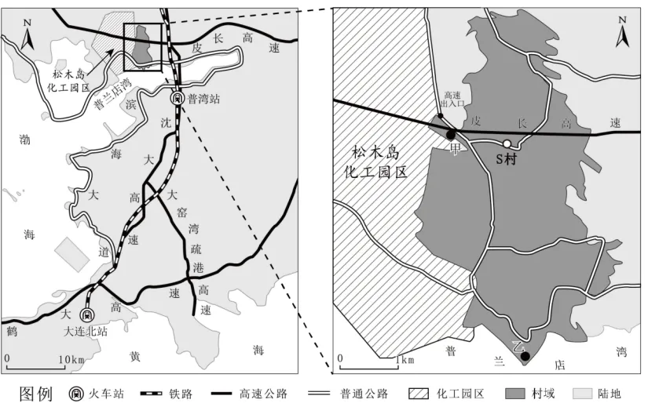

# 2024年广东高考地理真题 · 综合题第17题（小问1–3）

## 来源
- 来源文档：精品解析：2024年广东省高考地理真题（解析版）.docx
- 题号：第17题（非选择题，共3小问）

## 题组材料
17\. 阅读图文资料，完成下列要求。

辽宁省大连市的松木岛化工园区距主城区约60km，占地面积35km²，2005年，该园区开始承接大连市的化工企业转移，2016年被纳入国家级新区——大连金普新区。该园区大部分职工通勤于工作地与主城区之间，呈现职住分离现象。紧邻松木岛化工园区的S村，目前户籍人口约3800人，常住人口约2300人，村民的主要收入来源于种植业、渔业、废弃物循环利用产业及外出务工。如图示意松木岛化工园区及S村地理位置。

## 相关图片


### 第17题（1）
question_id: `2024-广东-地理-2024年广东高考地理真题-Q17-1`

**题干**：（1）简述松木岛化工园区承接大连市的化工企业转移的有利区位条件。

**答案**：【答案】（1）地理位置优越，位于大连瓦房店市西南沿海地区，距主城区近；化工园区位于乡村附近，土地成本低，周边有大面积土地，可保证园区继续拓展；交通运输便捷，靠近高速出入口，位于铁路沿线附近，同时距离港口较近，具备发展临港工业区的天然条件；位于大连附近，相关产业基础好，利于企业间优势互补；位于国家级新区——大连金普新区，扶持政策优越。

**解析**：【小问1详解】

从图中位置可以看到松木岛化工园区位于大连瓦房店市西南沿海地区，距主城区相对较近，同时南距大连，北距沈阳，海上西距秦皇岛，距离均较近，其地理位置较为优越。该园区周边有大面积的废弃盐田，位于乡村附近，其土地用地成本较低，由于有大面积的荒废土地，这保证了园区未来继续的拓展和发展。从图中可以看到，松木岛化工园区位于高速公路的出入口附近，同时该处也靠近铁路线附近，距离普兰店湾较近，具备临港工业区建设的交通优越条件。大连原有的化工类相关产业基础较好，其相关配套设施较为完善，该园区靠近大连附近，其相关产业基础较好，利于企业间的优势互补发展。从材料可以看到，2016年该园区被纳入国家级新区——大连金普新区，其政府的扶持力度相对较大，政策的优越性较好。

**知识点归属**：
- **核心考点 · 权重 1.0**：人文地理 → 产业区位 → 工业区位因素

**整体置信度**：高

<!-- MANAGED-KM-START Q17-1
```yaml
question_id: "2024-广东-地理-2024年广东高考地理真题-Q17-1"
question_number: 17
sub_question: 1
knowledge_points:
  - role: core_exam_point
    weight: 1.0
    domain_id: DM-HUM
    domain: "人文地理"
    theme_id: TH-HUM-INDUSTRY
    theme: "产业区位"
    knowledge_unit_id: KU-HUM-IND-002
    knowledge_unit: "工业区位因素"
    evidence: "承接化工企业转移需综合土地、交通、产业基础、市场距离和新区政策等工业区位条件。"
extra_tags:
  - "化工园区承接产业转移"
taxonomy_version: "config-v0.2-draft"
confidence: "high"
label_status: "completed"
needs_review: false
taxonomy_review:
  needs_review: false
  issue_type: "none"
  review_note: ""
note: ""
```
-->

### 第17题（2）
question_id: `2024-广东-地理-2024年广东高考地理真题-Q17-2`

**题干**：（2）结合S村村民主要收入来源，提出该园区帮扶该村经济发展的有效措施。

**答案**：【答案】（2）化工园区建设过程中可利用S村劳动力，建筑建设、园区管理等，可促进该村人口就业；工业园区将相关配套服务业转移至S村，如产品外包装加工、盒饭和餐饮服务、产品的对外运输服务等，带动村落产业发展；依托工业园区的产业外溢效应，积极发展共生产业，改善原有的村落单一产业结构，促进滨海产业的多元化发展。

**解析**：【小问2详解】

材料当中提及该村常住人口约2300人，户籍人口约3800人，其收入主要来自于种植业、渔业以及废弃物的循环利用产业、外出务工。该村产业基础较薄弱，收入水平相对较低。化工厂的建设初期需要大量的建设工人，该村可为其提供大量劳动力，这就能促进该村人口的就业增加该村农民的收入。同时村落也可为工业园区提供一定的配套服务设施，比如相关的盒饭、餐饮类的服务、一些产品的外包装加工以及产品的运输等，这些相关产业的发展能够带动村落产业延伸。同时依托工业园区部分产业的外溢效应，积极的发展与园区共生的产业，这有利于改善村落的单一产业结构，促进该村落向多元化发展，真正实现脱贫致富。

**知识点归属**：
- **核心考点 · 权重 1.0**：区域发展 → 城市与区域发展 → 城市辐射功能
- **支撑知识 · 权重 0.7**：区域发展 → 产业结构变化与区域发展 → 产业结构的升级

**整体置信度**：高

<!-- MANAGED-KM-START Q17-2
```yaml
question_id: "2024-广东-地理-2024年广东高考地理真题-Q17-2"
question_number: 17
sub_question: 2
knowledge_points:
  - role: core_exam_point
    weight: 1.0
    domain_id: DM-REG
    domain: "区域发展"
    theme_id: TH-REG-CITY
    theme: "城市与区域发展"
    knowledge_unit_id: KU-REG-CITY-002
    knowledge_unit: "城市辐射功能"
    evidence: "园区通过吸纳就业、外包配套服务和产业外溢带动邻近S村产业与收入增长。"
  - role: supporting_knowledge
    weight: 0.7
    domain_id: DM-REG
    domain: "区域发展"
    theme_id: TH-REG-INDUSTRY
    theme: "产业结构变化与区域发展"
    knowledge_unit_id: KU-REG-INDUSTRY-002
    knowledge_unit: "产业结构的升级"
    evidence: "发展园区共生产业和配套服务可推动村庄产业结构多元化升级。"
extra_tags:
  - "工业园区帮扶邻近乡村"
taxonomy_version: "config-v0.2-draft"
confidence: "high"
label_status: "completed"
needs_review: false
taxonomy_review:
  needs_review: false
  issue_type: "none"
  review_note: ""
note: ""
```
-->

### 第17题（3）
question_id: `2024-广东-地理-2024年广东高考地理真题-Q17-3`

**题干**：（3）为解决职工的职住分离问题，该园区拟在S村的甲、乙两地建设职工生活区。分析这两地居住环境的优劣。

**答案**：【答案】（3）甲地：甲地距离松木岛化工园区更近，通勤距离短；位于松木岛与S村之间，原有基础设施较好；靠近化工园区，受盛行风影响，大气环境质量相对较差；位于高速出入口附近，交通易拥堵。乙地：位于普兰店湾附近，环境质量较高；靠近普通公路，便于出行；距园区较远，通勤路程更长；远离人口密集区，基础设施建设成本高。

**解析**：【小问3详解】

从图中可以看到甲地靠近松木岛化工园区，其距离更近，通勤距离也相对较短，这能大大减少通勤的困难。同时甲地位于化工园区与S村之间，靠近S村其原有的基础设施也相对较好。但由于该地更靠近化工园区，受盛行风的影响甲地其大气环境质量可能相对较差。由于甲地更靠近高速出入口，该地容易出现交通拥堵，也不利于通勤。

从位置上来看，乙地位于普兰店湾附近，由于临海，其环境相对质量更高，其附近有普通公路连接，便于其出行。该地位于普兰店湾附近，距离松木岛化工园区相对较远，其通勤的路程更长。该地原有基础设施相对较为薄弱，其基础设施的建设成本也会相对较高，配套服务设施相对较差。

**知识点归属**：
- **核心考点 · 权重 1.0**：人文地理 → 乡村与城镇 → 合理利用城乡空间
- **支撑知识 · 权重 0.7**：人文地理 → 产业区位 → 工业区位因素

**整体置信度**：高

<!-- MANAGED-KM-START Q17-3
```yaml
question_id: "2024-广东-地理-2024年广东高考地理真题-Q17-3"
question_number: 17
sub_question: 3
knowledge_points:
  - role: core_exam_point
    weight: 1.0
    domain_id: DM-HUM
    domain: "人文地理"
    theme_id: TH-HUM-SETTLEMENT
    theme: "乡村与城镇"
    knowledge_unit_id: KU-HUM-SET-004
    knowledge_unit: "合理利用城乡空间"
    evidence: "生活区选址需权衡通勤距离、交通、基础设施、环境质量与建设成本。"
  - role: supporting_knowledge
    weight: 0.7
    domain_id: DM-HUM
    domain: "人文地理"
    theme_id: TH-HUM-INDUSTRY
    theme: "产业区位"
    knowledge_unit_id: KU-HUM-IND-002
    knowledge_unit: "工业区位因素"
    evidence: "靠近化工园区虽缩短通勤距离，但会增加工业污染暴露风险。"
extra_tags:
  - "职住平衡与居住区选址"
taxonomy_version: "config-v0.2-draft"
confidence: "high"
label_status: "completed"
needs_review: false
taxonomy_review:
  needs_review: false
  issue_type: "none"
  review_note: ""
note: ""
```
-->

## 教学备注
<!-- TEACHER-NOTES-START -->
- 易错点：
- 课堂提示：
- 讲解建议：
<!-- TEACHER-NOTES-END -->
