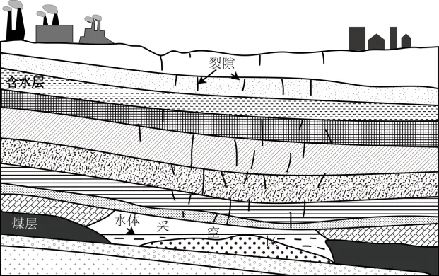

# 2024年广东高考地理真题 · 综合题第18题（小问1–2）

## 来源
- 来源文档：精品解析：2024年广东省高考地理真题（解析版）.docx
- 题号：第18题（非选择题，共2小问）

## 题组材料
18\. 阅读图文资料，完成下列要求。

针对干旱区煤矿采空区治理和水资源短缺等问题，我国学者提出利用采空区建设地下水库的建议。M煤矿矿区位于晋陕蒙交界地带，属温带大陆性季风气候，地下水资源丰富。该煤矿经过多年开采，已形成采空区。调查发现，该采空区水体中含有来自地表的污染物。图示意M煤矿采空区及地层剖面。

## 相关图片


### 第18题（1）
question_id: `2024-广东-地理-2024年广东高考地理真题-Q18-1`

**题干**：（1）简述M煤矿矿区地表污染物进入采空区水体的自然地理过程。

**答案**：【答案】（1）M矿矿区采矿活动产生的地表污染物，在降雨或地表水流动，被冲刷并携带进入河流、湖泊或地下水系统；煤矿采空区与地下水位和地下水系统相连通；污染物通过地下水系统，沿着岩石和土壤中的裂隙和空隙进入采空区；在某些情况下，地表污水可能直接通过塌陷坑或裂缝进入采空区。

**解析**：【小问1详解】

从地表污染物来源、污染物迁移、污染物进入采空区的途径等方面进行分析。读图可知，M矿矿区地表污染物主要来源于采矿活动，包括采矿过程中产生的废水、废气、废渣等，这些污染物可能含有重金属、化学物质和其他有害物质；在降雨或地表水流动的作用下，污染物被冲刷并携带进入河流、湖泊或地下水系统；该处岩层多裂隙，煤矿采空区通常与地下水位和地下水系统相连通；污染物通过地下水系统的渗透和流动，沿着岩石和土壤中的裂隙和空隙进入采空区；在某些情况下，地表水可能直接通过塌陷坑或裂缝进入采空区，从而携带污染物进入地下，造成地下水污染。

**知识点归属**：
- **核心考点 · 权重 1.0**：自然地理 → 水文与海洋 → 水循环
- **支撑知识 · 权重 0.7**：自然地理 → 水文与海洋 → 陆地水体及其相互关系
- **材料线索 · 权重 0.4**：资源、环境与国家安全 → 资源环境与人类社会 → 环境问题的形成与危害

**整体置信度**：高

<!-- MANAGED-KM-START Q18-1
```yaml
question_id: "2024-广东-地理-2024年广东高考地理真题-Q18-1"
question_number: 18
sub_question: 1
knowledge_points:
  - role: core_exam_point
    weight: 1.0
    domain_id: DM-NAT
    domain: "自然地理"
    theme_id: TH-NAT-WATER
    theme: "水文与海洋"
    knowledge_unit_id: KU-NAT-WATER-001
    knowledge_unit: "水循环"
    evidence: "降水和地表径流冲刷携带污染物，经下渗、地下水流动及裂隙进入采空区。"
  - role: supporting_knowledge
    weight: 0.7
    domain_id: DM-NAT
    domain: "自然地理"
    theme_id: TH-NAT-WATER
    theme: "水文与海洋"
    knowledge_unit_id: KU-NAT-WATER-005
    knowledge_unit: "陆地水体及其相互关系"
    evidence: "采空区与含水层和地下水系统连通，为污染物迁移提供通道。"
  - role: material_clue
    weight: 0.4
    domain_id: DM-RES
    domain: "资源、环境与国家安全"
    theme_id: TH-RES-SOC
    theme: "资源环境与人类社会"
    knowledge_unit_id: KU-RES-SOC-003
    knowledge_unit: "环境问题的形成与危害"
    evidence: "采矿产生的地表污染物进入地下会造成采空区水体污染。"
extra_tags:
  - "采空区地下水污染迁移"
taxonomy_version: "config-v0.2-draft"
confidence: "high"
label_status: "completed"
needs_review: false
taxonomy_review:
  needs_review: false
  issue_type: "none"
  review_note: ""
note: ""
```
-->

### 第18题（2）
question_id: `2024-广东-地理-2024年广东高考地理真题-Q18-2`

**题干**：（2）分析在M煤矿采空区建设地下水库的意义。

**答案**：【答案】（2）煤矿采空区地下水库的建设，可以有效利用矿井水和雨水等水资源，为矿区提供稳定的水源，缓解矿区水资源短缺问题；可以减少矿井水的直接排放，降低对地表水和地下水资源的污染；地下水库的储水作用有助于增加矿区的湿度，改善植被生长条件，促进生态恢复；地下水库可以提供稳定、可靠的水源，降低矿区用水成本，提升经济效益；建设地下水库是一种技术创新和示范，推广和应用这种技术，可以促进煤炭开采与水资源保护利用的协调发展，为其他类似地区提供了可借鉴的经验和模式。

**解析**：【小问2详解】

M煤矿采空区建设地下水库的意义可以从水资源的利用与保护、生态环境、经济效益等方面说明。煤矿采空区地下水库的建设，可以有效利用矿井水和雨水等水资源，将它们储存在地下水库中，为矿区提供稳定的水源。这不仅可以解决矿区水资源短缺的问题，还可以避免矿井水直接排放到环境中造成的污染和浪费；地下水库的建设通过减少矿井水的直接排放，可以降低对地表水和地下水资源的污染，同时地下水库的储水作用有助于增加矿区的湿度，改善植被生长条件，促进生态恢复；由于地下水库可以提供稳定、可靠的水源，矿区可以减少对外部水源的依赖，从而降低用水成本。同时，地下水库的建设还可以为矿区提供新的经济增长点，如开展水产业、旅游业等；煤矿采空区建设地下水库是一种技术创新和示范，这种技术不仅解决了矿区水资源短缺和环境污染的问题，还为其他类似地区提供了可借鉴的经验和模式。

**知识点归属**：
- **核心考点 · 权重 1.0**：区域发展 → 区域发展的条件 → 自然资源与区域发展
- **支撑知识 · 权重 0.7**：资源、环境与国家安全 → 资源环境安全保障 → 可持续发展

**整体置信度**：高

<!-- MANAGED-KM-START Q18-2
```yaml
question_id: "2024-广东-地理-2024年广东高考地理真题-Q18-2"
question_number: 18
sub_question: 2
knowledge_points:
  - role: core_exam_point
    weight: 1.0
    domain_id: DM-REG
    domain: "区域发展"
    theme_id: TH-REG-CONDITION
    theme: "区域发展的条件"
    knowledge_unit_id: KU-REG-CONDITION-002
    knowledge_unit: "自然资源与区域发展"
    evidence: "利用采空区储存矿井水和雨水可缓解干旱矿区水资源短缺并降低用水成本。"
  - role: supporting_knowledge
    weight: 0.7
    domain_id: DM-RES
    domain: "资源、环境与国家安全"
    theme_id: TH-RES-STRATEGY
    theme: "资源环境安全保障"
    knowledge_unit_id: KU-RES-STR-004
    knowledge_unit: "可持续发展"
    evidence: "地下水库兼顾污染减排、生态恢复、经济效益和技术示范，促进采矿与水资源保护协调。"
extra_tags:
  - "采空区地下水库"
  - "矿井水资源化"
taxonomy_version: "config-v0.2-draft"
confidence: "high"
label_status: "completed"
needs_review: false
taxonomy_review:
  needs_review: false
  issue_type: "none"
  review_note: ""
note: ""
```
-->

## 教学备注
<!-- TEACHER-NOTES-START -->
- 易错点：
- 课堂提示：
- 讲解建议：
<!-- TEACHER-NOTES-END -->
