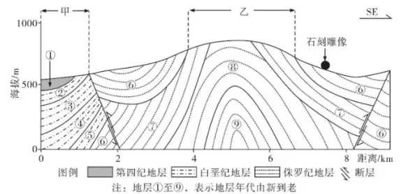
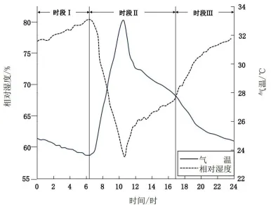

# 2024年广东高考地理真题 · 综合题第19题（小问1–3）

## 来源
- 来源文档：精品解析：2024年广东省高考地理真题（解析版）.docx
- 题号：第19题（非选择题，共3小问）

## 题组材料
19\. 阅读图文资料，完成下列要求。

当气温下降，湿度上升时，硫硝钠会吸水形成芒硝，使得裂隙中的容积增大；当气温上升，湿度下降时，芒硝会脱水产生反硝化。该过程涉及主要化学方程式为：Na₂SO₄+10H₂O⇌Na₂SO₄·10H₂O。四川仁寿县牛角寨为亚热带季风气候，在岩石表层紫色砂岩以及雕刻石像（牛角寨大佛）的裂缝中均发现了硫酸钠。下左图示意仁寿牛角寨地质剖面图；右图示意2021年8月份每天等时平均温度、平均湿度对比。

## 相关图片



### 第19题（1）
question_id: `2024-广东-地理-2024年广东高考地理真题-Q19-1`

**题干**：（1）说明甲、乙两区域的地质构造及地层年代特征，并据此判断甲、乙哪个区域的地表剥蚀作用更强。

**答案**：【答案】（1）甲区域为构造沉降区，易接受沉积；主要为白垩纪和第四纪地层，年代较新；乙区域为构造抬升区，背斜顶部，易受剥蚀；仅有侏罗纪地层，缺失侏罗纪之后的地层，年代较老。乙区域遭受的地表剥蚀作用更强烈。

**解析**：【小问1详解】

读图可知，甲区域位于断层下降的一侧，为构造沉降区，地势低洼，易接受沉积；主要为白垩纪和第四纪地层，相较于侏罗纪地层，年代较新；乙区域为断层上升的一侧，为构造抬升区，且位于背斜顶部，岩层较破碎，易受外力剥蚀；乙区域仅有侏罗纪地层，缺失侏罗纪之后的地层，年代相对较老。综上所述，乙区域遭受的地表剥蚀作用更强烈。

**知识点归属**：
- **核心考点 · 权重 1.0**：自然地理 → 地表形态 → 地质构造与地貌
- **支撑知识 · 权重 0.7**：自然地理 → 地球的结构与演化 → 地层与化石

**整体置信度**：高

<!-- MANAGED-KM-START Q19-1
```yaml
question_id: "2024-广东-地理-2024年广东高考地理真题-Q19-1"
question_number: 19
sub_question: 1
knowledge_points:
  - role: core_exam_point
    weight: 1.0
    domain_id: DM-NAT
    domain: "自然地理"
    theme_id: TH-NAT-LANDFORM
    theme: "地表形态"
    knowledge_unit_id: KU-NAT-LANDFORM-008
    knowledge_unit: "地质构造与地貌"
    evidence: "甲位于断层下降盘而乙位于构造抬升区和背斜顶部，构造差异控制沉积与剥蚀强弱。"
  - role: supporting_knowledge
    weight: 0.7
    domain_id: DM-NAT
    domain: "自然地理"
    theme_id: TH-NAT-EARTH-STRUCTURE
    theme: "地球的结构与演化"
    knowledge_unit_id: KU-NAT-EARTH-STRUCTURE-003
    knowledge_unit: "地层与化石"
    evidence: "甲保留白垩纪和第四纪较新地层，乙仅见侏罗纪较老地层，据此判断乙后期地层遭剥蚀。"
extra_tags:
  - "构造升降与地层缺失"
taxonomy_version: "config-v0.2-draft"
confidence: "high"
label_status: "completed"
needs_review: false
taxonomy_review:
  needs_review: false
  issue_type: "none"
  review_note: ""
note: ""
```
-->

### 第19题（2）
question_id: `2024-广东-地理-2024年广东高考地理真题-Q19-2`

**题干**：（2）根据硝化与反硝化条件，说明I、II、Ⅲ阶段硫酸钠的分别变化。

**答案**：【答案】（2）时段Ⅰ：气温持续下降，相对湿度持续增大，利于芒硝生成。时段Ⅱ：前期（约6:00-11:00），气温持续上升（至最高），相对湿度持续减小（至最低），利于芒硝脱水生成无水硫酸钠；后期（约11:00-17:00），气温持续下降，相对湿度持续增大，利于芒硝生成。时段Ⅲ：气温持续下降，相对湿度持续增大，利于芒硝生成。

**解析**：【小问2详解】

读图可知，在时段I，由于气温持续下降、相对湿度持续上升，满足硫酸钠吸水形成芒硝的条件，所以硫酸钠会吸水形成芒硝，利于芒硝生成；在时段Ⅱ，前期（约6:00-11:00），气温持续上升（至最高），相对湿度持续减小（至最低），利于芒硝脱水反硝化，生成无水硫酸钠；后期（约11:00-17:00），气温持续下降，相对湿度持续增大，利于芒硝生成。阶段Ⅲ：气温持续下降，相对湿度持续增大，使硫酸钠吸水形成芒硝，硫酸钠减少，利于芒硝生成。

**知识点归属**：
- **核心考点 · 权重 1.0**：自然地理 → 地表形态 → 塑造地表形态的内力与外力作用
- **材料线索 · 权重 0.4**：自然地理 → 大气 → 大气的受热过程

**整体置信度**：高

<!-- MANAGED-KM-START Q19-2
```yaml
question_id: "2024-广东-地理-2024年广东高考地理真题-Q19-2"
question_number: 19
sub_question: 2
knowledge_points:
  - role: core_exam_point
    weight: 1.0
    domain_id: DM-NAT
    domain: "自然地理"
    theme_id: TH-NAT-LANDFORM
    theme: "地表形态"
    knowledge_unit_id: KU-NAT-LANDFORM-006
    knowledge_unit: "塑造地表形态的内力与外力作用"
    evidence: "气温、湿度的日变化控制硫酸钠水合形成芒硝及芒硝脱水，构成盐类反复胀缩风化的物质过程。"
  - role: material_clue
    weight: 0.4
    domain_id: DM-NAT
    domain: "自然地理"
    theme_id: TH-NAT-ATMOSPHERE
    theme: "大气"
    knowledge_unit_id: KU-NAT-ATM-HEAT-003
    knowledge_unit: "大气的受热过程"
    evidence: "图中各时段气温升降与相对湿度反向变化，是判断硫酸钠形态变化的直接条件。"
extra_tags:
  - "硫酸钠水合—脱水循环"
  - "盐风化"
taxonomy_version: "config-v0.2-draft"
confidence: "high"
label_status: "completed"
needs_review: false
taxonomy_review:
  needs_review: false
  issue_type: "none"
  review_note: ""
note: ""
```
-->

### 第19题（3）
question_id: `2024-广东-地理-2024年广东高考地理真题-Q19-3`

**题干**：（3）结合当地的气候条件，分析裂缝中硫酸钠对雕刻石像（牛角寨大佛）的影响。

**答案**：【答案】（3）该区域位于亚热带季风气候区，气温和湿度变化较为明显；硫酸钠易发生水合或脱水反应，体积胀、缩反复交替发生；长期作用下，导致裂隙不断扩大，对石刻雕像表层岩体产生风化作用，破坏完整性。

**解析**：【小问3详解】

根据材料可知，四川仁寿县牛角寨为亚热带季风气候，夏季高温多雨，冬季温和少雨，气温和湿度变化较为明显；夏季当地降水多，进入雨季，平均湿度较大，硫酸钠易吸水形成芒硝，体积强烈膨胀，裂隙撑大；冬季时降水较少，进入旱季，平均温度较低，但昼夜温差较大，引起的相对湿度变化大，反复发生硝化和反硝化，硫酸钠易发生水合或脱水反应，体积胀、缩反复交替发生；频繁膨胀与收缩，导致雕刻石像裂隙增多、增大，对石刻雕像表层岩体产生风化作用，破坏完整性。

**知识点归属**：
- **核心考点 · 权重 1.0**：自然地理 → 地表形态 → 塑造地表形态的内力与外力作用
- **支撑知识 · 权重 0.7**：自然地理 → 大气 → 气压带和风带对气候的影响

**整体置信度**：高

<!-- MANAGED-KM-START Q19-3
```yaml
question_id: "2024-广东-地理-2024年广东高考地理真题-Q19-3"
question_number: 19
sub_question: 3
knowledge_points:
  - role: core_exam_point
    weight: 1.0
    domain_id: DM-NAT
    domain: "自然地理"
    theme_id: TH-NAT-LANDFORM
    theme: "地表形态"
    knowledge_unit_id: KU-NAT-LANDFORM-006
    knowledge_unit: "塑造地表形态的内力与外力作用"
    evidence: "硫酸钠反复水合、脱水造成裂隙内体积胀缩，长期机械作用扩大裂隙并破坏石像表层。"
  - role: supporting_knowledge
    weight: 0.7
    domain_id: DM-NAT
    domain: "自然地理"
    theme_id: TH-NAT-ATMOSPHERE
    theme: "大气"
    knowledge_unit_id: KU-NAT-ATM-CIRC-006
    knowledge_unit: "气压带和风带对气候的影响"
    evidence: "亚热带季风气候下气温和湿度变化明显，为盐类反复形态变化提供环境条件。"
extra_tags:
  - "盐结晶风化"
  - "石刻文物风化"
taxonomy_version: "config-v0.2-draft"
confidence: "high"
label_status: "completed"
needs_review: false
taxonomy_review:
  needs_review: false
  issue_type: "none"
  review_note: ""
note: ""
```
-->

## 教学备注
<!-- TEACHER-NOTES-START -->
- 易错点：
- 课堂提示：
- 讲解建议：
<!-- TEACHER-NOTES-END -->
