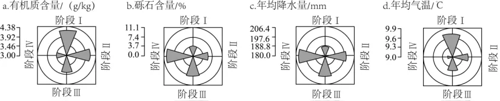

# 2024年广东高考地理真题 · 选择题题组 G1（第1–2题）

## 来源
- 来源文档：精品解析：2024年广东省高考地理真题（解析版）.docx
- 题号：第1–2题（选择题，共2小题）

## 题组材料
1984年以来，贺兰山东麓地区葡萄酒产业发展经历了萌发停滞（Ⅰ）、缓慢发展（Ⅱ）、快速发展（Ⅲ）和高速发展（Ⅳ）4个阶段，葡萄种植面积持续增加，葡萄酒生产集群规模不断扩大且重心向东南方向移动。如图反映4个阶段葡萄种植区自然要素变化。

## 相关图片


## 第1题
question_id: `2024-广东-地理-2024年广东高考地理真题-Q1`

**题干**：

1\. 1984年以来，贺兰山东麓地区新增葡萄种植区趋向（   ）

A. 土壤更贫瘠地区

B. 黄河两侧平原区

C. 暖湿化加剧地区

D. 贺兰山高海拔区

**答案**：

【答案】1. A

**解析**：

【1题详解】

据有机质含量在不同时期从阶段Ⅰ到阶段Ⅳ的数值体现是越来越少，说明整体葡萄种植区域的平均土壤有机质含量越来越低，而这四个阶段当地的葡萄种植面积持续增加，这说明贺兰山东麓新增葡萄种植区的趋向是向土壤更贫瘠地区方向拓展，A正确；据b砾石含量图可知从阶段Ⅰ到阶段Ⅳ葡萄种植区域的砾石含量占比越来越高，而黄河两侧平原区土壤中的砾石占比很小，所以新增葡萄种植区不应向黄河两侧平原区拓展，B错误；据c年均降水量和d年均气温从阶段Ⅰ到阶段Ⅳ的数值表现为年均降水量不断增加、年均气温以下降趋势为主，说明新增种植区域气候冷湿化加剧，C错误；葡萄生长需要一定的热量条件，贺兰山高海拔地区热量条件较差，新增区域不应向高海拔地区拓展，D错误。故选A。

**知识点归属**：
- **核心考点 · 权重 1.0**：人文地理 → 产业区位 → 农业区位因素

**整体置信度**：高

<!-- MANAGED-KM-START Q1
```yaml
question_id: "2024-广东-地理-2024年广东高考地理真题-Q1"
question_number: 1
knowledge_points:
  - role: core_exam_point
    weight: 1.0
    domain_id: DM-HUM
    domain: "人文地理"
    theme_id: TH-HUM-INDUSTRY
    theme: "产业区位"
    knowledge_unit_id: KU-HUM-IND-001
    knowledge_unit: "农业区位因素"
    evidence: "四阶段新增种植区有机质含量持续降低，说明葡萄种植向土壤更贫瘠地区扩展。"
extra_tags:
  - "农业扩张方向的自然要素判读"
taxonomy_version: "config-v0.2-draft"
confidence: "high"
label_status: "completed"
needs_review: false
taxonomy_review:
  needs_review: false
  issue_type: "none"
  review_note: ""
note: ""
```
-->

## 第2题
question_id: `2024-广东-地理-2024年广东高考地理真题-Q2`

**题干**：

2\. 驱动该地区葡萄酒生产集群规模不断扩大的主要因素有（   ）

①劳动力大量回流    ②政策支持与激励    ③肥沃的土地资源多

④旺盛的市场需求    ⑤适宜的气候条件    ⑥企业示范效应显著

A. ①③⑤

B. ①④⑤

C. ②③⑥

D. ②④⑥

**答案**：

【答案】2. D

**解析**：

【2题详解】

葡萄酒生产并不需要大量劳动力，且题目中没有信息表明有劳动力大量回流，排除①；葡萄种植和葡萄酒生产已成为宁夏的重要产业，自1984年以来葡萄种植规模和葡萄酒生产规模不断扩大离不开当地政府的政策支持与鼓励，②正确；据上题分析得知新增葡萄种植区域是向土壤贫瘠地区拓展，与当地肥沃的土壤资源多无关，③错误；葡萄酒旺盛的市场需求使得葡萄酒产业的生产规模不断扩大，④正确；当地气候条件是相对稳定因素，且气候对葡萄酒生产过程影响较小，⑤错误；葡萄酒生产集群规模不断扩大，说明从阶段Ⅰ开始一些葡萄酒企业的盈利能力产生了示范效应，影响力增强，从而使更多的企业投入到当地的葡萄酒生产，扩大了葡萄酒生产规模，⑥正确。故选D。

【点睛】贺兰山东麓地区位于东经105°45′39″—106°27′35″，北纬37°43′00″—39°05′3″之间，地处世界葡萄种植的"黄金地带"。位于中温带干旱气候区，属于典型的大陆性气候。

**知识点归属**：
- **核心考点 · 权重 1.0**：人文地理 → 产业区位 → 工业区位因素

**整体置信度**：高

<!-- MANAGED-KM-START Q2
```yaml
question_id: "2024-广东-地理-2024年广东高考地理真题-Q2"
question_number: 2
knowledge_points:
  - role: core_exam_point
    weight: 1.0
    domain_id: DM-HUM
    domain: "人文地理"
    theme_id: TH-HUM-INDUSTRY
    theme: "产业区位"
    knowledge_unit_id: KU-HUM-IND-002
    knowledge_unit: "工业区位因素"
    evidence: "政策激励、旺盛市场需求和企业示范效应共同驱动葡萄酒生产集群扩大。"
extra_tags:
  - "产业集群扩张动力"
taxonomy_version: "config-v0.2-draft"
confidence: "high"
label_status: "completed"
needs_review: false
taxonomy_review:
  needs_review: false
  issue_type: "none"
  review_note: ""
note: ""
```
-->

## 教学备注
<!-- TEACHER-NOTES-START -->
- 易错点：
- 课堂提示：
- 讲解建议：
<!-- TEACHER-NOTES-END -->
