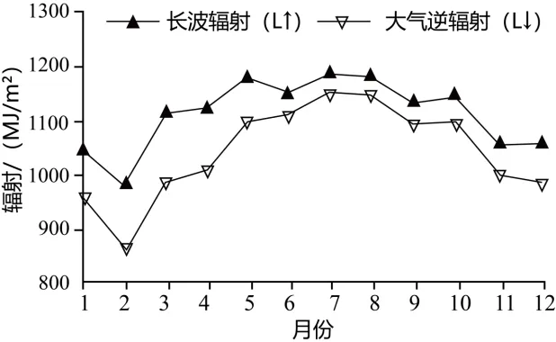

# 2024年广东高考地理真题 · 选择题题组 G2（第3–4题）

## 来源
- 来源文档：精品解析：2024年广东省高考地理真题（解析版）.docx
- 题号：第3–4题（选择题，共2小题）

## 题组材料
有效辐射为下垫面向上长波辐射与大气逆辐射的差值。如图表示2003—2012年云南省西双版纳热带季雨林林冠层向上长波辐射（L↑）及其上大气逆辐射（L↓）的月平均变化。据此完成下面小题。

## 相关图片


## 第3题
question_id: `2024-广东-地理-2024年广东高考地理真题-Q3`

**题干**：

3\. 与7—9月相比，2—4月西双版纳热带季雨林林冠层之上的大气逆辐射值较低，主要是因为2—4月期间（   ）

A. 降水较多

B. 云雾较少

C. 地表植被覆盖度较低

D. 正午太阳高度角较大

**答案**：

【答案】3. B

**解析**：

【3题详解】

云南西双版纳热带季雨林植被带对应热带季风气候，7-9月降水量远大于2-4月，2-4月由于降水较少，云雾日数少，天气以晴朗为主，故此林冠之上的大气逆辐射较弱，B正确，A错误；热带季雨林的植被覆盖度没有明显的季节变化，排除C；2-4月相比于7-9月西双版纳更远离太阳直射点，对应的正午太阳高度角较小，D错误。故选B。

**知识点归属**：
- **核心考点 · 权重 1.0**：自然地理 → 大气 → 大气的保温作用

**整体置信度**：高

<!-- MANAGED-KM-START Q3
```yaml
question_id: "2024-广东-地理-2024年广东高考地理真题-Q3"
question_number: 3
knowledge_points:
  - role: core_exam_point
    weight: 1.0
    domain_id: DM-NAT
    domain: "自然地理"
    theme_id: TH-NAT-ATMOSPHERE
    theme: "大气"
    knowledge_unit_id: KU-NAT-ATM-HEAT-004
    knowledge_unit: "大气的保温作用"
    evidence: "2—4月降水和云雾较少，大气吸收地面长波辐射后返还地面的逆辐射较弱。"
extra_tags:
  - "云量对大气逆辐射的影响"
taxonomy_version: "config-v0.2-draft"
confidence: "high"
label_status: "completed"
needs_review: false
taxonomy_review:
  needs_review: false
  issue_type: "none"
  review_note: ""
note: ""
```
-->

## 第4题
question_id: `2024-广东-地理-2024年广东高考地理真题-Q4`

**题干**：

4\. 根据有效辐射变化可知，一年中该地热带季雨林的林冠层（   ）

A. 表面的温度保持恒定

B. 热量主要来自大气层

C. 各月都是其上表层大气的冷源

D. 夏季对大气加热效果小于冬季

**答案**：

【答案】4. D

**解析**：

【4题详解】

受太阳辐射的季节变化影响，当地热带季雨林林冠层表面温度也会出现季节变化，夏季高于冬季，A错误；林冠向上的长波辐射在不同时间尺度上总是高于大气逆辐射，因此林冠层有效辐射在不同时间尺度上均是正值，这表明热带季节雨林林冠始终是大气的一个热源，是林冠层向大气提供热源，BC错误；据图示信息可知林冠层的长波辐射与大气逆辐射差值在夏季较冬季小，说明林冠层有效辐射夏季小于冬季，林冠层对大气的加热效果夏季小于冬季，D正确。故选D。

【点睛】西双版纳地处热带北部边缘，北有哀牢山、无量山为屏障，阻挡了南下的寒流；离海洋不远，夏季受印度洋的西南季风和太平洋东南气流的影响，造成了高温多雨、干湿季分明而四季不明显的气候特点，因而西双版纳气候终年温暖湿润，无四季之分，只有干湿季之别，形成热带季风气候。

**知识点归属**：
- **核心考点 · 权重 1.0**：自然地理 → 大气 → 大气的受热过程

**整体置信度**：高

<!-- MANAGED-KM-START Q4
```yaml
question_id: "2024-广东-地理-2024年广东高考地理真题-Q4"
question_number: 4
knowledge_points:
  - role: core_exam_point
    weight: 1.0
    domain_id: DM-NAT
    domain: "自然地理"
    theme_id: TH-NAT-ATMOSPHERE
    theme: "大气"
    knowledge_unit_id: KU-NAT-ATM-HEAT-003
    knowledge_unit: "大气的受热过程"
    evidence: "林冠向上长波辐射与大气逆辐射之差表明林冠向大气净输出热量，且夏季净输出小于冬季。"
extra_tags:
  - "林冠层有效辐射"
taxonomy_version: "config-v0.2-draft"
confidence: "high"
label_status: "completed"
needs_review: false
taxonomy_review:
  needs_review: false
  issue_type: "none"
  review_note: ""
note: ""
```
-->

## 教学备注
<!-- TEACHER-NOTES-START -->
- 易错点：
- 课堂提示：
- 讲解建议：
<!-- TEACHER-NOTES-END -->
