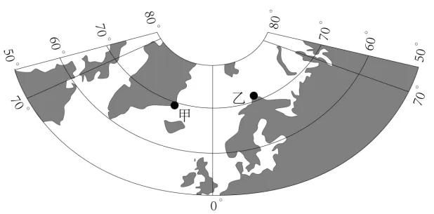

# 2024年广东高考地理真题 · 选择题题组 G5（第9–10题）

## 来源
- 来源文档：精品解析：2024年广东省高考地理真题（解析版）.docx
- 题号：第9–10题（选择题，共2小题）

## 题组材料
峡湾是冰川U形谷后期被海水淹没而形成的槽形谷。极地气候峡湾几乎常被海冰或冰川覆盖。而温带气候峡湾全年几乎没有海冰覆盖。如图示意在北半球发育极地气候峡湾的甲地和发育温带气候峡湾的乙地位置。据此完成下面小题。

## 相关图片


## 第9题
question_id: `2024-广东-地理-2024年广东高考地理真题-Q9`

**题干**：

9\. 与甲地对比，温带气候峡湾在乙地发育的主要原因是乙地（   ）

A. 冬季白昼的时长更长

B. 受到了暖流增温影响

C. 经历了更强构造运动

D. 海平面上升的幅度更大

**答案**：

【答案】9. B

**解析**：

【9题详解】

乙地位于欧洲西部，受北大西洋暖流增温的影响，海水温度较高，几乎没有海冰覆盖，B正确；乙地纬度略高于甲地，冬季白昼的时长更短，A错误；构造运动强弱没有信息显示，且海冰主要与水温、气温有关，而不是构造运动，C错误；同位于大西洋高纬度，海平面上升幅度没有差别，D错误。故选B。

**知识点归属**：
- **核心考点 · 权重 1.0**：自然地理 → 水文与海洋 → 洋流

**整体置信度**：高

<!-- MANAGED-KM-START Q9
```yaml
question_id: "2024-广东-地理-2024年广东高考地理真题-Q9"
question_number: 9
knowledge_points:
  - role: core_exam_point
    weight: 1.0
    domain_id: DM-NAT
    domain: "自然地理"
    theme_id: TH-NAT-WATER
    theme: "水文与海洋"
    knowledge_unit_id: KU-NAT-WATER-004
    knowledge_unit: "洋流"
    evidence: "北大西洋暖流对乙地沿岸海域增温，使其高纬峡湾全年几乎无海冰覆盖。"
extra_tags:
  - "暖流对高纬海域增温"
taxonomy_version: "config-v0.2-draft"
confidence: "high"
label_status: "completed"
needs_review: false
taxonomy_review:
  needs_review: false
  issue_type: "none"
  review_note: ""
note: ""
```
-->

## 第10题
question_id: `2024-广东-地理-2024年广东高考地理真题-Q10`

**题干**：

10\. 研究发现，极地气候峡湾沉积物中有机碳的累积速率往往较温带气候峡湾低，主要是因为极地气候峡湾区（   ）

①植被覆盖度更低    ②入海的径流更少    ③海水的盐度更低    ④波浪的动力更小

A. ①②

B. ①③

C. ②④

D. ③④

**答案**：

【答案】10. A

**解析**：

【10题详解】

极地气候峡湾区，气温更低，不利于植被生长，植被覆盖度更低，固碳速率慢，①正确；极地气候峡湾区，气温更低，河流结冰期长，入海径流更少，携带的营养盐类少，海洋浮游生物少，固碳速率慢，②正确；因海水大量结冰，海水的盐度可能更高，③错误；受极地东风影响，波浪的动力可能较大，④错误。①②组合正确，故选A。

【点睛】峡湾是冰川与海洋共同作用的结果，数万年前巨大的冰川切割海岸边的大地，形成一道道槽谷，而当冰川消融后，海水倒灌进槽谷，便形成了峡湾。

**知识点归属**：
- **核心考点 · 权重 1.0**：自然地理 → 自然环境的整体性与差异性 → 自然环境要素间的物质迁移和能量交换
- **支撑知识 · 权重 0.7**：自然地理 → 植被与土壤 → 植被与环境
- **支撑知识 · 权重 0.7**：自然地理 → 水文与海洋 → 陆地水体及其相互关系

**整体置信度**：高

<!-- MANAGED-KM-START Q10
```yaml
question_id: "2024-广东-地理-2024年广东高考地理真题-Q10"
question_number: 10
knowledge_points:
  - role: core_exam_point
    weight: 1.0
    domain_id: DM-NAT
    domain: "自然地理"
    theme_id: TH-NAT-INTEGRITY
    theme: "自然环境的整体性与差异性"
    knowledge_unit_id: KU-NAT-INTEGRITY-001
    knowledge_unit: "自然环境要素间的物质迁移和能量交换"
    evidence: "极地植被覆盖低、入海径流少，减少陆地有机质和营养物质向峡湾输送，降低有机碳累积。"
  - role: supporting_knowledge
    weight: 0.7
    domain_id: DM-NAT
    domain: "自然地理"
    theme_id: TH-NAT-VEGETATION-SOIL
    theme: "植被与土壤"
    knowledge_unit_id: KU-NAT-VEG-SOIL-001
    knowledge_unit: "植被与环境"
    evidence: "低温限制植被生长和陆地固碳，减少有机碳来源。"
  - role: supporting_knowledge
    weight: 0.7
    domain_id: DM-NAT
    domain: "自然地理"
    theme_id: TH-NAT-WATER
    theme: "水文与海洋"
    knowledge_unit_id: KU-NAT-WATER-005
    knowledge_unit: "陆地水体及其相互关系"
    evidence: "河流结冰期长使入海径流及其携带的营养盐和有机物减少。"
extra_tags:
  - "峡湾有机碳陆源输入"
taxonomy_version: "config-v0.2-draft"
confidence: "high"
label_status: "completed"
needs_review: false
taxonomy_review:
  needs_review: false
  issue_type: "none"
  review_note: ""
note: ""
```
-->

## 教学备注
<!-- TEACHER-NOTES-START -->
- 易错点：
- 课堂提示：
- 讲解建议：
<!-- TEACHER-NOTES-END -->
