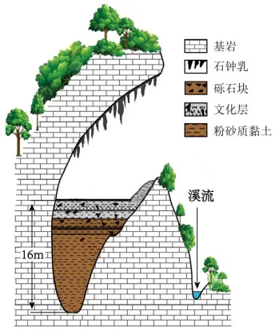

# 2024年广东高考地理真题 · 选择题题组 G6（第11–12题）

## 来源
- 来源文档：精品解析：2024年广东省高考地理真题（解析版）.docx
- 题号：第11–12题（选择题，共2小题）

## 题组材料
发育于云南省临沧市某处半山腰的硝洞是一个石灰岩溶洞，洞内有较厚的夹杂石灰岩砾石块的粉砂质黏土沉积物，其表层有约2m厚的文化层（含有古人类活动遗留物的沉积层）。左图为硝洞剖面示意图；右图为自洞内望向洞口方向的景观照片。据此完成下面小题。

## 相关图片


## 第11题
question_id: `2024-广东-地理-2024年广东高考地理真题-Q11`

**题干**：

11\. 参与该溶洞形成的主要外力作用包括（   ）

①化学溶蚀    ②重力崩塌    ③冰川刨蚀    ④风力吹蚀    ⑤流水侵蚀

A. ①②③

B. ①②⑤

C. ①④⑤

D. ③④⑤

**答案**：

【答案】11. B

**解析**：

【11题详解】

溶洞是流水溶蚀石灰岩等可溶性岩石形成的地下喀斯特地貌。该溶洞是受流水侵蚀、化学溶蚀可溶性石灰岩形成的，洞内有较厚的夹杂石灰岩砾石块的粉砂质黏土沉积物，故流水侵蚀、化学溶蚀石灰岩，重力崩塌形成洞穴，故参与该溶洞形成的主要外力作用包括化学溶蚀、重力崩塌、流水侵蚀，①②⑤正确，与风力、冰川作用关系不大，③④错误，故B正确，ACD错误。故选B。

**知识点归属**：
- **核心考点 · 权重 1.0**：自然地理 → 地表形态 → 喀斯特地貌

**整体置信度**：高

<!-- MANAGED-KM-START Q11
```yaml
question_id: "2024-广东-地理-2024年广东高考地理真题-Q11"
question_number: 11
knowledge_points:
  - role: core_exam_point
    weight: 1.0
    domain_id: DM-NAT
    domain: "自然地理"
    theme_id: TH-NAT-LANDFORM
    theme: "地表形态"
    knowledge_unit_id: KU-NAT-LANDFORM-001
    knowledge_unit: "喀斯特地貌"
    evidence: "石灰岩溶洞由流水化学溶蚀和机械侵蚀扩大，并伴随洞体重力崩塌。"
extra_tags:
  - "溶洞形成的外力作用"
taxonomy_version: "config-v0.2-draft"
confidence: "high"
label_status: "completed"
needs_review: false
taxonomy_review:
  needs_review: false
  issue_type: "none"
  review_note: ""
note: ""
```
-->

## 第12题
question_id: `2024-广东-地理-2024年广东高考地理真题-Q12`

**题干**：

12\. 可推断，该溶洞内粉砂质黏土沉积物主要源自（   ）

A. 洞顶的滴水化学淀积物

B. 人类活动遗留的堆填物

C. 洞内石灰岩崩塌堆积物

D. 地质时期的流水搬运物

**答案**：

【答案】12. D

**解析**：

【12题详解】

石灰岩属于浅海沉积，地质时期随地壳的抬升运动，石灰岩沉积处被抬升形成陆地；受地下水的溶蚀作用，形成溶洞，地下河流经中低山区，可能挟带砾石、砂和黏土等不同粒级的碎屑沉积物，这些物质随水流进入溶洞，并在洞内沉积下来，形成粉砂质黏土沉积物，D正确；洞顶的滴水化学淀积物、洞内石灰岩崩塌堆积物的主要成分应该是石灰岩块，而不是粉砂质黏土，AC错误；据材料可知，人类活动遗留物的沉积层在粉砂质黏土沉积物之上，B错误。故选D。

【点睛】溶洞：是地下水沿可溶性岩体的层面、节理或裂隙进行溶蚀扩大而成的空洞。在喀斯特溶洞发展过程中，除了以溶蚀作用为主外，还伴有水利、机械等其他的侵蚀作用及生物作用。

**知识点归属**：
- **核心考点 · 权重 1.0**：自然地理 → 地表形态 → 河流地貌
- **支撑知识 · 权重 0.7**：自然地理 → 地表形态 → 喀斯特地貌

**整体置信度**：高

<!-- MANAGED-KM-START Q12
```yaml
question_id: "2024-广东-地理-2024年广东高考地理真题-Q12"
question_number: 12
knowledge_points:
  - role: core_exam_point
    weight: 1.0
    domain_id: DM-NAT
    domain: "自然地理"
    theme_id: TH-NAT-LANDFORM
    theme: "地表形态"
    knowledge_unit_id: KU-NAT-LANDFORM-002
    knowledge_unit: "河流地貌"
    evidence: "粉砂质黏土及砾石等不同粒级碎屑由地质时期流水搬运进入洞穴并沉积。"
  - role: supporting_knowledge
    weight: 0.7
    domain_id: DM-NAT
    domain: "自然地理"
    theme_id: TH-NAT-LANDFORM
    theme: "地表形态"
    knowledge_unit_id: KU-NAT-LANDFORM-001
    knowledge_unit: "喀斯特地貌"
    evidence: "地下水沿石灰岩裂隙形成溶洞，为流水携沙沉积提供空间。"
extra_tags:
  - "溶洞碎屑沉积物来源"
taxonomy_version: "config-v0.2-draft"
confidence: "high"
label_status: "completed"
needs_review: false
taxonomy_review:
  needs_review: false
  issue_type: "none"
  review_note: ""
note: ""
```
-->

## 教学备注
<!-- TEACHER-NOTES-START -->
- 易错点：
- 课堂提示：
- 讲解建议：
<!-- TEACHER-NOTES-END -->
