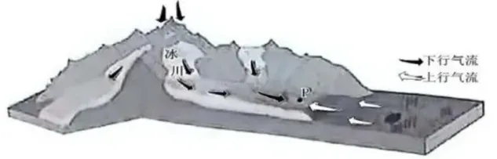
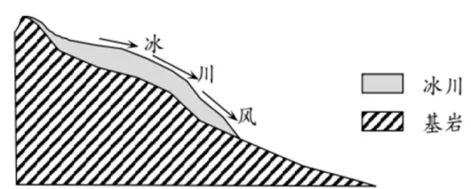

# 2024年广东高考地理真题 · 选择题题组 G7（第13–14题）

## 来源
- 来源文档：精品解析：2024年广东省高考地理真题（解析版）.docx
- 题号：第13–14题（选择题，共2小题）

## 题组材料
下图为珠穆朗玛峰南坡某冰川区暖季上、下气流运动状况示意图。据此完成下面小题。

## 相关图片


## 第13题
question_id: `2024-广东-地理-2024年广东高考地理真题-Q13`

**题干**：

13\. 若暖季上、下行气流常在图中P地附近交汇，则该地（   ）

A. 大气下沉气流增强

B. 冰面的流水作用减弱

C. 局地降水概率增加

D. 下行风焚风效应减弱

**答案**：

【答案】13. C

**解析**：

【13题详解】

由材料"若暖季上、下行气流常在图中P地附近交汇"可知，暖季时高海拔地区的冷空气吹向下方，与低海拔地区暖湿气流在图中P地附近交汇，冷暖气流交汇，暖气流上升，气流在上升过程中，海拔升高，气温降低，水汽易凝结形成降水，致使局地降水概率增加，C正确；由题干关键词"若暖季"可知，暖季时气温相对较高，大气下沉气流减弱，上升气流增强，A错误；该地位于珠穆朗玛峰南坡，是阳坡，暖季时气温较高，冰川融化导致冰面的流水作用增强，B错误；下行风指空气从上向下流动，焚风效应是气流在背风坡下沉过程中温度升高，湿度降低形成的干热风，综上，下行风会导致焚风效应增强，D错误。故选C。

**知识点归属**：
- **核心考点 · 权重 1.0**：自然地理 → 大气 → 大气热力环流
- **支撑知识 · 权重 0.7**：自然地理 → 大气 → 大气稳定度与对流运动

**整体置信度**：高

<!-- MANAGED-KM-START Q13
```yaml
question_id: "2024-广东-地理-2024年广东高考地理真题-Q13"
question_number: 13
knowledge_points:
  - role: core_exam_point
    weight: 1.0
    domain_id: DM-NAT
    domain: "自然地理"
    theme_id: TH-NAT-ATMOSPHERE
    theme: "大气"
    knowledge_unit_id: KU-NAT-ATM-HEAT-005
    knowledge_unit: "大气热力环流"
    evidence: "冰川冷下行气流与低海拔暖湿上行气流在P地辐合，迫使暖湿空气抬升。"
  - role: supporting_knowledge
    weight: 0.7
    domain_id: DM-NAT
    domain: "自然地理"
    theme_id: TH-NAT-ATMOSPHERE
    theme: "大气"
    knowledge_unit_id: KU-NAT-ATM-HEAT-007
    knowledge_unit: "大气稳定度与对流运动"
    evidence: "暖湿气流上升冷却凝结，提高P地局地降水概率。"
extra_tags:
  - "冰川风辐合降水"
taxonomy_version: "config-v0.2-draft"
confidence: "high"
label_status: "completed"
needs_review: false
taxonomy_review:
  needs_review: false
  issue_type: "none"
  review_note: ""
note: ""
```
-->

## 第14题
question_id: `2024-广东-地理-2024年广东高考地理真题-Q14`

**题干**：

14\. 近30年来，该地区暖季午间下行气流势力呈现增强趋势，由此可引起P地附近（   ）

A. 年均气温趋于降低

B. 冰川消融加快

C. 年降水量趋于增加

D. 湖泊效应增强

**答案**：

【答案】14. A

**解析**：

【14题详解】

由题干"近30年来，该地区暖季午间下行气流势力呈现增强趋势"可知，更强的下降风将高海拔地区的冷空气吹向下方，由此可能引起P地附近年均气温趋于降低，这种区域降温可能在一定程度上阻止了冰川的融化，导致冰川消融减慢，A正确，B错误；更强的下降风也降低了区域风辐合的高度，从而减少了P地附近的降水量，导致P地附近年降水量趋于减少，C错误；湖泊效应指水库(人造湖泊)对气候的作用，由于水体巨大的热容量和水分供应，可使水库附近的平均气温升高，气温日较差和年较差变小，更强的下降风引起的区域降温会导致湖泊效应减弱，D错误。故选A。

【点睛】冰川风也称冰河风，是一种下降风，是指在冰川地区沿着高山冰川表面向下吹的风。风速每秒可达3米到10米（7级风左右）。由于冰川表面气温与周围同高度气温相比要低得多，近冰川面的空气冷缩，冷而重的空气团沿着冰雪表面向下坡方向流动，冰缘地区（冰川外围地区）较暖的空气被迫抬升，形成了由冰川表面向冰缘地带吹送的冰川风。我国青藏高原、天山、祁连山都有冰川风，其中珠峰北坡冰川风很强势，给登山造成很大威胁。



**知识点归属**：
- **核心考点 · 权重 1.0**：自然地理 → 大气 → 大气热力环流

**整体置信度**：高

<!-- MANAGED-KM-START Q14
```yaml
question_id: "2024-广东-地理-2024年广东高考地理真题-Q14"
question_number: 14
knowledge_points:
  - role: core_exam_point
    weight: 1.0
    domain_id: DM-NAT
    domain: "自然地理"
    theme_id: TH-NAT-ATMOSPHERE
    theme: "大气"
    knowledge_unit_id: KU-NAT-ATM-HEAT-005
    knowledge_unit: "大气热力环流"
    evidence: "增强的冰川下行风把高海拔冷空气输送到P地附近，使局地气温趋于降低。"
extra_tags:
  - "冰川风增强的降温效应"
taxonomy_version: "config-v0.2-draft"
confidence: "high"
label_status: "completed"
needs_review: false
taxonomy_review:
  needs_review: false
  issue_type: "none"
  review_note: ""
note: ""
```
-->

## 教学备注
<!-- TEACHER-NOTES-START -->
- 易错点：
- 课堂提示：
- 讲解建议：
<!-- TEACHER-NOTES-END -->
