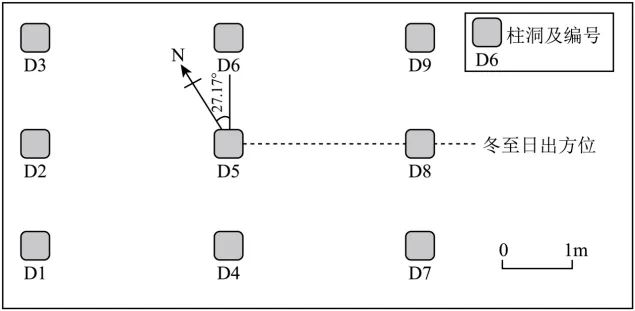

# 2024年广东高考地理真题 · 选择题题组 G8（第15–16题）

## 来源
- 来源文档：精品解析：2024年广东省高考地理真题（解析版）.docx
- 题号：第15–16题（选择题，共2小题）

## 题组材料
距今约3000年前的金沙遗址（30°41′N，104°01′E）是古蜀国时期的一处大型聚落遗址。在该遗址祭祀区的东部，有一处九柱建筑基址，其9个柱洞呈"田"字形分布。研究发现，这些柱洞分布具有一定的天文属性。左图为九柱建筑的复原示意图；右图示意该建筑柱洞平面分布及当时冬至日的日出方位。据此完成下面小题。

## 相关图片




## 第15题
question_id: `2024-广东-地理-2024年广东高考地理真题-Q15`

**题干**：

15\. 如果当时祭祀人员站在右图中的D5处，他在夏至日看到的日出方位位于（   ）

A. D5→D6连线方向

B. D6和D9之间

C. D5→D9连线方向

D. D8和D9之间

**答案**：

【答案】15. B

**解析**：

【15题详解】

根据图示信息可知，正北方向与D5→D6连线方向有27.17°的夹角，冬至日日出方位位于D5→D8连线方向，该地位于北半球，冬至日日出方位位于东南，则图中D5→D9连线方向大致为正东方向，该地位于北半球，夏至日太阳直射点位于北半球，当地日出方向位于东北，应位于D6和D9之间，B正确，ACD错误。故选B。

**知识点归属**：
- **核心考点 · 权重 1.0**：自然地理 → 地球的运动 → 黄赤交角与太阳直射点的回归运动

**整体置信度**：高

<!-- MANAGED-KM-START Q15
```yaml
question_id: "2024-广东-地理-2024年广东高考地理真题-Q15"
question_number: 15
knowledge_points:
  - role: core_exam_point
    weight: 1.0
    domain_id: DM-NAT
    domain: "自然地理"
    theme_id: TH-NAT-EARTH-MOTION
    theme: "地球的运动"
    knowledge_unit_id: KU-NAT-EARTH-MOTION-003
    knowledge_unit: "黄赤交角与太阳直射点的回归运动"
    evidence: "北半球夏至太阳直射北回归线，日出东北；结合柱洞方位可定位在D6与D9之间。"
extra_tags:
  - "夏至日日出方位"
taxonomy_version: "config-v0.2-draft"
confidence: "high"
label_status: "completed"
needs_review: false
taxonomy_review:
  needs_review: false
  issue_type: "none"
  review_note: ""
note: ""
```
-->

## 第16题
question_id: `2024-广东-地理-2024年广东高考地理真题-Q16`

**题干**：

16\. 已知3000年前的黄赤交角比现今大，与现在遗址地居民相比，则当时金沙先民在（   ）

A. 春分日看到日出时间更早

B. 夏至日经历更长的夜长

C. 秋分日看到日落时间更晚

D. 冬至日经历更短的昼长

**答案**：

【答案】16. D

**解析**：

【16题详解】

黄赤交角变大后，冬至和夏至时的太阳直射点的纬度变大，各地昼夜长短的年变化幅度增大，冬至日北半球各地昼更短、夜更长，夏至日北半球各地昼更长、夜更短，B错误，D正确；春秋分太阳直射点位于赤道，全球昼夜平分，该地日出日落时间不会变化，AC错误。故选D。

【点睛】太阳一天的位置和方向：太阳直射赤道上，全球日出正东，日落正西。太阳直射北半球，全球（除极昼极夜地区外）日出东北，日落西北；（偏北）。太阳直射南半球，全球（除极昼极夜地区外）日出东南，日落西南。（偏南）。

**知识点归属**：
- **核心考点 · 权重 1.0**：自然地理 → 地球的运动 → 黄赤交角与太阳直射点的回归运动
- **支撑知识 · 权重 0.7**：自然地理 → 地球的运动 → 昼夜长短的变化

**整体置信度**：高

<!-- MANAGED-KM-START Q16
```yaml
question_id: "2024-广东-地理-2024年广东高考地理真题-Q16"
question_number: 16
knowledge_points:
  - role: core_exam_point
    weight: 1.0
    domain_id: DM-NAT
    domain: "自然地理"
    theme_id: TH-NAT-EARTH-MOTION
    theme: "地球的运动"
    knowledge_unit_id: KU-NAT-EARTH-MOTION-003
    knowledge_unit: "黄赤交角与太阳直射点的回归运动"
    evidence: "黄赤交角增大会扩大冬至太阳直射点纬度，使北半球冬至太阳直射更偏南。"
  - role: supporting_knowledge
    weight: 0.7
    domain_id: DM-NAT
    domain: "自然地理"
    theme_id: TH-NAT-EARTH-MOTION
    theme: "地球的运动"
    knowledge_unit_id: KU-NAT-EARTH-MOTION-006
    knowledge_unit: "昼夜长短的变化"
    evidence: "太阳直射纬度变化幅度增大使北半球冬至昼长更短、夜长更长。"
extra_tags:
  - "黄赤交角变化与昼夜年较差"
taxonomy_version: "config-v0.2-draft"
confidence: "high"
label_status: "completed"
needs_review: false
taxonomy_review:
  needs_review: false
  issue_type: "none"
  review_note: ""
note: ""
```
-->

## 教学备注
<!-- TEACHER-NOTES-START -->
- 易错点：
- 课堂提示：
- 讲解建议：
<!-- TEACHER-NOTES-END -->
