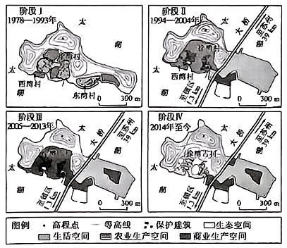

# 精品解析：2025年广东高考地理真题（解析版） · 综合题第17题（小问1–3）

## 来源
- 来源文档：精品解析：2025年广东高考地理真题（解析版）
- 题号：第17题（非选择题，共3小问）

## 题组材料
叶山岛位于太湖东南水域、南宋末年就有村民在该岛定居；至清代，岛上居民已达百余家，村民以渔、农为业，皆会唱曲。20世纪90年代以来，随着该岛被纳入太湖国家旅游度假区以及徐湾古村被列入苏州市第一批传统乡村名录，当地居民的生活、生产空间发生了显著改变。近年来，当地政府利用古村落和传统戏剧文化资源发展文旅产业，下图示意1978年以来叶山岛生活、生产和生态空间的变化过程。

## 相关图片


### 第17题（1）
question_id: `2025-广东-地理-精品解析：2025年广东高考地理真题（解析版）-Q17-1`

**题干**：（1）指出叶山岛的地形特征，并说明其对早期村落布局的影响。

**答案**：（北侧等高线密集，起伏较大）南侧地形和缓，利于建造村宅及农耕；北、东、西侧地势较高，减少冬季寒潮影响；向南开口，有利于夏季风携带水汽进入，调节小气候；山地为村落提供屏障，利于村落防御。

**解析**：据图示信息可知，叶山岛北部等高线密集，说明北侧地势起伏较大，而南侧等高线稀疏，说明地形平坦，适宜建设村宅及农耕用地，建设成本低；当地冬季受西北季风的影响，聚落的北、东、西侧地势较高，能阻挡冬季风的深入，从而减少冬季寒潮影响，利于居住和农耕；当地夏季受湿润东南季风影响，地形向南敞开，有利于夏季风携带水汽进入，调节当地局部气候；北、东、西侧的山地形成自然屏障，不易进入，利于村落防御。

**知识点归属**：
- **核心考点 · 权重 1.0**：自然地理 → 地表形态 → 地貌的观察
- **支撑知识 · 权重 0.7**：人文地理 → 乡村与城镇 → 乡村土地利用

**整体置信度**：高

<!-- MANAGED-KM-START Q17-1
```yaml
question_id: "2025-广东-地理-精品解析：2025年广东高考地理真题（解析版）-Q17-1"
question_number: 17
sub_question: 1
knowledge_points:
  - role: core_exam_point
    weight: 1.0
    domain_id: DM-NAT
    domain: "自然地理"
    theme_id: TH-NAT-LANDFORM
    theme: "地表形态"
    knowledge_unit_id: KU-NAT-LANDFORM-005
    knowledge_unit: "地貌的观察"
    evidence: "据等高线判读北侧起伏大、南侧和缓，属地貌观察。"
  - role: supporting_knowledge
    weight: 0.7
    domain_id: DM-HUM
    domain: "人文地理"
    theme_id: TH-HUM-SETTLEMENT
    theme: "乡村与城镇"
    knowledge_unit_id: KU-HUM-SET-001
    knowledge_unit: "乡村土地利用"
    evidence: "地形对早期村宅与农耕用地布局的影响属乡村土地利用。"
extra_tags:
  - "叶山岛地形"
  - "早期村落布局"
taxonomy_version: "config-v0.2-draft"
confidence: "high"
label_status: "completed"
needs_review: false
taxonomy_review:
  needs_review: false
  issue_type: "none"
  review_note: ""
note: ""
```
-->

### 第17题（2）
question_id: `2025-广东-地理-精品解析：2025年广东高考地理真题（解析版）-Q17-2`

**题干**：（2）在阶段Ⅲ，徐湾古村生产空间类型较阶段Ⅱ发生了显著变化，分析促使这种变化产生的有利条件。

**答案**：地理位置优越，距周边大城市近，且大桥开通后受辐射影响强;社会经济发展，旅游需求增长，产品销售市场扩大；大桥建成后便于从外界购买农产品，对本土农业依赖下降；政策支持和引导力度加大；该村古建资源得到保护，对周边城市吸引力增强。

**解析**：叶山岛是太湖东南水域，太湖周边地区大城市较多，尤其是叶山岛距离苏州较近，随着大桥开通，受苏州等大城市的辐射影响更加显著；从阶段Ⅱ到阶段Ⅲ，我国经济发展迅速，尤其是旅游市场快速增长，相关产品销售市场扩大；此阶段的大桥建立便于当地与外界联系，当地人们可以方便从外界购买相关农产品，从而对本地的农业依赖有所下降；主导产业的转型离不开政策的支持与引导，转型成功说明政策支持和引导力度加大；近年来，叶山岛引入戏剧村的文创概念，侧面反映了当地政府对该村古建资源保护力度大，旅游资源独特，从而对周边城市居民吸引力增强。

**知识点归属**：
- **核心考点 · 权重 1.0**：区域发展 → 产业结构变化与区域发展 → 产业结构的升级
- **支撑知识 · 权重 0.7**：区域发展 → 城市与区域发展 → 城市辐射功能
- **材料线索 · 权重 0.4**：人文地理 → 乡村与城镇 → 乡村土地利用

**整体置信度**：高

<!-- MANAGED-KM-START Q17-2
```yaml
question_id: "2025-广东-地理-精品解析：2025年广东高考地理真题（解析版）-Q17-2"
question_number: 17
sub_question: 2
knowledge_points:
  - role: core_exam_point
    weight: 1.0
    domain_id: DM-REG
    domain: "区域发展"
    theme_id: TH-REG-INDUSTRY
    theme: "产业结构变化与区域发展"
    knowledge_unit_id: KU-REG-INDUSTRY-002
    knowledge_unit: "产业结构的升级"
    evidence: "阶段Ⅲ生产空间转型受旅游市场与政策驱动，属产业结构升级。"
  - role: supporting_knowledge
    weight: 0.7
    domain_id: DM-REG
    domain: "区域发展"
    theme_id: TH-REG-CITY
    theme: "城市与区域发展"
    knowledge_unit_id: KU-REG-CITY-002
    knowledge_unit: "城市辐射功能"
    evidence: "大桥开通后受苏州等大城市辐射影响增强。"
  - role: material_clue
    weight: 0.4
    domain_id: DM-HUM
    domain: "人文地理"
    theme_id: TH-HUM-SETTLEMENT
    theme: "乡村与城镇"
    knowledge_unit_id: KU-HUM-SET-001
    knowledge_unit: "乡村土地利用"
    evidence: "生产空间类型变化以乡村土地利用演变为载体。"
extra_tags:
  - "生产空间转型"
  - "城市辐射"
taxonomy_version: "config-v0.2-draft"
confidence: "high"
label_status: "completed"
needs_review: false
taxonomy_review:
  needs_review: false
  issue_type: "none"
  review_note: ""
note: ""
```
-->

### 第17题（3）
question_id: `2025-广东-地理-精品解析：2025年广东高考地理真题（解析版）-Q17-3`

**题干**：（3）当地拟利用徐湾古村资源打造“戏剧文化村”，请分析该举措对叶山岛古村落保护的益处。

**答案**：旅游项目的开展为村落保护提供资金；提高村落知名度，有利于保护性开发；优化村落空间结构，修缮古建筑，实现保护性开发；改善基础设施，美化人居环境；弘扬戏剧文化，利于村落传统文化延续。

**解析**：乡村特色戏剧项目是当地特色的旅游品牌项目，旅游项目活动的开展提高了当地的经济收益，为村落保护提供资金；乡村特色戏剧项目的推广，弘扬当地特色戏剧文化，利于古村落文化的延续，也提高了当地村落的知名度；当地居民的生活、生产空间发生了显著改变，说明当地优化了村落空间结构，通过对古建筑进行修缮，提高了古村落建筑的完整度，有利于古村落保护性开发；经济实力的提升有助于改善当地基础设施，美化了当地人居环境，改善了投资环境。

**知识点归属**：
- **核心考点 · 权重 1.0**：人文地理 → 乡村与城镇 → 地域文化与城乡景观
- **支撑知识 · 权重 0.7**：区域发展 → 区域与区域发展 → 因地制宜与区域发展

**整体置信度**：高

<!-- MANAGED-KM-START Q17-3
```yaml
question_id: "2025-广东-地理-精品解析：2025年广东高考地理真题（解析版）-Q17-3"
question_number: 17
sub_question: 3
knowledge_points:
  - role: core_exam_point
    weight: 1.0
    domain_id: DM-HUM
    domain: "人文地理"
    theme_id: TH-HUM-SETTLEMENT
    theme: "乡村与城镇"
    knowledge_unit_id: KU-HUM-SET-008
    knowledge_unit: "地域文化与城乡景观"
    evidence: "利用戏剧文化与古村落资源属地域文化与城乡景观保护性开发。"
  - role: supporting_knowledge
    weight: 0.7
    domain_id: DM-REG
    domain: "区域发展"
    theme_id: TH-REG-REGION
    theme: "区域与区域发展"
    knowledge_unit_id: KU-REG-REGION-005
    knowledge_unit: "因地制宜与区域发展"
    evidence: "文旅举措体现因地制宜与区域发展。"
extra_tags:
  - "戏剧文化村"
  - "古村落保护"
taxonomy_version: "config-v0.2-draft"
confidence: "high"
label_status: "completed"
needs_review: false
taxonomy_review:
  needs_review: false
  issue_type: "none"
  review_note: ""
note: ""
```
-->

## 教学备注
<!-- TEACHER-NOTES-START -->
- 易错点：
- 课堂提示：
- 讲解建议：
<!-- TEACHER-NOTES-END -->
