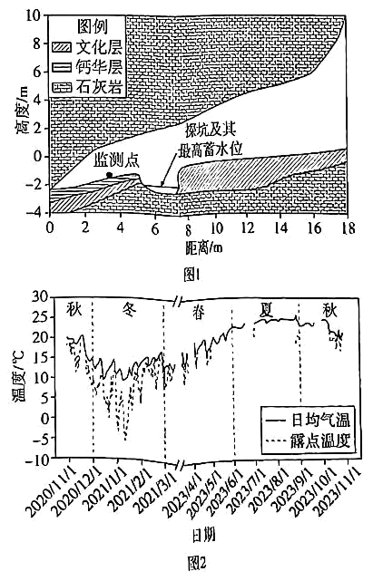

# 精品解析：2025年广东高考地理真题（解析版） · 综合题第18题（小问1–2）

## 来源
- 来源文档：精品解析：2025年广东高考地理真题（解析版）
- 题号：第18题（非选择题，共2小问）

## 题组材料
甑皮岩遗址是我国华南地区重要的新石器时代洞穴遗址，位于桂林市区的一个石灰岩溶洞内（图1）。该遗址文化层（含有古人类活动遗留物的沉积层）组成物质中含有较多碳酸盐成分。文化层表面发育许多溶蚀孔洞。在洞穴底部，现存一个未回填的考古探坑。2020年11月至2023年11月，有关部门在洞内开展了气温和露点温度（气压和水汽含量不变，未饱和空气因冷却达到饱和时的温度）监测，结果如图2所示。

## 相关图片


### 第18题（1）
question_id: `2025-广东-地理-精品解析：2025年广东高考地理真题（解析版）-Q18-1`

**题干**：（1）指出洞内未回填考古探坑对该遗址保护性开发可发挥的作用。

**答案**：有利于展示文化层考古成果；丰富旅游体验；便于继续开展科研考察；减少回填挖土对其他地区的扰动。

**解析**：洞内未回填考古探坑，可向外界清晰地展示新石器时代洞穴遗址文化层的考古过程，更好的展示考古成果，具有很高的科考文化意义；现今的考古主要是在文化层，可能还有遗址和遗迹存在，不回填有利于继续开展科研考察；回填的土壤不是原有的土壤，若回填新土会对矿坑周边的其他地区的环境产生一定扰动，所以当地决定不回填考古坑。

**知识点归属**：
- **核心考点 · 权重 1.0**：人文地理 → 乡村与城镇 → 地域文化与城乡景观
- **支撑知识 · 权重 0.7**：人文地理 → 产业区位 → 服务业区位因素

**整体置信度**：高

<!-- MANAGED-KM-START Q18-1
```yaml
question_id: "2025-广东-地理-精品解析：2025年广东高考地理真题（解析版）-Q18-1"
question_number: 18
sub_question: 1
knowledge_points:
  - role: core_exam_point
    weight: 1.0
    domain_id: DM-HUM
    domain: "人文地理"
    theme_id: TH-HUM-SETTLEMENT
    theme: "乡村与城镇"
    knowledge_unit_id: KU-HUM-SET-008
    knowledge_unit: "地域文化与城乡景观"
    evidence: "未回填探坑展示考古文化层、延续科研并减少扰动，体现文化遗址景观的保护性开发。"
  - role: supporting_knowledge
    weight: 0.7
    domain_id: DM-HUM
    domain: "人文地理"
    theme_id: TH-HUM-INDUSTRY
    theme: "产业区位"
    knowledge_unit_id: KU-HUM-IND-003
    knowledge_unit: "服务业区位因素"
    evidence: "探坑能够丰富旅游体验，体现文化旅游服务供给。"
extra_tags:
  - "考古遗址保护性开发"
taxonomy_version: "config-v0.2-draft"
confidence: "high"
label_status: "completed"
needs_review: false
taxonomy_review:
  needs_review: false
  issue_type: "none"
  review_note: ""
note: ""
```
-->

### 第18题（2）
question_id: `2025-广东-地理-精品解析：2025年广东高考地理真题（解析版）-Q18-2`

**题干**：（2）根据图2所示，分析洞内气温变化对水汽状态的影响，并说明该影响有助于文化层表面溶蚀孔洞形成的作用机理。

**答案**：影响：春夏气温上升，露点温度上升，气温和露点温度基本重合，相对湿度接近100%，水汽凝结；秋冬气温下降，露点温度下降，冬季气温与露点温度差最大，相对湿度最小，水分蒸发。作用机理：当相对湿度达到100%时，产生凝结水，覆盖在文化层表面，吸收洞底高浓度二氧化碳，形成酸性水环境，溶蚀文化层，并在重力作用下滴落带走，形成溶蚀坑洞。

**解析**：据图示信息可知当地春夏季节气温上升较为显著，露点温度也相应上升，露点温度是水汽达到饱和时的气温，春季和夏季时的气温和露点温度重合度很高，这说明此时相对湿度接近饱和，相对湿度接近100%，水汽易凝结；秋冬季节时气温下降，而露点温度也随之下降，尤其是冬季时气温与露点温度差最大，导致当地相对湿度最小，有利于水分蒸发。文化层上溶蚀坑洞是流水溶蚀的结果，需要有一定的水分，当春夏季时相对湿度达到饱和，岩层表面易产生凝结液态水，液态水吸收洞底高浓度二氧化碳，形成稳定持续的酸性水环境，覆盖在文化层表面岩层，从而不断溶蚀文化层，凝结水在重力作用下滴落带走，逐渐形成溶蚀坑洞。

**知识点归属**：
- **核心考点 · 权重 1.0**：自然地理 → 地表形态 → 喀斯特地貌
- **支撑知识 · 权重 0.7**：自然地理 → 大气 → 大气的受热过程

**整体置信度**：高

<!-- MANAGED-KM-START Q18-2
```yaml
question_id: "2025-广东-地理-精品解析：2025年广东高考地理真题（解析版）-Q18-2"
question_number: 18
sub_question: 2
knowledge_points:
  - role: core_exam_point
    weight: 1.0
    domain_id: DM-NAT
    domain: "自然地理"
    theme_id: TH-NAT-LANDFORM
    theme: "地表形态"
    knowledge_unit_id: KU-NAT-LANDFORM-001
    knowledge_unit: "喀斯特地貌"
    evidence: "凝结水吸收CO₂形成酸性水溶蚀碳酸盐文化层，属喀斯特溶蚀。"
  - role: supporting_knowledge
    weight: 0.7
    domain_id: DM-NAT
    domain: "自然地理"
    theme_id: TH-NAT-ATMOSPHERE
    theme: "大气"
    knowledge_unit_id: KU-NAT-ATM-HEAT-003
    knowledge_unit: "大气的受热过程"
    evidence: "气温与露点差决定凝结/蒸发，属大气受热过程与水汽状态。"
extra_tags:
  - "溶蚀孔洞"
  - "气温露点"
taxonomy_version: "config-v0.2-draft"
confidence: "high"
label_status: "completed"
needs_review: false
taxonomy_review:
  needs_review: false
  issue_type: "none"
  review_note: ""
note: ""
```
-->

## 教学备注
<!-- TEACHER-NOTES-START -->
- 易错点：
- 课堂提示：
- 讲解建议：
<!-- TEACHER-NOTES-END -->
