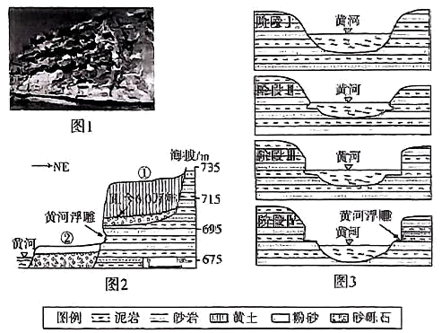

# 精品解析：2025年广东高考地理真题（解析版） · 综合题第19题（小问1–3）

## 来源
- 来源文档：精品解析：2025年广东高考地理真题（解析版）
- 题号：第19题（非选择题，共3小问）

## 题组材料
在晋陕峡谷山西临县段黄河两侧有河流阶地发育。在该地黄河东岸崖壁上发育的微地貌、因其形态各异、凹凸有致而被形象地称为“黄河浮雕”（圈1）、其发育的物质基础由坚硬砂岩和较软泥岩互层构成。黄河浮雕出现于图2所示部位。图3示意某学者提出的外力作用对黄河浮雕形成的影响过程模式。

## 相关图片


### 第19题（1）
question_id: `2025-广东-地理-精品解析：2025年广东高考地理真题（解析版）-Q19-1`

**题干**：（1）根据图3所示过程模式，描述黄河浮雕形成的主要外力作用过程。

**答案**：流水侵蚀较松软的泥岩，形成凹陷；其上部坚硬的砂岩失去支撑，发生重力崩塌，形成垂直崖壁；高水位时期，流水侵蚀，形成“黄河浮雕”的雏形；低水位时期，浮雕雏形露出水面，接受风蚀作用的改造。

**解析**：流水侵蚀作用具有一定的差异性，松软的泥岩相对较更容易被流水侵蚀，从而形成凹陷；松软的泥岩之上的坚硬的砂岩受流水侵蚀作用较小，但由于下部松软的泥岩被侵蚀，受重力影响上部坚硬的砂岩失去支撑，发生重力崩塌，形成了垂直崖壁；“黄河浮雕”是风力和流水共同作用下的结果，由于黄河径流量季节变化大，在高水位时受流水侵蚀作用较强，形成“黄河浮雕”的雏形；当地低水位时，黄河浮雕雏形露出水面，继续接受风力侵蚀作用的改造，最终在风力侵蚀和流水侵蚀的共同作用下形成“黄河浮雕”。

**知识点归属**：
- **核心考点 · 权重 1.0**：自然地理 → 地表形态 → 塑造地表形态的内力与外力作用
- **支撑知识 · 权重 0.7**：自然地理 → 地表形态 → 河流地貌

**整体置信度**：高

<!-- MANAGED-KM-START Q19-1
```yaml
question_id: "2025-广东-地理-精品解析：2025年广东高考地理真题（解析版）-Q19-1"
question_number: 19
sub_question: 1
knowledge_points:
  - role: core_exam_point
    weight: 1.0
    domain_id: DM-NAT
    domain: "自然地理"
    theme_id: TH-NAT-LANDFORM
    theme: "地表形态"
    knowledge_unit_id: KU-NAT-LANDFORM-006
    knowledge_unit: "塑造地表形态的内力与外力作用"
    evidence: "流水侵蚀泥岩、砂岩重力崩塌、风蚀改造，属外力作用过程。"
  - role: supporting_knowledge
    weight: 0.7
    domain_id: DM-NAT
    domain: "自然地理"
    theme_id: TH-NAT-LANDFORM
    theme: "地表形态"
    knowledge_unit_id: KU-NAT-LANDFORM-002
    knowledge_unit: "河流地貌"
    evidence: "黄河高低水位侵蚀与阶地发育属河流地貌。"
extra_tags:
  - "黄河浮雕"
  - "外力过程"
taxonomy_version: "config-v0.2-draft"
confidence: "high"
label_status: "completed"
needs_review: false
taxonomy_review:
  needs_review: false
  issue_type: "none"
  review_note: ""
note: ""
```
-->

### 第19题（2）
question_id: `2025-广东-地理-精品解析：2025年广东高考地理真题（解析版）-Q19-2`

**题干**：（2）结合图2中阶地①地层的沉积环境差异和黄土层最底部的年代，该学者推测黄河浮雕的形成不早于距今6.0万年。请给出此推断的依据。

**答案**：黄土堆积一定是在陆地上才能形成，当黄土能覆盖于河流相砾石层之上时，说明此时水面下降形成阶地，阶地前缘面开始高出水面，浮雕才能形成。黄河阶地面上覆黄土的底界年龄为6万年，所以浮雕形成不会早于距今6万年前。

**解析**：黄土不会在水域环境下堆积，且据所学知识可知黄土主要是风力沉积形成的，因此推断黄土堆积一定是在陆地环境下形成，而砾石层是河流相堆积物质，当黄土层覆盖于河流相砾石层之上时，说明砾石层出露于水面，此时水面下降形成阶地，当阶地前缘面开始高出水面，砾石层在水面之上时浮雕才能形成。而黄河阶地面上覆黄土的底界年龄为6万年，所以浮雕形成一定是在6万年之后，不会早于距今6万年前。

**知识点归属**：
- **核心考点 · 权重 1.0**：自然地理 → 地表形态 → 河流地貌
- **支撑知识 · 权重 0.7**：自然地理 → 地球的结构与演化 → 地质年代表

**整体置信度**：高

<!-- MANAGED-KM-START Q19-2
```yaml
question_id: "2025-广东-地理-精品解析：2025年广东高考地理真题（解析版）-Q19-2"
question_number: 19
sub_question: 2
knowledge_points:
  - role: core_exam_point
    weight: 1.0
    domain_id: DM-NAT
    domain: "自然地理"
    theme_id: TH-NAT-LANDFORM
    theme: "地表形态"
    knowledge_unit_id: KU-NAT-LANDFORM-002
    knowledge_unit: "河流地貌"
    evidence: "黄土覆盖河流相砾石层指示水面下降成阶地，属河流地貌沉积环境。"
  - role: supporting_knowledge
    weight: 0.7
    domain_id: DM-NAT
    domain: "自然地理"
    theme_id: TH-NAT-EARTH-STRUCTURE
    theme: "地球的结构与演化"
    knowledge_unit_id: KU-NAT-EARTH-STRUCTURE-004
    knowledge_unit: "地质年代表"
    evidence: "黄土底界年龄6万年用于年代推断，属地质年代表。"
extra_tags:
  - "阶地沉积"
  - "年代推断"
taxonomy_version: "config-v0.2-draft"
confidence: "high"
label_status: "completed"
needs_review: false
taxonomy_review:
  needs_review: false
  issue_type: "none"
  review_note: ""
note: ""
```
-->

### 第19题（3）
question_id: `2025-广东-地理-精品解析：2025年广东高考地理真题（解析版）-Q19-3`

**题干**：（3）最近，某中学研学小组在该地考察黄河浮雕过程中，发现在图2中阶地②上的粉砂层表层沉积物粒径呈现下粗、上细的特征，同学们推测这与黄河水流中的携泥沙差异性沉降相关。请你设计一个小实验（写出主要的实验步骤），根据实验结果证实该研学小组的推测是合理的。

**答案**：①准备两个倾角不同的斜坡、相同的喷水器、岩土体。②将等量岩土体放置于两个斜坡顶端，用相同的流量喷水。③观察两个斜坡底部收集的沉积物粒径，坡度大的平均粒径大，坡度小的平均粒径小。

**解析**：步骤①：首先准备两个倾角不同的斜坡，斜坡不同代表河流地势落差有差异，水流速度有一定差异，从而演示不同的流速所显示的流水侵蚀（搬运）能力的差异；再准备相同的喷水器、岩土体；步骤②：将等量岩土体（保障被侵蚀搬运的物质量一致，抗侵蚀能力一致）放置于两个斜坡顶端，用相同的流量喷水（模拟保障河流径流量一致）。步骤③：观察两个斜坡坡脚搜集的沉积物粒径，实验结果应是坡度大的平均粒径大，说明河流流速越快，流水侵蚀（搬运）能力越强，相应的坡度小的平均粒径小。

**知识点归属**：
- **核心考点 · 权重 1.0**：自然地理 → 地表形态 → 塑造地表形态的内力与外力作用
- **支撑知识 · 权重 0.7**：自然地理 → 地表形态 → 河流地貌

**整体置信度**：高

<!-- MANAGED-KM-START Q19-3
```yaml
question_id: "2025-广东-地理-精品解析：2025年广东高考地理真题（解析版）-Q19-3"
question_number: 19
sub_question: 3
knowledge_points:
  - role: core_exam_point
    weight: 1.0
    domain_id: DM-NAT
    domain: "自然地理"
    theme_id: TH-NAT-LANDFORM
    theme: "地表形态"
    knowledge_unit_id: KU-NAT-LANDFORM-006
    knowledge_unit: "塑造地表形态的内力与外力作用"
    evidence: "实验通过改变坡度和流速比较沉积物粒径，验证流水搬运能力变化导致粗细颗粒差异沉降的分选规律。"
  - role: supporting_knowledge
    weight: 0.7
    domain_id: DM-NAT
    domain: "自然地理"
    theme_id: TH-NAT-LANDFORM
    theme: "地表形态"
    knowledge_unit_id: KU-NAT-LANDFORM-002
    knowledge_unit: "河流地貌"
    evidence: "粉砂层下粗上细是河流搬运与沉积过程中颗粒分选形成的沉积特征。"
extra_tags:
  - "流水沉积作用的分选规律"
  - "沉积物粒径分选"
  - "差异性沉降实验"
taxonomy_version: "config-v0.2-draft"
confidence: "high"
label_status: "completed"
needs_review: false
taxonomy_review:
  needs_review: false
  issue_type: "none"
  review_note: ""
note: ""
```
-->

## 教学备注
<!-- TEACHER-NOTES-START -->
- 易错点：
- 课堂提示：
- 讲解建议：
<!-- TEACHER-NOTES-END -->
