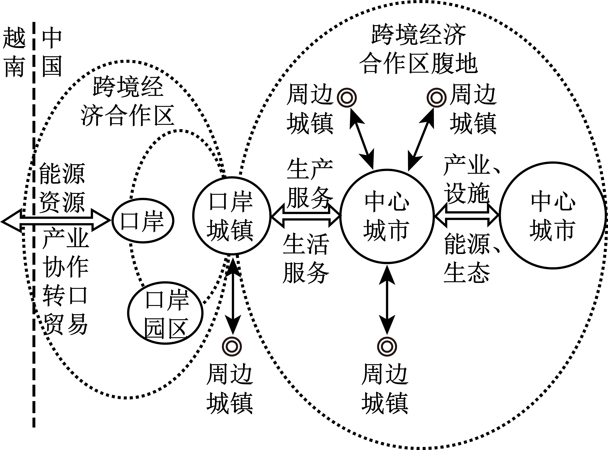

# 精品解析：2025年广东高考地理真题（解析版） · 选择题题组 G1（第1–2题）

## 来源
- 来源文档：精品解析：2025年广东高考地理真题（解析版）
- 题号：第1–2题（选择题，共2小题）

## 题组材料
云南省河口口岸早期以货物过境贸易为主，口岸城镇功能相对单一。2007年中国河口—越南老街跨境经济合作区成立。近年来，该合作区加快推进转型升级，对口岸城镇功能及合作区腹地产生了影响。下图示意该合作区转型升级后的口岸城镇与口岸、腹地中心城市互动关系模式。据此完成下面小题。

## 相关图片


## 第1题
question_id: `2025-广东-地理-精品解析：2025年广东高考地理真题（解析版）-Q1`

**题干**：1. 该合作区转型升级后，口岸城镇（ ） ①商贸服务能力变化不大②三大产业的比重均等 ③产业间的协作能力增强④生产组织功能更强大

**选项**：
- A. ①②
- B. ①④
- C. ②③
- D. ③④

**答案**：D

**解析**：合作区转型升级，口岸城镇从单一货物过境贸易向多元协作发展，商贸服务能力应是提升，并非变化不大，①错误。图中体现口岸城镇与中心城市、口岸之间存在生产和生活服务等联系，可推测口岸城镇第三产业比重会提升，②错误。口岸城镇与腹地中心城市、周边城镇、口岸有服务、产业、设施、能源、生态等协作，说明口岸城镇产业结构多元化，产业间协作能力增强，③正确。作为互动关系中的关键节点，口岸城镇提供生产生活服务、推动产业协作等，生产组织功能更强大，④正确。故选D。

**知识点归属**：
- **核心考点 · 权重 1.0**：区域发展 → 产业结构变化与区域发展 → 产业结构的升级
- **支撑知识 · 权重 0.7**：区域发展 → 城市与区域发展 → 城市功能与区域作用
- **材料线索 · 权重 0.4**：区域发展 → 区际联系与区域协调发展 → 经济全球化与国际合作
- **背景知识 · 权重 0.2**：区域发展 → 区域与区域发展 → 区域差异与关联性

**整体置信度**：高

<!-- MANAGED-KM-START Q1
```yaml
question_id: "2025-广东-地理-精品解析：2025年广东高考地理真题（解析版）-Q1"
question_number: 1
knowledge_points:
  - role: core_exam_point
    weight: 1.0
    domain_id: DM-REG
    domain: "区域发展"
    theme_id: TH-REG-INDUSTRY
    theme: "产业结构变化与区域发展"
    knowledge_unit_id: KU-REG-INDUSTRY-002
    knowledge_unit: "产业结构的升级"
    evidence: "转型升级使口岸城镇产业协作增强、生产组织功能强化，对应产业结构升级（③④）。"
  - role: supporting_knowledge
    weight: 0.7
    domain_id: DM-REG
    domain: "区域发展"
    theme_id: TH-REG-CITY
    theme: "城市与区域发展"
    knowledge_unit_id: KU-REG-CITY-001
    knowledge_unit: "城市功能与区域作用"
    evidence: "口岸城镇作为互动节点，功能由单一过境贸易转向多元服务与组织。"
  - role: material_clue
    weight: 0.4
    domain_id: DM-REG
    domain: "区域发展"
    theme_id: TH-REG-INTERREGION
    theme: "区际联系与区域协调发展"
    knowledge_unit_id: KU-REG-INTERREGION-004
    knowledge_unit: "经济全球化与国际合作"
    evidence: "跨境经济合作区为区域经济一体化与国际合作的情境载体。"
  - role: background_knowledge
    weight: 0.2
    domain_id: DM-REG
    domain: "区域发展"
    theme_id: TH-REG-REGION
    theme: "区域与区域发展"
    knowledge_unit_id: KU-REG-REGION-004
    knowledge_unit: "区域差异与关联性"
    evidence: "口岸—腹地城镇间要素与功能关联属区域关联性背景。"
extra_tags:
  - "跨境经济合作区转型升级"
  - "口岸城镇功能"
taxonomy_version: "config-v0.2-draft"
confidence: "high"
label_status: "completed"
needs_review: false
taxonomy_review:
  needs_review: false
  issue_type: "none"
  review_note: ""
note: ""
```
-->

## 第2题
question_id: `2025-广东-地理-精品解析：2025年广东高考地理真题（解析版）-Q2`

**题干**：2. 该合作区的转型升级将促使腹地中心城市（ ）

**选项**：
- A. 生产要素流动加快
- B. 外贸依存度降低
- C. 单位产值能耗增加
- D. 同质化竞争加剧

**答案**：A

**解析**：合作区转型升级，加强了口岸城镇与腹地中心城市的产业、服务、设施等互动，会促使生产要素（人才、资金、技术等）流动加快，A正确。合作区发展跨境经济，腹地中心城市参与其中，外贸依存度应提升，B错误。转型升级推动产业优化，如发展服务业、循环经济等，会降低单位产值能耗，C错误。合作区促进产业分工协作，腹地中心城市会发展特色产业，同质化竞争应减弱，D错误。故选A。

**知识点归属**：
- **核心考点 · 权重 1.0**：区域发展 → 区域与区域发展 → 区域差异与关联性
- **支撑知识 · 权重 0.7**：区域发展 → 城市与区域发展 → 城市辐射功能
- **材料线索 · 权重 0.4**：区域发展 → 区际联系与区域协调发展 → 经济全球化与国际合作

**整体置信度**：高

<!-- MANAGED-KM-START Q2
```yaml
question_id: "2025-广东-地理-精品解析：2025年广东高考地理真题（解析版）-Q2"
question_number: 2
knowledge_points:
  - role: core_exam_point
    weight: 1.0
    domain_id: DM-REG
    domain: "区域发展"
    theme_id: TH-REG-REGION
    theme: "区域与区域发展"
    knowledge_unit_id: KU-REG-REGION-004
    knowledge_unit: "区域差异与关联性"
    evidence: "互动加强促使生产要素在口岸与腹地中心城市间流动加快（A）。"
  - role: supporting_knowledge
    weight: 0.7
    domain_id: DM-REG
    domain: "区域发展"
    theme_id: TH-REG-CITY
    theme: "城市与区域发展"
    knowledge_unit_id: KU-REG-CITY-002
    knowledge_unit: "城市辐射功能"
    evidence: "腹地中心城市参与互动，其辐射与集聚影响要素流向。"
  - role: material_clue
    weight: 0.4
    domain_id: DM-REG
    domain: "区域发展"
    theme_id: TH-REG-INTERREGION
    theme: "区际联系与区域协调发展"
    knowledge_unit_id: KU-REG-INTERREGION-004
    knowledge_unit: "经济全球化与国际合作"
    evidence: "跨境合作区是要素流动的情境来源。"
extra_tags:
  - "腹地中心城市要素流动"
taxonomy_version: "config-v0.2-draft"
confidence: "high"
label_status: "completed"
needs_review: false
taxonomy_review:
  needs_review: false
  issue_type: "none"
  review_note: ""
note: ""
```
-->

## 教学备注
<!-- TEACHER-NOTES-START -->
- 易错点：
- 课堂提示：
- 讲解建议：
<!-- TEACHER-NOTES-END -->
