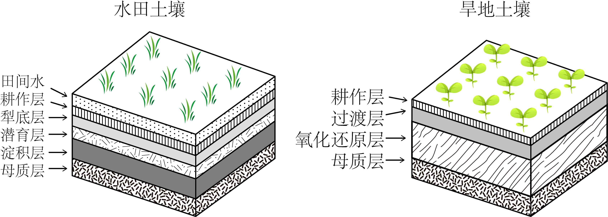

# 精品解析：2025年广东高考地理真题（解析版） · 选择题题组 G2（第3–4题）

## 来源
- 来源文档：精品解析：2025年广东高考地理真题（解析版）
- 题号：第3–4题（选择题，共2小题）

## 题组材料
下图示意长江三角洲某地在相同母质、相邻地块上发育的水田土壤和旱地土壤剖面层次结构。据此完成下面小题。

## 相关图片


## 第3题
question_id: `2025-广东-地理-精品解析：2025年广东高考地理真题（解析版）-Q3`

**题干**：3. 在水田土壤中，受人类活动影响最小的土层是（ ）

**选项**：
- A. 耕作层
- B. 犁底层
- C. 淀积层
- D. 母质层

**答案**：D

**解析**：耕作层是水田中直接进行耕种作业的土层，人类的灌溉、施肥、耕作等活动对其影响极大，比如施肥会改变土壤养分，耕作会改变土壤结构，A错误。犁底层是长期耕作过程中，因犁耕等作用形成的紧实土层，受人类耕作活动影响明显，B错误。淀积层会因水田中水分下渗，携带的物质在此沉积，而水田的水分管理等人类活动（如灌溉、排水）会影响水分下渗过程，进而影响淀积层，C错误。母质层是土壤形成的物质基础，其性质主要由成土母质决定，在土壤发育初期就已存在，受后期人类在水田的耕作、灌溉等活动影响最小，D正确。故选D。

**知识点归属**：
- **核心考点 · 权重 1.0**：自然地理 → 植被与土壤 → 土壤的主要形成因素
- **支撑知识 · 权重 0.7**：自然地理 → 植被与土壤 → 土壤的组成与观察

**整体置信度**：高

<!-- MANAGED-KM-START Q3
```yaml
question_id: "2025-广东-地理-精品解析：2025年广东高考地理真题（解析版）-Q3"
question_number: 3
knowledge_points:
  - role: core_exam_point
    weight: 1.0
    domain_id: DM-NAT
    domain: "自然地理"
    theme_id: TH-NAT-VEGETATION-SOIL
    theme: "植被与土壤"
    knowledge_unit_id: KU-NAT-VEG-SOIL-005
    knowledge_unit: "土壤的主要形成因素"
    evidence: "母质层受人类耕作灌溉影响最小，由成土因素决定。"
  - role: supporting_knowledge
    weight: 0.7
    domain_id: DM-NAT
    domain: "自然地理"
    theme_id: TH-NAT-VEGETATION-SOIL
    theme: "植被与土壤"
    knowledge_unit_id: KU-NAT-VEG-SOIL-004
    knowledge_unit: "土壤的组成与观察"
    evidence: "需识别水田土壤剖面各层次。"
extra_tags:
  - "土壤剖面层次"
  - "人类活动影响"
taxonomy_version: "config-v0.2-draft"
confidence: "high"
label_status: "completed"
needs_review: false
taxonomy_review:
  needs_review: false
  issue_type: "none"
  review_note: ""
note: ""
```
-->

## 第4题
question_id: `2025-广东-地理-精品解析：2025年广东高考地理真题（解析版）-Q4`

**题干**：4. 由图可知，相较于水田土壤，旱地土壤（ ）

**选项**：
- A. 剖面层次更为复杂
- B. 表层与大气间的热量交换更少
- C. 表层淋溶作用更弱
- D. 表层水气相对占比波动更频繁

**答案**：D

**解析**：从图中看，水田土壤剖面层次比旱地土壤更复杂，A错误。旱地土壤没有水田的田间水层，表层与大气接触更直接，热量交换应更多，B错误。水田因长期有水，淋溶作用更突出；旱地水分相对少，淋溶作用弱，但该选项表述不准确，且不是最符合的，关键是对比两者表层水热变化，C错误。水田有田间水层，水分相对稳定；旱地没有持续水层，受降水、蒸发等影响，表层水气相对占比波动更频繁，D正确。故选D。

**知识点归属**：
- **核心考点 · 权重 1.0**：自然地理 → 植被与土壤 → 土壤的组成与观察
- **支撑知识 · 权重 0.7**：自然地理 → 植被与土壤 → 土壤的主要形成因素

**整体置信度**：高

<!-- MANAGED-KM-START Q4
```yaml
question_id: "2025-广东-地理-精品解析：2025年广东高考地理真题（解析版）-Q4"
question_number: 4
knowledge_points:
  - role: core_exam_point
    weight: 1.0
    domain_id: DM-NAT
    domain: "自然地理"
    theme_id: TH-NAT-VEGETATION-SOIL
    theme: "植被与土壤"
    knowledge_unit_id: KU-NAT-VEG-SOIL-004
    knowledge_unit: "土壤的组成与观察"
    evidence: "对比水田/旱地剖面层次与表层水气波动，属土壤组成与观察。"
  - role: supporting_knowledge
    weight: 0.7
    domain_id: DM-NAT
    domain: "自然地理"
    theme_id: TH-NAT-VEGETATION-SOIL
    theme: "植被与土壤"
    knowledge_unit_id: KU-NAT-VEG-SOIL-005
    knowledge_unit: "土壤的主要形成因素"
    evidence: "水分管理差异源于成土因素中气候与人为作用。"
extra_tags:
  - "水田与旱地土壤对比"
taxonomy_version: "config-v0.2-draft"
confidence: "high"
label_status: "completed"
needs_review: false
taxonomy_review:
  needs_review: false
  issue_type: "none"
  review_note: ""
note: ""
```
-->

## 教学备注
<!-- TEACHER-NOTES-START -->
- 易错点：
- 课堂提示：
- 讲解建议：
<!-- TEACHER-NOTES-END -->
