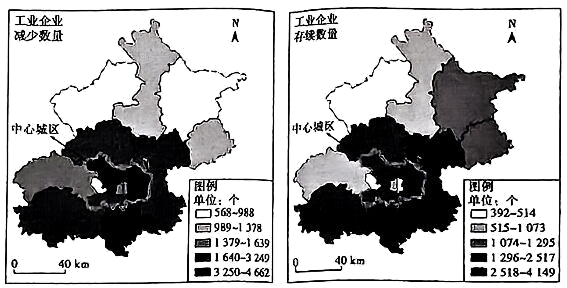

# 精品解析：2025年广东高考地理真题（解析版） · 选择题题组 G3（第5–6题）

## 来源
- 来源文档：精品解析：2025年广东高考地理真题（解析版）
- 题号：第5–6题（选择题，共2小题）

## 题组材料
下图反映北京市2000—2020年期间各区工业企业减少数量及2020年底各区工业企业存续数量。据此完成下面小题。

## 相关图片


## 第5题
question_id: `2025-广东-地理-精品解析：2025年广东高考地理真题（解析版）-Q5`

**题干**：5. 2000—2020年，中心城区工业企业数量的大幅减少有助于该区域（ ） ①升级产业结构②疏解非首都功能 ③增加土地资源④缓解人口老龄化

**选项**：
- A. ①②
- B. ①④
- C. ②③
- D. ③④

**答案**：A

**解析**：中心城区工业企业数量大幅减少，为发展高端服务业、高新技术产业等腾出空间，有助于升级产业结构，①正确。北京作为首都，有疏解非核心的工业等非首都功能需求，中心城区工业企业数量减少，有助于疏解非首都功能，②正确。土地资源是客观存在的，工业企业减少只是改变土地利用方式，不会增加土地资源总量，③错误。工业企业减少意味着就业机会减少，外来青壮年劳动力减少，该区域人口老龄化可能加重，④错误。所以选A。

**知识点归属**：
- **核心考点 · 权重 1.0**：区域发展 → 产业结构变化与区域发展 → 产业结构的升级
- **支撑知识 · 权重 0.7**：区域发展 → 城市与区域发展 → 城市功能与区域作用
- **背景知识 · 权重 0.2**：人文地理 → 乡村与城镇 → 城镇化问题

**整体置信度**：高

<!-- MANAGED-KM-START Q5
```yaml
question_id: "2025-广东-地理-精品解析：2025年广东高考地理真题（解析版）-Q5"
question_number: 5
knowledge_points:
  - role: core_exam_point
    weight: 1.0
    domain_id: DM-REG
    domain: "区域发展"
    theme_id: TH-REG-INDUSTRY
    theme: "产业结构变化与区域发展"
    knowledge_unit_id: KU-REG-INDUSTRY-002
    knowledge_unit: "产业结构的升级"
    evidence: "中心城区工业减少为高端产业腾出空间，对应产业结构升级（①）。"
  - role: supporting_knowledge
    weight: 0.7
    domain_id: DM-REG
    domain: "区域发展"
    theme_id: TH-REG-CITY
    theme: "城市与区域发展"
    knowledge_unit_id: KU-REG-CITY-001
    knowledge_unit: "城市功能与区域作用"
    evidence: "疏解非首都功能属城市功能调整（②）。"
  - role: background_knowledge
    weight: 0.2
    domain_id: DM-HUM
    domain: "人文地理"
    theme_id: TH-HUM-SETTLEMENT
    theme: "乡村与城镇"
    knowledge_unit_id: KU-HUM-SET-007
    knowledge_unit: "城镇化问题"
    evidence: "大城市功能疏解与大城市病治理相关。"
extra_tags:
  - "北京工业疏解"
  - "非首都功能"
taxonomy_version: "config-v0.2-draft"
confidence: "high"
label_status: "completed"
needs_review: false
taxonomy_review:
  needs_review: false
  issue_type: "none"
  review_note: ""
note: ""
```
-->

## 第6题
question_id: `2025-广东-地理-精品解析：2025年广东高考地理真题（解析版）-Q6`

**题干**：6. 2020年底，北京市工业企业存续数量空间分布的特点是（ ）

**选项**：
- A. 中心城区企业密度最小
- B. 空间集聚的特征明显
- C. 呈现同心圆状分布格局
- D. 自中心城区向北递增

**答案**：B

**解析**：从“存续数量”图看，中心城区部分区域颜色深，企业存续数量较多，空间范围不大，可推测密度较大，A错误。工业企业存续数量在空间上有明显的集中区域（如部分区域颜色深，代表数量多），空间集聚特征明显，B正确。图中企业分布不是同心圆状，C错误。从图中看北部颜色较浅，说明企业分布数量较少，中心城区数量较多，D错误。所以选B。

**知识点归属**：
- **核心考点 · 权重 1.0**：人文地理 → 产业区位 → 工业区位因素
- **支撑知识 · 权重 0.7**：人文地理 → 乡村与城镇 → 城镇内部空间结构

**整体置信度**：高

<!-- MANAGED-KM-START Q6
```yaml
question_id: "2025-广东-地理-精品解析：2025年广东高考地理真题（解析版）-Q6"
question_number: 6
knowledge_points:
  - role: core_exam_point
    weight: 1.0
    domain_id: DM-HUM
    domain: "人文地理"
    theme_id: TH-HUM-INDUSTRY
    theme: "产业区位"
    knowledge_unit_id: KU-HUM-IND-002
    knowledge_unit: "工业区位因素"
    evidence: "工业企业存续数量空间集聚特征属工业区位中的集聚因素。"
  - role: supporting_knowledge
    weight: 0.7
    domain_id: DM-HUM
    domain: "人文地理"
    theme_id: TH-HUM-SETTLEMENT
    theme: "乡村与城镇"
    knowledge_unit_id: KU-HUM-SET-002
    knowledge_unit: "城镇内部空间结构"
    evidence: "存续数量的空间分布格局对应城镇内部空间结构。"
extra_tags:
  - "工业企业空间分布"
  - "空间集聚"
taxonomy_version: "config-v0.2-draft"
confidence: "high"
label_status: "completed"
needs_review: false
taxonomy_review:
  needs_review: false
  issue_type: "none"
  review_note: ""
note: ""
```
-->

## 教学备注
<!-- TEACHER-NOTES-START -->
- 易错点：
- 课堂提示：
- 讲解建议：
<!-- TEACHER-NOTES-END -->
