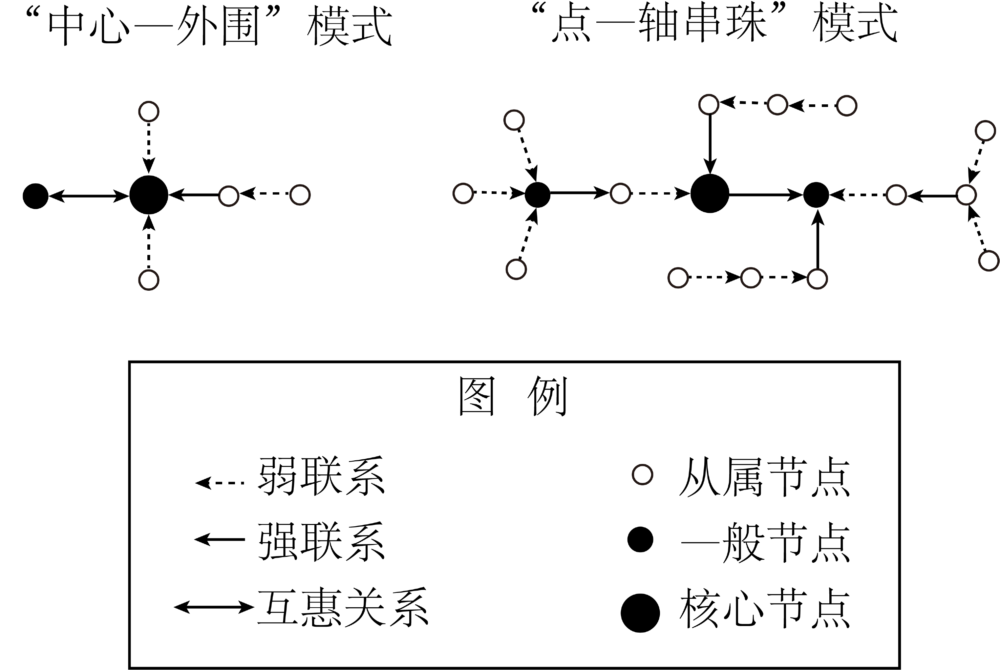

# 精品解析：2025年广东高考地理真题（解析版） · 选择题题组 G5（第9–10题）

## 来源
- 来源文档：精品解析：2025年广东高考地理真题（解析版）
- 题号：第9–10题（选择题，共2小题）

## 题组材料
某研究利用1990—2019年省际铁路货运量数据，总结了我国不同区域呈现出的“中心—外围”“点—轴串珠”两种省际铁路货运网络模式（下图）。图中节点表示省份，节点大（小）表示某省份与周边省份的铁路货运联系强（弱），节点的箭头指向与该省份铁路货运量最大的省份。据此完成下面小题。

## 相关图片


## 第9题
question_id: `2025-广东-地理-精品解析：2025年广东高考地理真题（解析版）-Q9`

**题干**：9. 相较于“中心—外围”模式，“点—轴串珠”模式呈现出的特征是（ ）

**选项**：
- A. 货运网络结构更复杂
- B. 邻近节点间互惠关系更强
- C. 更为单一的货运流向
- D. 货运网络层级性明显减弱

**答案**：A

**解析**：“点—轴串珠”模式有核心节点、一般节点、从属节点等，节点间联系多样（强联系、弱联系、互惠关系），相比“中心—外围”模式，货运网络结构更复杂，A正确。从图例看，“点—轴串珠”模式中，并非邻近节点间都有强互惠关系，存在弱联系等，无法说明邻近节点互惠关系更强，B错误。“点—轴串珠”模式货运流向更丰富，不是单一流向，C错误。“点—轴串珠”模式有核心、一般、从属节点，层级性仍存在，没有明显减弱，D错误。故选A。

**知识点归属**：
- **核心考点 · 权重 1.0**：区域发展 → 城市与区域发展 → 城市体系与区域空间组织
- **支撑知识 · 权重 0.7**：人文地理 → 交通运输与区域发展 → 交通运输布局对区域发展的影响

**整体置信度**：高

<!-- MANAGED-KM-START Q9
```yaml
question_id: "2025-广东-地理-精品解析：2025年广东高考地理真题（解析版）-Q9"
question_number: 9
knowledge_points:
  - role: core_exam_point
    weight: 1.0
    domain_id: DM-REG
    domain: "区域发展"
    theme_id: TH-REG-CITY
    theme: "城市与区域发展"
    knowledge_unit_id: KU-REG-CITY-003
    knowledge_unit: "城市体系与区域空间组织"
    evidence: "点—轴串珠包含核心、一般和从属节点及多样联系，体现区域空间组织中的层级与网络结构。"
  - role: supporting_knowledge
    weight: 0.7
    domain_id: DM-HUM
    domain: "人文地理"
    theme_id: TH-HUM-TRANSPORT
    theme: "交通运输与区域发展"
    knowledge_unit_id: KU-HUM-TRA-002
    knowledge_unit: "交通运输布局对区域发展的影响"
    evidence: "省际铁路货运联系构成交通网络，其结构反映交通联系对区域空间组织的作用。"
extra_tags:
  - "点—轴串珠模式"
  - "货运网络结构"
taxonomy_version: "config-v0.2-draft"
confidence: "high"
label_status: "completed"
needs_review: false
taxonomy_review:
  needs_review: false
  issue_type: "none"
  review_note: ""
note: ""
```
-->

## 第10题
question_id: `2025-广东-地理-精品解析：2025年广东高考地理真题（解析版）-Q10`

**题干**：10. 1990—2019年，东北地区铁路货运网络一直呈现“中心—外围”模式，其主要原因是该地区（ ） ①地理单元相对独立②轻重工业结构比较均衡 ③人口季节性流动大④货运铁路干线结构稳定

**选项**：
- A. ①②
- B. ①④
- C. ②③
- D. ③④

**答案**：B

**解析**：东北地区因山脉、地形、地理位置等特征，使东北地区作为地理单元相对独立，与外界联系通道有限，利于形成以区域内中心城市（如沈阳、哈尔滨等）为核心，辐射外围的“中心—外围”货运模式，①正确。产业结构均衡会促进多样货运联系，不利于长期维持单一“中心—外围”模式，且东北地区工业结构以重工业为主，②错误。人口季节性流动大主要影响客运，与铁路货运网络模式关联小，③错误。长期稳定的货运铁路干线（如京哈线等），支撑以中心城市为核心的货运辐射格局，使“中心—外围”模式长期维持，④正确。故选B。

**知识点归属**：
- **核心考点 · 权重 1.0**：区域发展 → 区域与区域发展 → 区域整体性
- **支撑知识 · 权重 0.7**：人文地理 → 交通运输与区域发展 → 区域发展对交通运输布局的影响

**整体置信度**：高

<!-- MANAGED-KM-START Q10
```yaml
question_id: "2025-广东-地理-精品解析：2025年广东高考地理真题（解析版）-Q10"
question_number: 10
knowledge_points:
  - role: core_exam_point
    weight: 1.0
    domain_id: DM-REG
    domain: "区域发展"
    theme_id: TH-REG-REGION
    theme: "区域与区域发展"
    knowledge_unit_id: KU-REG-REGION-003
    knowledge_unit: "区域整体性"
    evidence: "东北地区作为相对独立的地理单元，内部要素联系和边界条件共同维持中心—外围货运模式。"
  - role: supporting_knowledge
    weight: 0.7
    domain_id: DM-HUM
    domain: "人文地理"
    theme_id: TH-HUM-TRANSPORT
    theme: "交通运输与区域发展"
    knowledge_unit_id: KU-HUM-TRA-001
    knowledge_unit: "区域发展对交通运输布局的影响"
    evidence: "长期稳定的货运铁路干线结构支撑区域中心节点与外围节点的联系格局。"
extra_tags:
  - "中心—外围模式"
  - "东北货运网络"
taxonomy_version: "config-v0.2-draft"
confidence: "high"
label_status: "completed"
needs_review: false
taxonomy_review:
  needs_review: false
  issue_type: "none"
  review_note: ""
note: ""
```
-->

## 教学备注
<!-- TEACHER-NOTES-START -->
- 易错点：
- 课堂提示：
- 讲解建议：
<!-- TEACHER-NOTES-END -->
