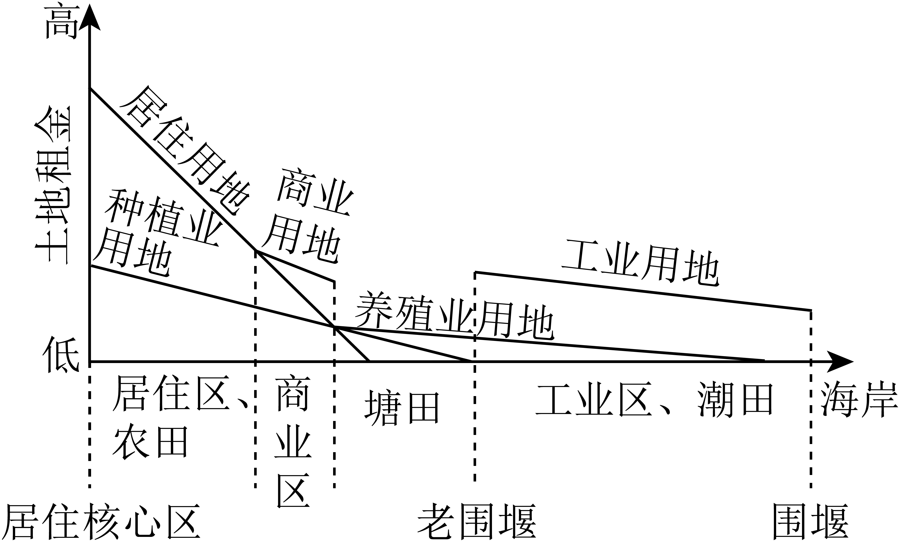

# 精品解析：2025年广东高考地理真题（解析版） · 选择题题组 G7（第13–14题）

## 来源
- 来源文档：精品解析：2025年广东高考地理真题（解析版）
- 题号：第13–14题（选择题，共2小题）

## 题组材料
广东沿海某村早期的土地利用，按照海拔由高到低依次为林地、居住用地、耕地和海岸滩涂。随着工业化发展，该村从居住核心区至海岸的土地利用发生明显变化，这种变化与土地利用的地租竞争力相关。下图示意该区段土地利用及其地租竞争力空间分布。据此完成下面小题。

## 相关图片


## 第13题
question_id: `2025-广东-地理-精品解析：2025年广东高考地理真题（解析版）-Q13`

**题干**：13. 影响该村在塘田段种植业用地地租竞争力向海岸方向变化的主要自然原因是（ ）

**选项**：
- A. 溃涝逐渐加重
- B. 灌溉水源减少
- C. 土壤质地变粗
- D. 积温逐渐降低

**答案**：A

**解析**：该村在塘田段种植业用地地租竞争力向海岸方向降低，原因是向海岸方向海拔更低，靠海更近，受潮汐和降水影响，排水不畅易形成渍涝，种植业用地靠近海岸时，渍涝风险增加，作物生长条件恶化，导致地租竞争力下降，A正确；海岸附近通常临近河流或海洋，水源总量未必减少，但可能因潮汐带来咸水入侵，影响灌溉水源质量，与靠近海岸导致的地租竞争力变化关系不大，B错误；海岸带土壤受海浪沉积影响，沙质成分可能增加，但土壤质地变化并非地租竞争力下降的主要自然原因，C错误。积温主要受纬度和海拔影响，沿海地区海拔差异小，积温变化不显著，且海岸附近受海洋调节，积温未必降低，D错误。故选A。

**知识点归属**：
- **核心考点 · 权重 1.0**：人文地理 → 产业区位 → 农业区位因素
- **支撑知识 · 权重 0.7**：自然地理 → 地表形态 → 海岸地貌

**整体置信度**：高

<!-- MANAGED-KM-START Q13
```yaml
question_id: "2025-广东-地理-精品解析：2025年广东高考地理真题（解析版）-Q13"
question_number: 13
knowledge_points:
  - role: core_exam_point
    weight: 1.0
    domain_id: DM-HUM
    domain: "人文地理"
    theme_id: TH-HUM-INDUSTRY
    theme: "产业区位"
    knowledge_unit_id: KU-HUM-IND-001
    knowledge_unit: "农业区位因素"
    evidence: "向海岸渍涝加重使种植业地租竞争力下降，属农业区位自然因素（A）。"
  - role: supporting_knowledge
    weight: 0.7
    domain_id: DM-NAT
    domain: "自然地理"
    theme_id: TH-NAT-LANDFORM
    theme: "地表形态"
    knowledge_unit_id: KU-NAT-LANDFORM-004
    knowledge_unit: "海岸地貌"
    evidence: "沿海低地排水不畅与海岸地貌特征相关。"
extra_tags:
  - "地租竞争力"
  - "沿海渍涝"
taxonomy_version: "config-v0.2-draft"
confidence: "high"
label_status: "completed"
needs_review: false
taxonomy_review:
  needs_review: false
  issue_type: "none"
  review_note: ""
note: ""
```
-->

## 第14题
question_id: `2025-广东-地理-精品解析：2025年广东高考地理真题（解析版）-Q14`

**题干**：14. 该村原来零星的临时商业活动向上图所示商业区聚集，这种现象有利于（ ）

**选项**：
- A. 优化村域交通网络
- B. 减少商铺租金支出
- C. 扩大商业服务范围
- D. 降低村民消费支出

**答案**：C

**解析**：商业区聚集可能对交通提出更高需求，但交通网络的优化需依赖基础设施建设，而非商业区聚集行为本身的直接结果，A错误；商业区通常位于区位优势明显处（如交通便利、人流量大），租金成本较高，聚集不会降低租金，B错误；商业聚集形成规模效应，通过集中展示商品、共享客源，可吸引本村及周边区域的消费者，显著扩大商业服务范围，C正确；商业聚集可能加剧竞争，促使价格下降，但也可能因垄断或地租成本转嫁导致价格上升，消费支出未必降低，D错误。故选C。

**知识点归属**：
- **核心考点 · 权重 1.0**：人文地理 → 产业区位 → 服务业区位因素
- **支撑知识 · 权重 0.7**：人文地理 → 乡村与城镇 → 城镇内部空间结构

**整体置信度**：高

<!-- MANAGED-KM-START Q14
```yaml
question_id: "2025-广东-地理-精品解析：2025年广东高考地理真题（解析版）-Q14"
question_number: 14
knowledge_points:
  - role: core_exam_point
    weight: 1.0
    domain_id: DM-HUM
    domain: "人文地理"
    theme_id: TH-HUM-INDUSTRY
    theme: "产业区位"
    knowledge_unit_id: KU-HUM-IND-003
    knowledge_unit: "服务业区位因素"
    evidence: "商业聚集扩大服务范围属服务业区位因素（C）。"
  - role: supporting_knowledge
    weight: 0.7
    domain_id: DM-HUM
    domain: "人文地理"
    theme_id: TH-HUM-SETTLEMENT
    theme: "乡村与城镇"
    knowledge_unit_id: KU-HUM-SET-002
    knowledge_unit: "城镇内部空间结构"
    evidence: "商业区聚集对应城镇内部商业空间结构。"
extra_tags:
  - "商业聚集"
  - "商业服务范围"
taxonomy_version: "config-v0.2-draft"
confidence: "high"
label_status: "completed"
needs_review: false
taxonomy_review:
  needs_review: false
  issue_type: "none"
  review_note: ""
note: ""
```
-->

## 教学备注
<!-- TEACHER-NOTES-START -->
- 易错点：
- 课堂提示：
- 讲解建议：
<!-- TEACHER-NOTES-END -->
