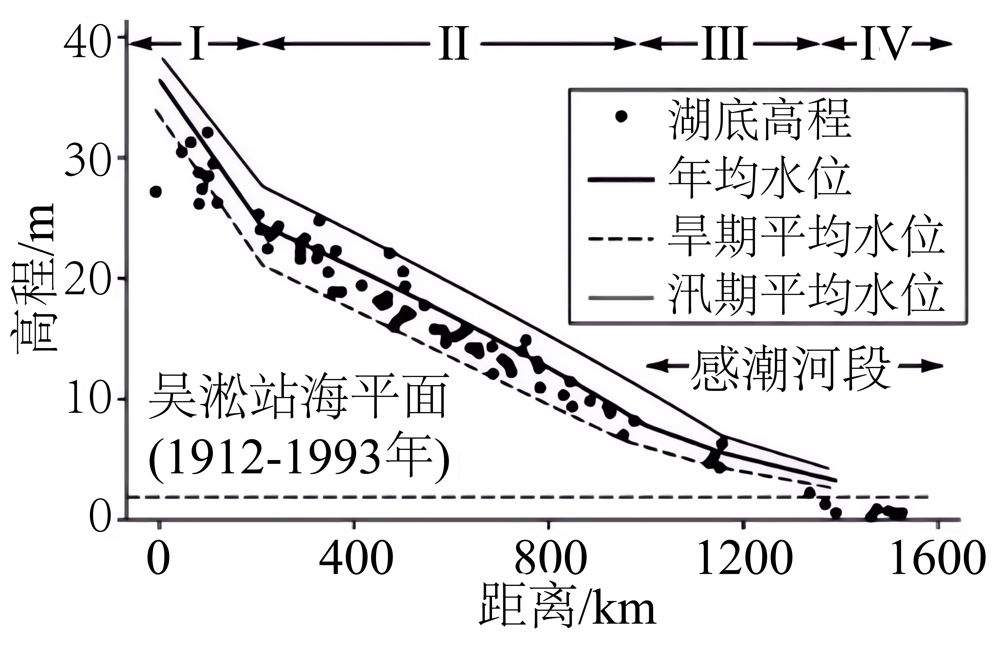

# 精品解析：2025年广东高考地理真题（解析版） · 选择题题组 G8（第15–16题）

## 来源
- 来源文档：精品解析：2025年广东高考地理真题（解析版）
- 题号：第15–16题（选择题，共2小题）

## 题组材料
长江中下游地区湖泊众多，这些湖泊历史上多与长江自然连通。下图示意自长江中游沙市水文站至感潮河段多个沿江湖泊湖底高程（湖面高程减去平均水深后的高程值）及其与长江水位高程的对比关系。据此完成下面小题。

## 相关图片


## 第15题
question_id: `2025-广东-地理-精品解析：2025年广东高考地理真题（解析版）-Q15`

**题干**：15. 沿江湖泊与长江相互补给作用最显著的河段是（ ）

**选项**：
- A. I
- B. Ⅱ
- C. Ⅲ
- D. Ⅳ

**答案**：B

**解析**：由图可知，Ⅱ河段湖泊众多，汛期长江水位高于多数湖泊的湖底高程，且高差较大，可推测长江补给湖泊，旱期长江水位低于多数湖泊湖底高程，可推测多数湖泊补给长江，故Ⅱ河段湖泊与长江相互补给作用最显著，B正确；Ⅰ、Ⅲ、Ⅳ河段湖泊较少，湖泊与长江的相互补给作用不如Ⅱ河段显著，ACD错误。故选B。

**知识点归属**：
- **核心考点 · 权重 1.0**：自然地理 → 水文与海洋 → 陆地水体及其相互关系
- **支撑知识 · 权重 0.7**：自然地理 → 水文与海洋 → 水循环

**整体置信度**：高

<!-- MANAGED-KM-START Q15
```yaml
question_id: "2025-广东-地理-精品解析：2025年广东高考地理真题（解析版）-Q15"
question_number: 15
knowledge_points:
  - role: core_exam_point
    weight: 1.0
    domain_id: DM-NAT
    domain: "自然地理"
    theme_id: TH-NAT-WATER
    theme: "水文与海洋"
    knowledge_unit_id: KU-NAT-WATER-005
    knowledge_unit: "陆地水体及其相互关系"
    evidence: "沿江湖泊与长江相互补给最显著河段属陆地水体相互关系（B）。"
  - role: supporting_knowledge
    weight: 0.7
    domain_id: DM-NAT
    domain: "自然地理"
    theme_id: TH-NAT-WATER
    theme: "水文与海洋"
    knowledge_unit_id: KU-NAT-WATER-001
    knowledge_unit: "水循环"
    evidence: "江湖补给关系是水循环环节的体现。"
extra_tags:
  - "江湖相互补给"
  - "陆地水体关系"
taxonomy_version: "config-v0.2-draft"
confidence: "high"
label_status: "completed"
needs_review: false
taxonomy_review:
  needs_review: false
  issue_type: "none"
  review_note: ""
note: ""
```
-->

## 第16题
question_id: `2025-广东-地理-精品解析：2025年广东高考地理真题（解析版）-Q16`

**题干**：16. 在第Ⅳ河段，湖泊湖底高程都低于上图中所示的海平面。除海平面变化外，还可导致这种现象发生的自然原因最可能是（ ）

**选项**：
- A. 湖泊淤积减弱
- B. 潮汐作用影响强烈
- C. 湖底侵蚀加剧
- D. 湖泊区域构造下沉

**答案**：D

**解析**：在第Ⅳ河段，湖泊湖底高程低于海平面，可推测湖泊区域构造下沉，导致湖底高程降低，D正确；根据所学知识，入海的河湖，其下蚀深度大致与海平面一致，即当地的侵蚀基准面大致与海平面一致，若考虑湖底侵蚀加剧，则湖底高程大致等于海平面高程，而不是低于海平面，C错误；湖底淤积减弱，导致湖床不易升高，但也不会低于海平面，A错误；潮汐作用主要影响河口地区，对多个湖泊的湖底作用较弱，且潮汐作用包括潮流的侵蚀和淤积等，也不能直接导致湖底高程低于海平面，B错误。故选D。

**知识点归属**：
- **核心考点 · 权重 1.0**：自然地理 → 地表形态 → 塑造地表形态的内力与外力作用
- **支撑知识 · 权重 0.7**：自然地理 → 水文与海洋 → 陆地水体及其相互关系

**整体置信度**：高

<!-- MANAGED-KM-START Q16
```yaml
question_id: "2025-广东-地理-精品解析：2025年广东高考地理真题（解析版）-Q16"
question_number: 16
knowledge_points:
  - role: core_exam_point
    weight: 1.0
    domain_id: DM-NAT
    domain: "自然地理"
    theme_id: TH-NAT-LANDFORM
    theme: "地表形态"
    knowledge_unit_id: KU-NAT-LANDFORM-006
    knowledge_unit: "塑造地表形态的内力与外力作用"
    evidence: "湖底低于海平面由区域构造下沉所致，属内力作用（D）。"
  - role: supporting_knowledge
    weight: 0.7
    domain_id: DM-NAT
    domain: "自然地理"
    theme_id: TH-NAT-WATER
    theme: "水文与海洋"
    knowledge_unit_id: KU-NAT-WATER-005
    knowledge_unit: "陆地水体及其相互关系"
    evidence: "湖盆与河流水位关系属陆地水体关系。"
extra_tags:
  - "湖底高程"
  - "构造下沉"
taxonomy_version: "config-v0.2-draft"
confidence: "high"
label_status: "completed"
needs_review: false
taxonomy_review:
  needs_review: false
  issue_type: "none"
  review_note: ""
note: ""
```
-->

## 教学备注
<!-- TEACHER-NOTES-START -->
- 易错点：
- 课堂提示：
- 讲解建议：
<!-- TEACHER-NOTES-END -->
