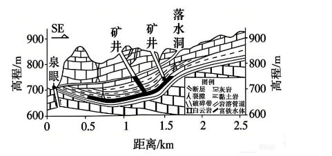

# 2026年广东高考地理真题 · 第17题

## 来源
- 来源文档：2026年高考地理试卷（广东）（空白卷）.docx（及 2026年高考地理试卷（广东）（解析卷）.docx）
- 题号：17

## 题组材料
17\. 阅读图文资料，完成下列要求。

贵州省某流域岩溶地貌发育。该地具有较长的煤炭（含黄铁矿）开采历史，现今煤炭矿井多已废弃。监测发现，矿井废弃后，从该流域某处泉眼溢出的泉水中铁元素含量明显增高，下图示意该泉眼附近地区废弃煤炭矿井和水文地质情况。

## 相关图片


### 第17题
question_id: `2026-广东-地理-2026年广东高考地理真题-Q17`

**题干**：

分析矿井废弃后，泉水中铁元素含量增高的原因及富铁水体自泉眼中溢出的过程。

**答案**：

【答案】原因：矿井废弃后，坑道积水；地下水与黄铁矿接触（反应），水体中铁元素增多。过程：富铁积水与岩溶管道地下水混合；岩溶管道存在高差，富铁地下径流流向泉眼；泉眼位于断层破碎带，泉水自此溢出。

**解析**：

【详解】

本题双设问，第一问，矿井废弃→泉水铁含量增高。需结合图文材料信息“贵州喀斯特岩溶地貌、含黄铁矿煤层、废弃矿井”，从废弃矿井积水条件、黄铁矿化学溶蚀含铁两方面分析。矿井开采时，会持续抽水疏干地下水，井下坑道干燥；矿井废弃后，抽水停止，坑道不再排水，大量地下水汇入、积存，形成坑内积水。矿区煤层富含黄铁矿，废弃矿井坑道长期与黄铁矿裸露岩层接触，地下水长期浸泡、发生化学反应，黄铁矿中的铁元素不断溶解进入水体，地下水铁离子浓度持续升高。

第二问，富铁水体从井下→泉眼溢出。需结合区域背景：贵州喀斯特地貌广布，地下溶洞、暗河、岩溶裂隙发育，地下水连通性极强，矿井水污染极易大范围扩散，并结合图示信息，从水体混合补给、地势高差驱动、断层破碎带出露溢出通道等方面分析。井下废弃坑道积水，顺着岩层裂隙、岩溶管道，与周边岩溶含水层地下水相互连通、混合，整体地下水含铁量同步升高。区域喀斯特岩溶管道发育完整，矿井分布地势更高，泉眼出露位置地势更低，地下水存在稳定水位高差，驱动富铁地下水顺着岩溶管道向下游径流。泉眼恰好位于断层破碎带，岩石裂隙发育、透水性极强，地下水运移至此收到阻挡、水位抬升，最终沿破碎裂隙、岩溶管道上升，在地表泉眼处溢出。

**知识点归属**：
- **核心考点 · 权重 1.0**：资源、环境与国家安全 → 资源环境与人类社会 → 环境问题的形成与危害
  - 依据：矿井废弃后坑道积水与黄铁矿接触反应，铁进入水体导致水质变化。
- **核心考点 · 权重 1.0**：自然地理 → 水文与海洋 → 陆地水体及其相互关系
  - 依据：矿井积水与岩溶地下水混合，受水位高差驱动沿管道径流并自泉眼溢出。
- **支撑知识 · 权重 0.7**：自然地理 → 地表形态 → 地质构造与地貌
  - 依据：泉眼位于断层破碎带，发育的裂隙为富铁地下水出露提供通道。

**具体考查**：废弃矿井富铁水形成；岩溶管道地下水运移

**整体置信度**：高

**待复核**：否

**映射说明**：同一设问同时要求解释铁含量增高原因和富铁水溢出过程，分别对应污染形成与陆地水体联系两个核心考点。

<!-- MANAGED-KM-START Q17
```yaml
question_id: "2026-广东-地理-2026年广东高考地理真题-Q17"
question_number: 17
knowledge_points:
  - role: core_exam_point
    weight: 1.0
    domain_id: DM-RES
    domain: "资源、环境与国家安全"
    theme_id: TH-RES-SOC
    theme: "资源环境与人类社会"
    knowledge_unit_id: KU-RES-SOC-003
    knowledge_unit: "环境问题的形成与危害"
    evidence: "矿井废弃后坑道积水与黄铁矿接触反应，铁进入水体导致水质变化。"
  - role: core_exam_point
    weight: 1.0
    domain_id: DM-NAT
    domain: "自然地理"
    theme_id: TH-NAT-WATER
    theme: "水文与海洋"
    knowledge_unit_id: KU-NAT-WATER-005
    knowledge_unit: "陆地水体及其相互关系"
    evidence: "矿井积水与岩溶地下水混合，受水位高差驱动沿管道径流并自泉眼溢出。"
  - role: supporting_knowledge
    weight: 0.7
    domain_id: DM-NAT
    domain: "自然地理"
    theme_id: TH-NAT-LANDFORM
    theme: "地表形态"
    knowledge_unit_id: KU-NAT-LANDFORM-008
    knowledge_unit: "地质构造与地貌"
    evidence: "泉眼位于断层破碎带，发育的裂隙为富铁地下水出露提供通道。"
extra_tags:
  - "废弃矿井富铁水形成"
  - "岩溶管道地下水运移"
taxonomy_version: "config-v0.2-draft"
confidence: "high"
label_status: "completed"
needs_review: false
taxonomy_review:
  needs_review: false
  issue_type: "none"
  review_note: ""
note: "同一设问同时要求解释铁含量增高原因和富铁水溢出过程，分别对应污染形成与陆地水体联系两个核心考点。"
```
-->

## 教学备注
<!-- TEACHER-NOTES-START -->
- 易错点：
- 课堂提示：
- 讲解建议：
<!-- TEACHER-NOTES-END -->
